# 🍽️ FlavorForge

## From Recipe Ideas to a Production-Ready Cloud Platform


---

> 🍴 **Great recipes need the right ingredients.**  
> 🚀 **Great software requires the right engineering practices.**

---

# 👨‍🍳 The FlavorForge Story

FlavorForge began as a simple recipe-sharing application built to provide users with an intuitive platform for discovering and exploring recipes through a modern web interface.

While the application itself is straightforward, the primary objective of this project extends far beyond application development.

The real engineering challenge was to transform a basic full-stack application into a production-inspired cloud platform by implementing modern DevSecOps practices, automated delivery pipelines, cloud-native infrastructure, security integration, and GitOps-based deployment.

This capstone demonstrates that complete transformation—from the first Git commit to a fully deployed application running on **Azure Kubernetes Service (AKS)**.


The application is the product.

The DevSecOps platform behind it is the engineering story.

---

# 🍴 Meet FlavorForge

FlavorForge is a full-stack recipe-sharing platform developed as an **Azure DevSecOps Capstone Project** to demonstrate how modern software is built, secured, deployed, and operated using enterprise DevSecOps practices.

The application combines a modern frontend with a RESTful backend while showcasing an end-to-end cloud-native delivery pipeline running on Microsoft Azure.

The solution includes:

- **React** frontend for a responsive user experience
- **Node.js and Express** backend API
- **Docker** containerization for consistent application packaging
- **Azure Container Registry (ACR)** for private container image management
- **Azure Kubernetes Service (AKS)** for container orchestration
- **Azure DevOps** multi-stage CI/CD pipelines
- **SonarCloud** for continuous code quality analysis
- **Trivy** for container vulnerability scanning
- **ArgoCD** for GitOps-based continuous delivery
- **Azure Monitor** for application and infrastructure monitoring

This project is not intended to demonstrate application development alone.

Instead, it showcases the complete software delivery lifecycle followed by modern engineering teams—from source code management and automated validation to secure deployment, GitOps synchronization, and operational monitoring.

---

# 🎯 Project Overview

Developing an application is only one part of modern software engineering.

Production systems must also address critical operational requirements, including:

- How can application changes be delivered safely?
- How can code quality be validated automatically?
- How can security vulnerabilities be detected before deployment?
- How can deployments remain consistent across multiple environments?
- How can applications recover from configuration drift or deployment failures?
- How can engineering teams monitor application health and platform performance?

FlavorForge addresses these challenges by implementing an enterprise-inspired DevSecOps workflow that integrates automation, security, infrastructure, and operational best practices into a single delivery platform.

The project demonstrates:

- ✅ Automated CI/CD pipelines using Azure DevOps
- ✅ Continuous code quality analysis with SonarCloud
- ✅ Container security scanning using Trivy
- ✅ Docker-based application containerization
- ✅ Private image management through Azure Container Registry
- ✅ Kubernetes orchestration with Azure Kubernetes Service
- ✅ GitOps-based continuous delivery using ArgoCD
- ✅ Cloud monitoring with Azure Monitor
- ✅ Comprehensive engineering documentation and operational guidance

The objective is not simply to deploy an application, but to demonstrate how production-ready software can be delivered, secured, managed, and continuously improved using modern DevSecOps practices.

---

# 🧩 The Engineering Challenge

Traditional application deployments often rely on manual processes where building, testing, packaging, and deployment are performed separately. While this approach may be sufficient for small projects, it becomes increasingly difficult to maintain consistency, reliability, and security as applications grow.

A typical manual deployment workflow looks like this:


Such deployments introduce several operational challenges:

- Manual deployment errors
- Inconsistent environments
- Limited deployment traceability
- Delayed security validation
- Difficult rollback and recovery
- Minimal deployment automation

FlavorForge addresses these challenges by implementing an enterprise-inspired DevSecOps workflow where every code change is automatically validated, secured, containerized, and prepared for deployment.

The modern delivery workflow is illustrated below:


Each stage introduces an additional layer of automation, quality assurance, security, operational consistency, and deployment reliability.

#### Evidence


*Figure 3.1 – Multi-stage Azure DevOps pipeline implementing automated build, validation, security scanning, containerization, and deployment stages.*

---

# 🔄 The FlavorForge Transformation Journey

FlavorForge was developed incrementally, with each phase introducing a new layer of engineering capability. Rather than focusing only on application development, the project evolved into a complete DevSecOps platform that demonstrates modern software delivery practices.


This phased approach reflects how enterprise engineering teams gradually evolve an application into a secure, automated, cloud-native platform capable of supporting continuous delivery and operational excellence.

---

# 🏗️ Architecture Foundation

FlavorForge follows a cloud-native architecture that separates application development, continuous integration, container management, cloud infrastructure, deployment automation, and operational monitoring into independent but integrated layers.

This layered design improves maintainability, scalability, security, and deployment consistency while following modern DevSecOps engineering practices.

The overall architecture is illustrated below.


Each layer has a clearly defined responsibility within the software delivery lifecycle.

| Layer | Responsibility |
|--------|----------------|
| Source Control | Version management and collaboration using GitHub |
| Continuous Integration | Automated build, validation, code quality analysis, and security scanning using Azure DevOps |
| Containerization | Packaging frontend and backend applications into Docker images |
| Container Registry | Secure storage and versioning of container images in Azure Container Registry (ACR) |
| Container Orchestration | Running and managing workloads using Azure Kubernetes Service (AKS) |
| GitOps | Continuous synchronization of Kubernetes resources using ArgoCD |
| Monitoring | Observability and operational visibility using Azure Monitor |

#### Evidence

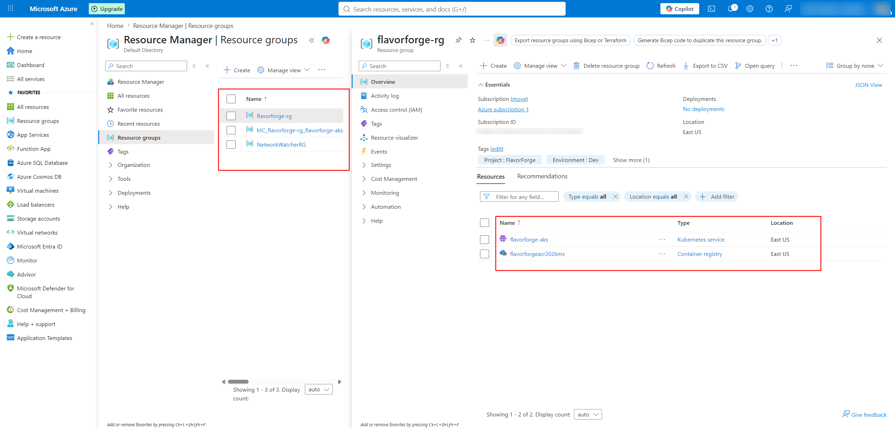

*Figure 4.1 – Azure Resource Group containing the core cloud infrastructure used by the FlavorForge platform.*

---

# 🚀 From Code Commit to Running Application

Every code change in FlavorForge follows a standardized DevSecOps workflow that transforms source code into a securely deployed cloud-native application.

Instead of relying on manual deployment activities, each stage is automated to improve consistency, traceability, and deployment reliability.

The complete delivery workflow is shown below.


The delivery lifecycle consists of the following stages:

## 1. Source Control

Application source code, Kubernetes manifests, automation scripts, and documentation are maintained in a GitHub repository.

GitHub serves as the single source of truth for version control and collaboration.

---

## 2. Continuous Integration

Every code commit automatically triggers an Azure DevOps multi-stage pipeline that performs:

- Source validation
- Dependency installation
- Application build
- Code quality analysis
- Security scanning
- Docker image creation

---

## 3. Container Registry

After successful validation, Docker images are securely published to Azure Container Registry (ACR), where versioned images are stored for deployment.

---

## 4. Continuous Delivery

ArgoCD continuously monitors the Git repository and synchronizes Kubernetes resources with the desired application state.

This GitOps approach minimizes manual deployments and ensures that the running cluster always reflects the version stored in Git.

---

## 5. Cloud Operations

Azure Kubernetes Service (AKS) runs the application workloads, while Azure Monitor provides operational visibility into cluster health, application availability, and runtime performance.

#### Evidence


*Figure 5.1 – Successful execution of the Azure DevOps pipeline demonstrating the automated CI workflow.*

---

# 🧱 Application Architecture

FlavorForge follows a modular full-stack architecture that separates the user interface, business logic, deployment infrastructure, and operational platform into independent components.

This separation improves maintainability, scalability, testing, and deployment while allowing each layer to evolve independently.

The overall application architecture is shown below.


---

## 🎨 Frontend Layer

The frontend is developed using **React** and built with **Vite**, then served through an **Nginx** container.

### Responsibilities

- Responsive user interface
- Recipe browsing and searching
- Backend API communication
- Client-side routing
- Reusable component architecture

#### Technology Stack

- React
- Vite
- JavaScript
- CSS
- Nginx

#### Evidence

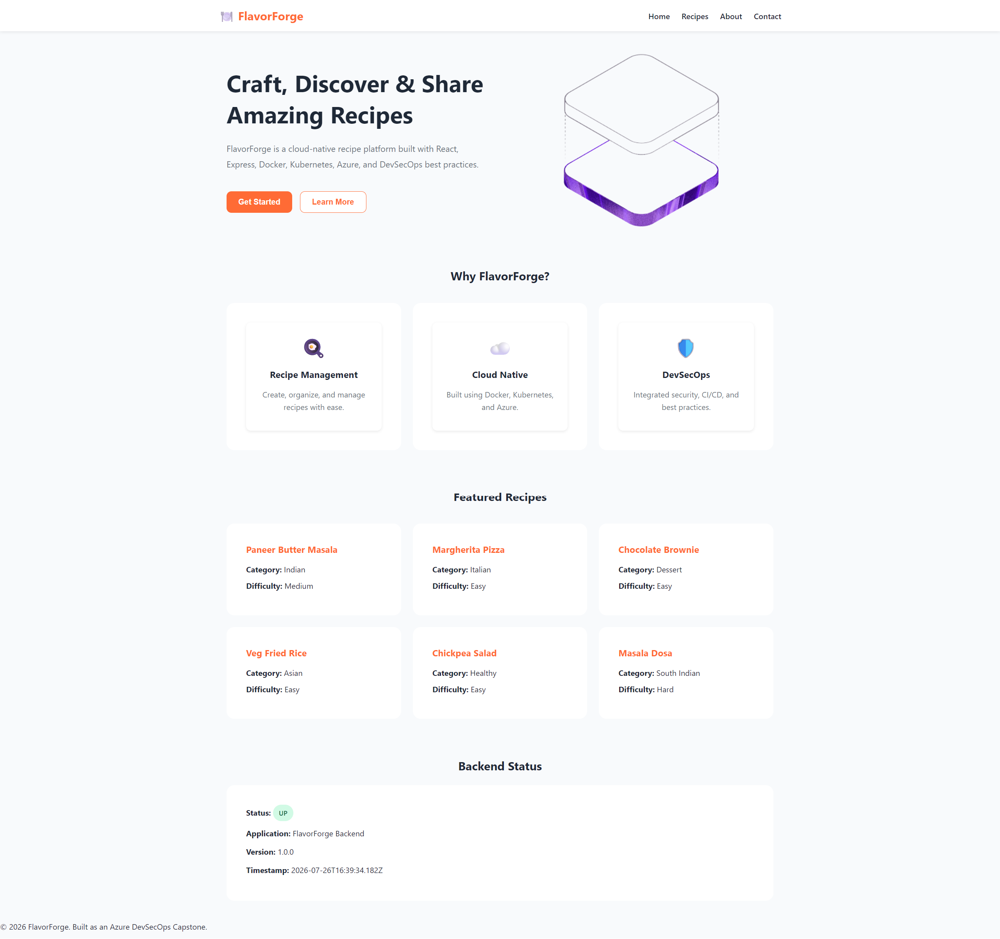

*Figure 6.1 – FlavorForge React frontend displaying the integrated recipe application.*

---

## ⚙️ Backend Layer

The backend is implemented using **Node.js** and **Express**, exposing REST APIs consumed by the frontend.

It manages application logic, health monitoring endpoints, and API services while maintaining a clean layered architecture.

### Responsibilities

- REST API endpoints
- Business logic
- Health monitoring
- Application services
- API responses

#### Technology Stack

- Node.js
- Express
- JavaScript

#### Evidence

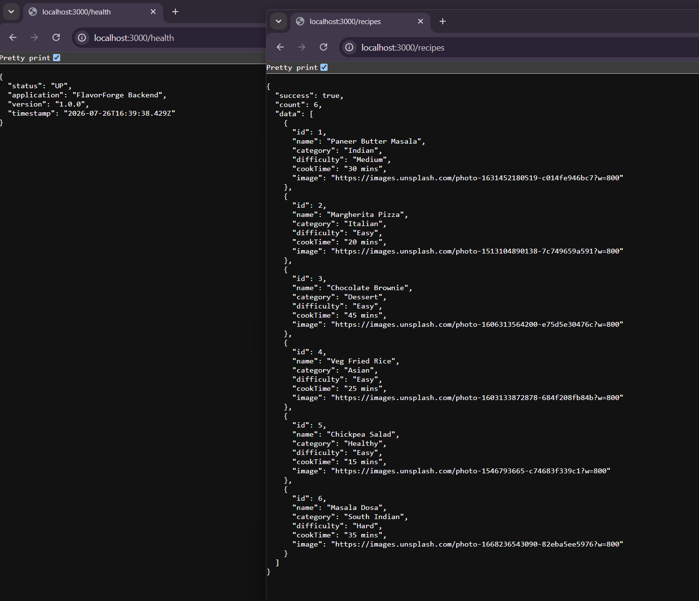

*Figure 6.2 – Backend REST API successfully serving application requests.*

---

The clear separation between the frontend and backend enables independent development, testing, deployment, and scaling while supporting cloud-native deployment on Azure Kubernetes Service.

---

# 🔄 DevSecOps Lifecycle

FlavorForge implements DevSecOps principles by integrating quality assurance, security, automation, and deployment practices throughout the software delivery lifecycle.

Rather than treating security and operations as separate activities, every stage contributes to delivering reliable, secure, and production-ready software.

The lifecycle implemented in this project is illustrated below.


Each phase has a clearly defined responsibility.

| DevSecOps Stage | FlavorForge Implementation |
|-----------------|----------------------------|
| **Plan** | Project planning, architecture design, and engineering documentation |
| **Code** | Application development using GitHub for source control |
| **Build** | Automated build process using Azure DevOps Pipelines |
| **Test** | Application validation and build verification |
| **Secure** | Code quality analysis with SonarCloud and container vulnerability scanning with Trivy |
| **Package** | Docker image creation and version management |
| **Deploy** | Azure Kubernetes Service (AKS) deployment using GitOps principles |
| **Operate** | Application lifecycle management using Kubernetes and ArgoCD |
| **Monitor** | Cluster and application monitoring through Azure Monitor |

By integrating automation into every stage, FlavorForge reduces manual effort, improves deployment consistency, and ensures quality and security checks are performed before application deployment.

#### Evidence


*Figure 7.1 – Successful execution of the DevSecOps pipeline demonstrating automated build, validation, and deployment stages.*

---

# 🛠️ Technology Stack

FlavorForge brings together modern open-source technologies and Microsoft Azure services to implement a secure, automated, and cloud-native DevSecOps platform.

Each technology has a well-defined responsibility within the software delivery lifecycle.

| Category | Technology | Purpose |
|----------|------------|---------|
| Frontend | React | Builds the responsive user interface |
| Backend | Node.js + Express | Provides REST API services |
| Database | SQLite | Stores application data |
| Source Control | GitHub | Version control and collaboration |
| CI/CD | Azure DevOps | Multi-stage build and deployment automation |
| Code Quality | SonarCloud | Static code quality analysis |
| Security | Trivy | Container vulnerability scanning |
| Containerization | Docker | Application packaging and portability |
| Container Registry | Azure Container Registry (ACR) | Secure private container image repository |
| Cloud Platform | Microsoft Azure | Cloud infrastructure hosting |
| Container Orchestration | Azure Kubernetes Service (AKS) | Kubernetes cluster management |
| GitOps | ArgoCD | Continuous deployment and desired state synchronization |
| Monitoring | Azure Monitor | Cluster and application monitoring |
| Documentation | Markdown + Mermaid | Technical documentation and architecture visualization |

Each component contributes to a production-inspired DevSecOps workflow, ensuring that application development, security validation, deployment automation, and operational monitoring work together as an integrated engineering platform.

#### Evidence


*Figure 8.1 – Azure Resource Group containing the primary cloud services supporting the FlavorForge platform.*

---

# 📂 Repository Structure

The repository is organized to separate application source code, infrastructure configuration, automation scripts, and engineering documentation into clearly defined directories.

This structure improves maintainability, collaboration, and scalability while following common enterprise repository practices.

```text
flavorforge-azure-devsecops-capstone
│
├── frontend/                 # React frontend application
├── backend/                  # Node.js & Express backend API
├── docker/                   # Docker-related resources
├── kubernetes/               # Kubernetes manifests and overlays
│   ├── base/
│   └── overlays/
├── argocd/                   # GitOps application definitions
├── scripts/                  # Automation and lifecycle scripts
├── docs/                     # Project documentation
├── screenshots/              # Evidence used throughout documentation
├── azure-pipelines.yml       # Azure DevOps CI/CD pipeline
├── argocd-pipeline.yml       # ArgoCD bootstrap pipeline
├── sonar-project.properties  # SonarCloud configuration
└── README.md
```

The repository structure separates application development from infrastructure, deployment automation, operational scripts, and documentation, making the project easier to understand, maintain, and extend.

#### Evidence

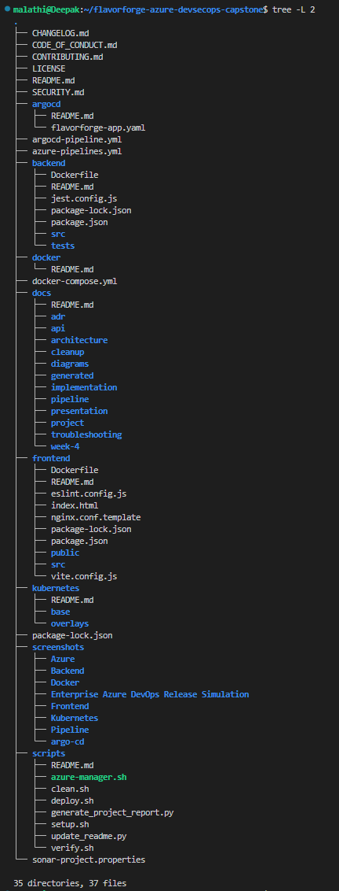

*Figure 8.2 – Project structure after successful frontend production build.*

---


# 📊 Automated Project Status

To keep the project documentation accurate and up to date, FlavorForge includes an automated documentation generation workflow powered by GitHub Actions.

Whenever changes are pushed to the repository, the workflow scans the project structure, detects implemented components, and automatically updates the project status section in this README.

This ensures that the documented implementation always reflects the current state of the repository.

<!-- AUTO_STATUS_START -->

# 📊 FlavorForge Automated Project Status

**Generated:** 2026-08-10 12:31:04

| Component | Status |
|-----------|--------|
| Frontend Application | ✅ Detected |
| Backend API | ✅ Detected |
| Docker Containerization | ✅ Detected |
| Azure Container Registry (ACR) | ✅ Detected |
| Azure DevOps Pipeline | ✅ Detected |
| Kubernetes Deployment | ✅ Detected |
| Ingress | ✅ Detected |
| Secrets | ✅ Detected |
| Horizontal Pod Autoscaler (HPA) | ✅ Detected |
| ArgoCD GitOps | ✅ Detected |
| SonarCloud Integration | ✅ Detected |
| Trivy Security Scan | ✅ Detected |
| Azure Monitor | ✅ Detected |
| Documentation | ✅ Detected |

<!-- AUTO_STATUS_END -->

## ✅ What the Documentation Generator Verifies

The GitHub Actions workflow automatically validates the presence of key project components, including:

- Frontend application
- Backend API
- Docker containerization
- Azure Container Registry (ACR)
- Azure DevOps pipeline
- Kubernetes manifests
- Ingress configuration
- Horizontal Pod Autoscaler (HPA)
- ArgoCD GitOps configuration
- SonarCloud integration
- Trivy security scanning
- Azure Monitor configuration
- Project documentation

## 🔄 Documentation Automation Workflow


This automation helps keep the project documentation synchronized with the implementation, reducing manual maintenance while providing an accurate overview of the platform's current capabilities.

---

# 📌 Current Implementation Status

FlavorForge has successfully implemented the core capabilities required for a production-inspired Azure DevSecOps platform.

| Component | Status |
|-----------|--------|
| Frontend Application | ✅ Completed |
| Backend REST API | ✅ Completed |
| Docker Containerization | ✅ Completed |
| Azure Container Registry (ACR) | ✅ Completed |
| Azure Kubernetes Service (AKS) | ✅ Completed |
| Azure DevOps Multi-Stage Pipeline | ✅ Completed |
| SonarCloud Integration | ✅ Completed |
| Trivy Security Scanning | ✅ Completed |
| ArgoCD GitOps | ✅ Completed |
| Azure Monitor Integration | ✅ Completed |
| Engineering Documentation | ✅ Completed |

The project now demonstrates an end-to-end DevSecOps implementation covering application development, automated validation, secure containerization, cloud deployment, GitOps-based delivery, and operational monitoring.

#### Evidence

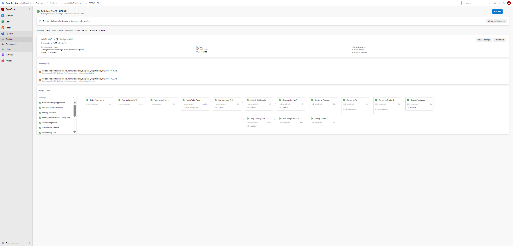

*Figure 8.3 – Successful Azure DevOps pipeline execution confirming the implemented DevSecOps workflow.*

---


# 🔐 DevSecOps Implementation Deep Dive

Developing an application is only the first step in modern software engineering.

Enterprise applications must also ensure that every software release is reliable, secure, repeatable, and observable. FlavorForge achieves this by integrating DevSecOps practices throughout the entire software delivery lifecycle.

The implementation combines automated quality validation, security scanning, containerization, cloud deployment, GitOps, and monitoring into a single engineering workflow.

---

# 🔄 Azure DevOps Multi-Stage Pipeline

The Azure DevOps pipeline automates the complete journey from source code to a deployable container image.

Each pipeline execution performs validation, quality analysis, security scanning, container image creation, and publishing without requiring manual intervention.

The workflow is illustrated below.


The automated pipeline provides:

- Continuous Integration (CI)
- Automated validation
- Code quality enforcement
- Security verification
- Standardized container image creation
- Consistent deployment artifacts

#### Evidence


*Figure 9.1 – Successful execution of the Azure DevOps multi-stage pipeline.*

---

# 🚦 Pipeline Stages

The FlavorForge CI pipeline is organized into multiple logical stages, ensuring that every code change passes quality and security validation before deployment.

## Stage 1 — Source Validation

The pipeline begins by retrieving the latest source code from GitHub.

### Activities

- Checkout source code
- Validate repository structure
- Prepare the build environment
- Restore project dependencies

### Objective

Ensure that only valid source code progresses through the pipeline.

---

## Stage 2 — Application Build

Application components are compiled and prepared for deployment.

### Activities

- Install frontend dependencies
- Install backend dependencies
- Build application artifacts
- Validate project structure

### Objective

Detect build failures before creating deployment artifacts.

---

## Stage 3 — Code Quality Analysis

Static code analysis is performed using SonarCloud.

The quality gate evaluates:

- Bugs
- Code smells
- Maintainability
- Technical debt
- Security hotspots

This early validation helps prevent low-quality code from progressing further into the delivery pipeline.

---

## Stage 4 — Container Security Scanning

After the application is successfully built, Docker images are scanned using Trivy.

Security validation includes:

- Operating system vulnerabilities
- Dependency vulnerabilities
- Known CVEs
- Security recommendations

Only validated images continue through the delivery workflow.

#### Evidence


*Figure 9.2 – Azure DevOps pipeline completing all validation stages successfully.*

---

# 🐳 Docker Containerization Strategy

FlavorForge uses Docker to package the frontend and backend into lightweight, portable, and reproducible containers.

Containerization eliminates environment-specific inconsistencies by ensuring the application behaves identically during local development, testing, and cloud deployment.

The implementation follows containerization best practices, including multi-stage builds, optimized images, and isolated application services.

### Container Architecture


### Key Benefits

- Consistent runtime across all environments
- Faster application deployment
- Simplified dependency management
- Improved portability
- Better scalability in Kubernetes
- Lightweight production-ready images

#### Evidence

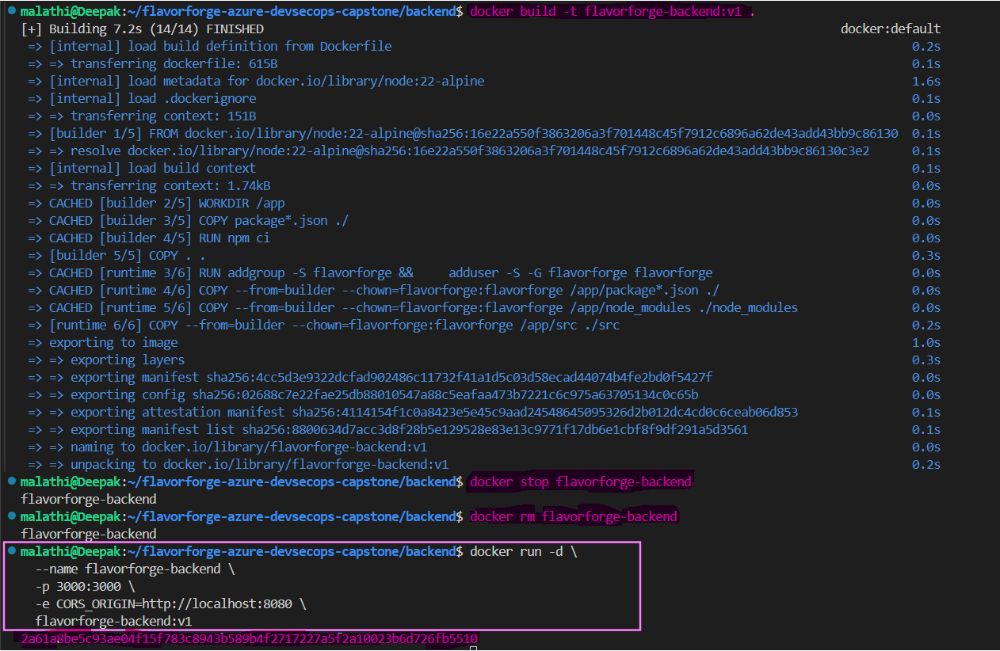

*Figure 10.1 – Frontend and backend containers running successfully using Docker.*

---

# 📦 Azure Container Registry (ACR) Integration

Once Docker images are successfully built and validated, they are pushed to Azure Container Registry (ACR), which serves as the project's private container image repository.

Azure Container Registry provides secure image storage, version management, and seamless integration with Azure Kubernetes Service.

### Image Publishing Workflow


### Azure Container Registry Responsibilities

- Secure image storage
- Image version management
- Private container repository
- Integration with AKS
- Reliable image distribution

#### Evidence

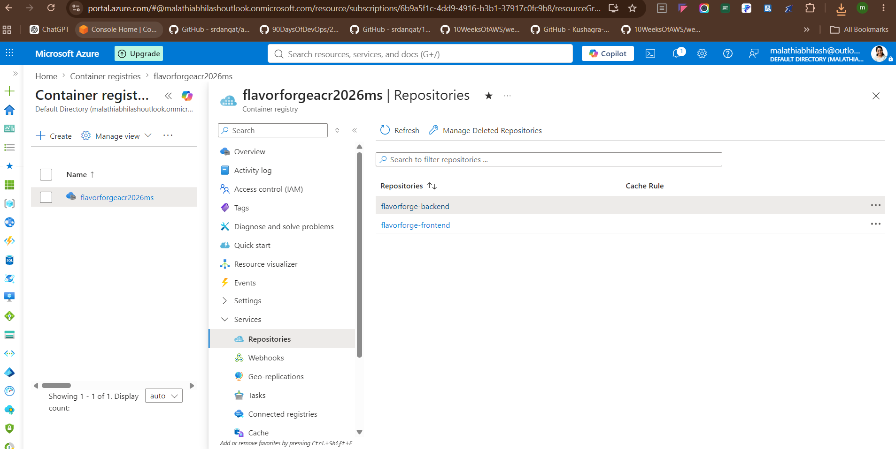

*Figure 10.2 – Container images successfully stored in Azure Container Registry.*

---

# 🔀 CI/CD and GitOps Responsibility Separation

FlavorForge separates Continuous Integration (CI) from Continuous Delivery (CD), following enterprise DevOps practices.

This separation allows the CI pipeline to focus on producing validated deployment artifacts, while GitOps manages application deployment and cluster synchronization.

## Continuous Integration (Azure DevOps)

Azure DevOps is responsible for:

- Building the application
- Running quality checks
- Performing security scanning
- Building Docker images
- Publishing images to Azure Container Registry


---

## Continuous Delivery (ArgoCD)

ArgoCD continuously monitors the Git repository and synchronizes Kubernetes resources with the desired application state.


### Benefits of This Architecture

- Clear separation of responsibilities
- Improved deployment traceability
- Git as the single source of truth
- Automated Kubernetes synchronization
- Simplified rollback and recovery

#### Evidence

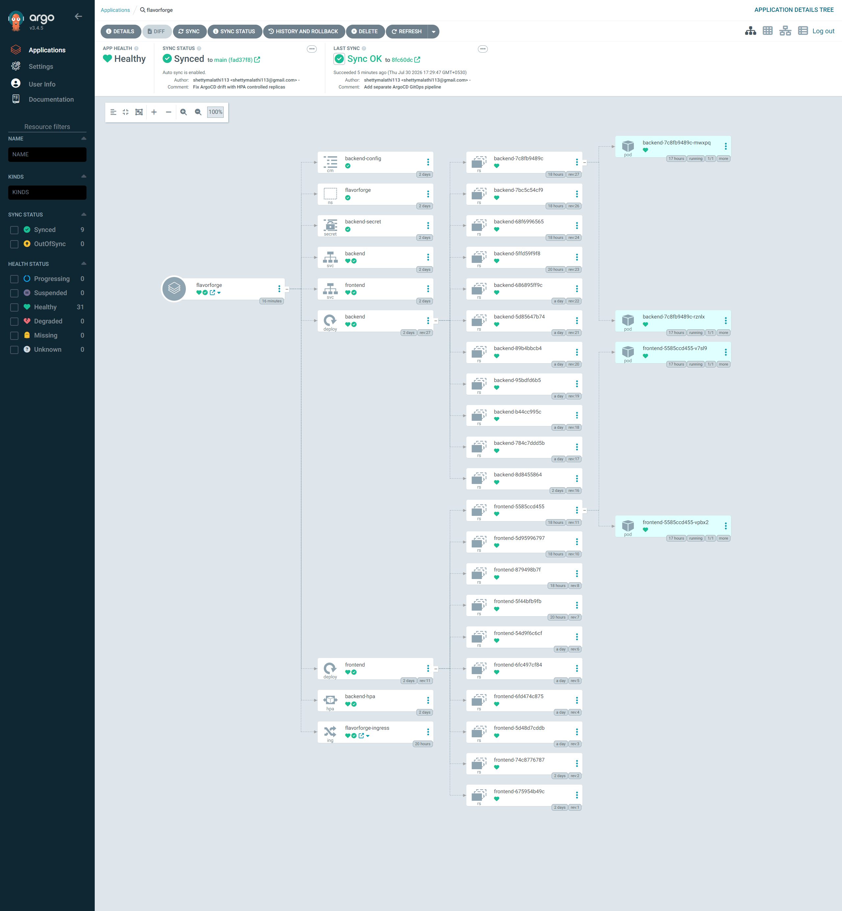

*Figure 10.3 – ArgoCD managing and synchronizing the FlavorForge Kubernetes application.*

---

# 🌱 GitOps Deployment Model

FlavorForge adopts GitOps to manage Kubernetes deployments declaratively.

Instead of deploying directly from the CI pipeline, Kubernetes continuously reconciles its running state with the configuration stored in Git.

## Traditional Deployment


---

## GitOps Deployment


The GitOps approach provides:

- Version-controlled infrastructure
- Automatic synchronization
- Drift detection
- Simplified rollback
- Declarative deployments
- Improved operational consistency

---

# 🔒 Security-First Engineering Approach

Security is integrated throughout the FlavorForge software delivery lifecycle rather than being treated as a final deployment activity.

Each release undergoes automated quality validation, vulnerability assessment, secure containerization, and controlled deployment before reaching the Kubernetes environment.

The security implementation consists of multiple complementary layers.

| Security Layer | Implementation |
|----------------|----------------|
| Source Code Quality | SonarCloud Static Code Analysis |
| Container Security | Trivy Vulnerability Scanning |
| Container Registry | Azure Container Registry (Private) |
| Deployment Platform | Azure Kubernetes Service (AKS) |
| Operational Monitoring | Azure Monitor |
| GitOps | ArgoCD Desired State Management |


By validating application quality and container security before deployment, FlavorForge follows a proactive DevSecOps approach that minimizes deployment risk and improves operational reliability.

#### Evidence


*Figure 11.1 – Azure DevOps pipeline successfully completing quality validation and security verification.*

---

# 📊 DevSecOps Maturity Journey

FlavorForge evolved through multiple implementation phases, with each phase introducing additional engineering capabilities.


The project demonstrates the progression from a standalone application to a production-inspired cloud-native DevSecOps platform.

---

# ☁️ Cloud Deployment & GitOps Operations

After successful validation and containerization, FlavorForge is deployed to Microsoft Azure using Azure Kubernetes Service (AKS) and managed through a GitOps workflow powered by ArgoCD.

This deployment model separates application delivery from deployment management while ensuring Kubernetes always reflects the desired state stored in Git.

---

# ☁️ Azure Cloud Architecture

FlavorForge uses Microsoft Azure services to provide secure, scalable, and production-inspired infrastructure.

The primary Azure services used in this project are:

| Azure Service | Purpose |
|--------------|---------|
| Azure Resource Group | Groups and manages cloud resources |
| Azure Container Registry | Stores private Docker images |
| Azure Kubernetes Service | Hosts Kubernetes workloads |
| Azure Monitor | Collects logs, metrics, and operational insights |


#### Evidence


*Figure 11.2 – Azure Resource Group containing the cloud infrastructure supporting the FlavorForge platform.*

---

# ☸️ Azure Kubernetes Service (AKS)

Azure Kubernetes Service (AKS) provides the managed Kubernetes environment where FlavorForge workloads are deployed and operated.

AKS manages:

- Container scheduling
- Application availability
- Replica management
- Service discovery
- Rolling updates
- Cluster orchestration

The platform hosts both frontend and backend workloads while integrating with Azure Container Registry, ArgoCD, and Azure Monitor.

#### Evidence

.png)

*Figure 11.3 – Azure Kubernetes Service displaying the deployed frontend and backend workloads, ReplicaSets, and running Pods.*

---

# 🧱 Kubernetes Deployment Architecture

FlavorForge organizes Kubernetes resources using a structured, reusable, and environment-specific directory layout based on Kustomize.

This approach separates common Kubernetes manifests from environment-specific customizations, making deployments easier to maintain across Development, QA, and Production environments.

The repository organization is illustrated below.


This structure promotes configuration reuse while allowing each deployment environment to maintain its own customized settings.

#### Evidence

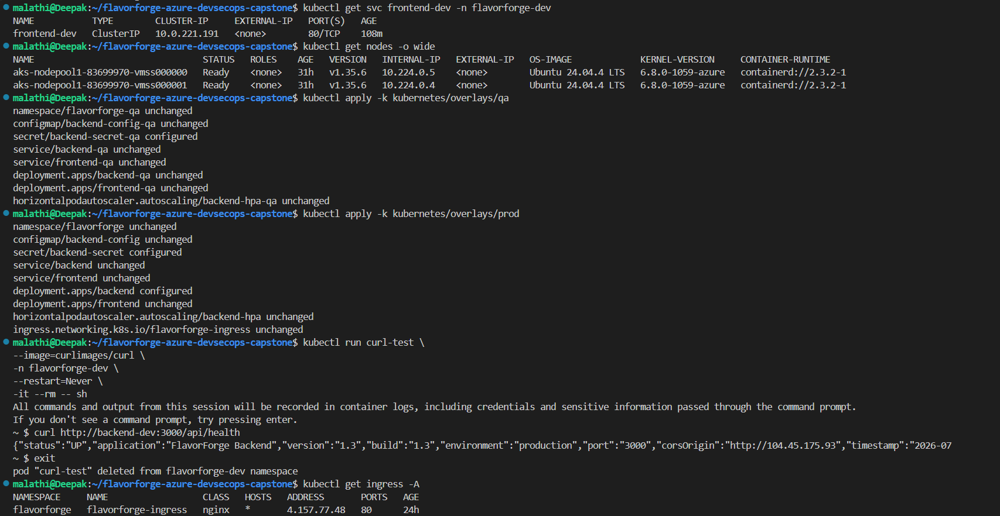

*Figure 12.1 – Kustomize base and overlay structure used to manage multiple deployment environments.*

---

# 🔧 Kubernetes Components

FlavorForge uses multiple Kubernetes resources to deliver a resilient and production-inspired application platform.

## Deployments

Deployments manage application Pods, ReplicaSets, rolling updates, and self-healing.

Responsibilities include:

- Maintaining desired replica count
- Performing rolling updates
- Recovering failed Pods automatically


#### Evidence

.png)

*Figure 12.2 – AKS Deployments managing frontend and backend application Pods.*

---

## Services

Kubernetes Services provide stable networking between frontend and backend workloads.

They enable service discovery while abstracting Pod IP addresses.


#### Evidence


*Figure 12.3 – Kubernetes Services and Ingress resources exposing the FlavorForge application.*

---

## ConfigMaps

ConfigMaps store non-sensitive application configuration outside container images.

Examples include:

- Environment configuration
- Application settings
- Runtime configuration

#### Evidence

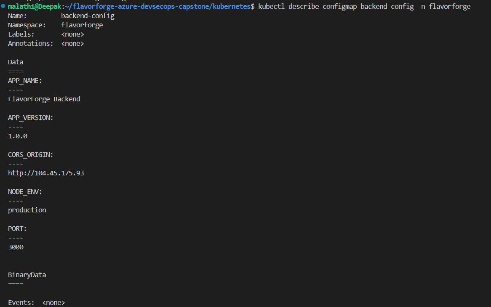

*Figure 12.4 – Kubernetes ConfigMap used to manage application configuration.*

---

## Secrets

Sensitive values are managed using Kubernetes Secrets instead of embedding them inside application code or container images.

For this demonstration project, only placeholder values are stored in Git. Production environments should integrate external secret management solutions such as Azure Key Vault.

Examples include:

- API credentials
- Passwords
- Access tokens

#### Evidence

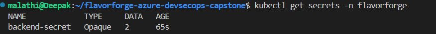

*Figure 12.5 – Kubernetes Secrets securely managing sensitive application configuration.*

---

## Horizontal Pod Autoscaler (HPA)

FlavorForge implements Horizontal Pod Autoscaling (HPA) to automatically adjust the number of running Pods based on workload demand.

Benefits include:

- Automatic scaling
- Improved application availability
- Better resource utilization
- Enhanced fault tolerance


#### Evidence

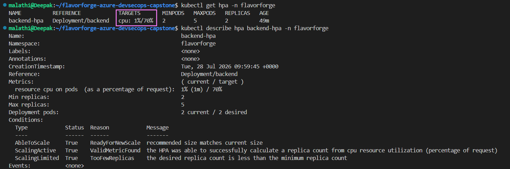

*Figure 12.6 – Horizontal Pod Autoscaler configured to scale application workloads automatically.*

---

# 🌍 Application Exposure with Ingress

FlavorForge uses Kubernetes Ingress to provide a single entry point for external traffic while routing requests to the appropriate backend services.

Instead of exposing every service individually, Ingress centralizes traffic management, simplifies routing, and provides a cleaner architecture for cloud-native applications.

The request flow is illustrated below.


Ingress provides the following benefits:

- Centralized traffic routing
- Simplified external access
- Reduced service exposure
- Scalable application architecture
- Better maintainability

#### Evidence


*Figure 13.1 – Kubernetes Services and Ingress routing external traffic to the FlavorForge application.*

---

# 🔄 Kustomize Environment Management

FlavorForge uses **Kustomize** to manage multiple deployment environments while maintaining a single reusable Kubernetes codebase.

Common resources are stored in the **base** directory, while environment-specific customizations are maintained as overlays.


Environment organization:

```text
base/
overlays/dev/
overlays/qa/
overlays/prod/
```

Benefits include:

- No duplicated YAML files
- Consistent deployments
- Environment-specific customization
- Simplified maintenance
- Better scalability

#### Evidence


*Figure 13.2 – Base and overlay structure used for Development, QA, and Production environments.*

---

# 🚀 GitOps with ArgoCD

FlavorForge adopts GitOps using ArgoCD to automate Kubernetes deployments.

Instead of applying manifests directly from the CI pipeline, ArgoCD continuously monitors the Git repository and synchronizes the Kubernetes cluster with the declared desired state.

## Traditional Deployment


---

## GitOps Deployment


The GitOps approach provides:

- Declarative deployments
- Continuous synchronization
- Configuration drift detection
- Simplified rollback
- Improved deployment traceability
- Git as the single source of truth

#### Evidence


*Figure 13.3 – ArgoCD managing and synchronizing the FlavorForge application deployed on AKS.*

---

# 🧭 GitOps Deployment Workflow

The deployment workflow implemented in FlavorForge follows a fully automated GitOps model.


This workflow separates application delivery from deployment management while ensuring every Kubernetes change remains version-controlled and auditable.

---

# 📊 Monitoring & Operations

Deploying an application is only part of operating a cloud-native platform.

FlavorForge incorporates monitoring and operational visibility to help engineers observe application health, troubleshoot issues, and verify that workloads continue to operate as expected.

The monitoring strategy combines Kubernetes health information with Azure platform monitoring.


Operational monitoring provides visibility into:

- Cluster health
- Pod availability
- Service status
- Deployment health
- Load Balancer status
- Application availability

#### Evidence

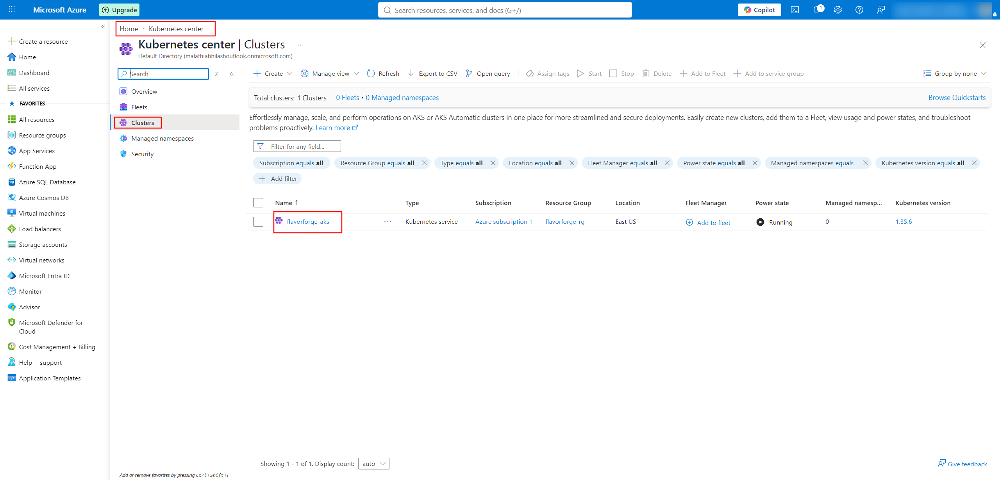

*Figure 14.1 – Azure Kubernetes Service dashboard providing operational visibility into the FlavorForge cluster.*

---

# 🩺 Deployment Verification

After deployment, the application was verified at multiple layers to ensure that every component functioned correctly.

| Verification | Status |
|--------------|--------|
| Frontend Application | ✅ Verified |
| Backend REST API | ✅ Verified |
| Docker Images | ✅ Verified |
| Azure Container Registry | ✅ Verified |
| Kubernetes Deployments | ✅ Verified |
| Services | ✅ Verified |
| Ingress | ✅ Verified |
| ArgoCD Synchronization | ✅ Verified |

Deployment verification confirms that the application is healthy and accessible through the Kubernetes platform.

#### Evidence

.png)

*Figure 14.2 – Running frontend and backend workloads successfully verified within Azure Kubernetes Service.*

---

# 💻 Local Development Setup

Developers can run FlavorForge locally for development, testing, or troubleshooting before deploying to Azure.

## Prerequisites

Ensure the following tools are installed:

- Git
- Node.js (v20 or later)
- npm
- Docker Desktop

Verify the installations:

```bash
git --version
node --version
npm --version
docker --version
```

### Evidence

#### Node.js Installation 
 

#### npm Project Setup 
 


---

## Clone the Repository

```bash
git clone https://github.com/shettymalathib/flavorforge-azure-devsecops-capstone.git

cd flavorforge-azure-devsecops-capstone
```

---

## Install Dependencies

Frontend

```bash
cd frontend
npm install
```

Backend

```bash
cd backend
npm install
```

---

## Run the Application

Frontend

```bash
npm run dev
```

Backend

```bash
npm run dev
```

The application will be available locally for development and testing.

### Evidence


#### Frontend Running 


#### Backend Running 


---

# 🐳 Running with Docker Local Execution

FlavorForge can also be executed locally using Docker to ensure a consistent runtime environment.

## Build Images

```bash
docker build -t flavorforge-frontend ./frontend

docker build -t flavorforge-backend ./backend
```

## Run Containers

```bash
docker run -d -p 3000:3000 flavorforge-backend

docker run -d -p 5173:80 flavorforge-frontend
```

Or use Docker Compose:

```bash
docker compose up --build -d
```

### Evidence


#### Docker Build


#### Docker Images 


#### Running Containers 


#### Docker Compose 


---

# 🔍 Deployment Verification & Troubleshooting

After deployment, verify that the application is healthy.

## Verify Kubernetes Resources

```bash
kubectl get pods

kubectl get svc

kubectl get ingress

kubectl get deployments
```

## View Pod Logs

```bash
kubectl logs <pod-name>
```

## Describe a Pod

```bash
kubectl describe pod <pod-name>
```

## Verify ArgoCD

```bash
argocd app list

argocd app get flavorforge-app
```

Expected:

```text
Health : Healthy

Sync Status : Synced
```

### Evidence

#### kubectl get all 


#### Ingress 


#### ArgoCD 


---

# 🧹 Cleanup & Azure Cost Management

Cloud resources continue to incur charges while running. After completing testing or demonstrations, clean up unused resources to reduce Azure costs.

## Recommended Practices

- Stop AKS clusters when not in use
- Delete unused Resource Groups
- Remove unused container images from ACR
- Monitor Azure spending regularly
- Use development-sized resources where appropriate

## Automation Scripts

FlavorForge includes helper scripts for common lifecycle tasks.

```text
scripts/
├── setup.sh
├── deploy.sh
├── verify.sh
└── clean.sh
```

The cleanup script can be executed using:

```bash
./scripts/clean.sh
```

### Evidence

#### Resource Group 


#### Azure Resources 


---

# 📖 Documentation

Comprehensive documentation is maintained alongside the application to support development, deployment, operations, troubleshooting, and project demonstrations.

The documentation covers:

- Project setup
- Backend implementation
- Frontend implementation
- Docker containerization
- Kubernetes deployment
- Azure infrastructure
- Azure DevOps pipelines
- Security implementation
- GitOps with ArgoCD
- Monitoring
- Troubleshooting
- Demo preparation
- Operational runbooks

Keeping documentation close to the source code improves maintainability, knowledge sharing, and project reproducibility.

#### Evidence

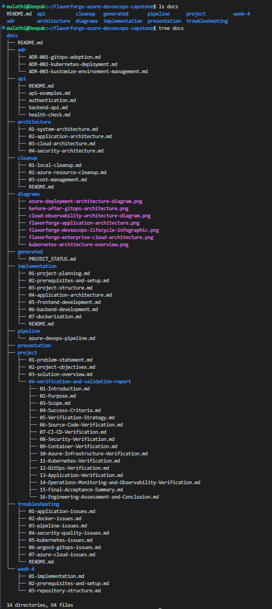

*Figure 14.3 – Repository documentation structure supporting the complete FlavorForge implementation.*

---


# 🧪 Verification Checklist

The following components were successfully implemented and verified during the project lifecycle.

| Component | Verification |
|-----------|:-----------:|
| React Frontend | ✅ |
| Node.js Backend | ✅ |
| Docker Images | ✅ |
| Azure Container Registry | ✅ |
| Azure Kubernetes Service | ✅ |
| Kubernetes Services | ✅ |
| Ingress | ✅ |
| Azure DevOps Pipeline | ✅ |
| SonarCloud Analysis | ✅ |
| Trivy Security Scan | ✅ |
| ArgoCD GitOps | ✅ |
| Azure Monitor | ✅ |
| Engineering Documentation | ✅ |

This verification demonstrates that the project successfully delivers a complete production-inspired Azure DevSecOps implementation.

---

# 🚀 Future Enhancements

Although FlavorForge demonstrates a complete production-inspired Azure DevSecOps platform, several enhancements could further extend its enterprise capabilities.

## 🚀 Progressive Delivery

- Implement Blue-Green deployment strategies
- Introduce Canary deployments for controlled releases
- Configure automated rollback mechanisms using Argo Rollouts

---

## 🔐 Enhanced Security

- Integrate Azure Key Vault for secure secrets management
- Enable policy enforcement using Open Policy Agent (OPA) or Azure Policy
- Strengthen Kubernetes security with Network Policies and Pod Security Standards

---

## 📊 Advanced Observability

- Add Prometheus for metrics collection
- Build Grafana dashboards for visualization
- Implement centralized logging using Loki or the ELK Stack

---

## ☁️ Infrastructure & Operations

- Add automated performance and load testing
- Implement automated backup and disaster recovery strategies
- Expand multi-environment release governance with approval workflows
- Provision and manage Azure infrastructure using Terraform

---

These enhancements would further improve the platform's security, scalability, resilience, observability, and operational maturity while aligning with modern cloud-native and DevSecOps engineering best practices.

---

# 🎬 Demo Walkthrough

The project can be demonstrated using the following sequence:

1. Present the project architecture and repository structure.
2. Review the Azure infrastructure supporting the application.
3. Trigger the Azure DevOps multi-stage pipeline.
4. Demonstrate successful pipeline execution.
5. Verify Docker images in Azure Container Registry.
6. Review workloads running in Azure Kubernetes Service.
7. Demonstrate ArgoCD synchronization.
8. Access the application through the Ingress endpoint.
9. Verify backend health endpoints.
10. Review Azure Monitor for operational visibility.

#### Evidence


*Figure 15.1 – Successful Azure DevOps pipeline execution used during the project demonstration.*

---

# 📚 Key Learning Outcomes

This capstone project provided practical experience across the complete DevSecOps lifecycle.

Key areas of learning include:

- Designing and developing a full-stack application
- Containerizing applications using Docker
- Managing container images with Azure Container Registry
- Deploying workloads to Azure Kubernetes Service
- Building automated Azure DevOps multi-stage pipelines
- Integrating SonarCloud for code quality analysis
- Performing container vulnerability scanning with Trivy
- Implementing GitOps using ArgoCD
- Managing Kubernetes resources with Kustomize
- Monitoring cloud-native workloads using Azure Monitor
- Creating enterprise-grade engineering documentation

The project demonstrates how modern software engineering combines development, security, automation, cloud infrastructure, and operations into a unified DevSecOps workflow.

---

# 📚 Documentation Index

The FlavorForge documentation is organized to support the complete journey from local development to cloud deployment, GitOps operations, verification, troubleshooting, and project demonstration.

## 🚀 Getting Started

| #  | Documentation                                         | Purpose                                                    |
| -- | ----------------------------------------------------- | ---------------------------------------------------------- |
| 01 | [Documentation Home](docs/README.md)                  | Central index for all project documentation                |
| 02 | [Implementation Guide](docs/implementation/README.md) | Complete implementation walkthrough                        |
| 03 | [Build Journey](docs/BUILD-JOURNEY/BUILD-JOURNEY.md)  | Development journey from application to DevSecOps platform |

## 🏗️ Application & Containerization

| #  | Documentation                  | Purpose                                         |
| -- | ------------------------------ | ----------------------------------------------- |
| 04 | [Frontend](frontend/README.md) | React frontend architecture and development     |
| 05 | [Backend](backend/README.md)   | Node.js and Express API documentation           |
| 06 | [Docker](docker/README.md)     | Dockerfiles, image builds, and containerization |

## ☁️ Azure & CI/CD

| #  | Documentation                                    | Purpose                                             |
| -- | ------------------------------------------------ | --------------------------------------------------- |
| 07 | [Azure DevOps Pipeline](docs/pipeline/README.md) | CI/CD pipeline stages, configuration, and execution |
| 08 | [Kubernetes](kubernetes/README.md)               | Kubernetes manifests and Kustomize environments     |
| 09 | [Argo CD GitOps](argocd/README.md)               | GitOps deployment and synchronization               |
| 10 | [Azure Architecture](docs/architecture/)         | Cloud and application architecture documentation    |

## 🔍 Verification & Operations

| #  | Documentation                                                               | Purpose                                             |
| -- | --------------------------------------------------------------------------- | --------------------------------------------------- |
| 11 | [Verification Reports](docs/project/04-verification-and-validation-report/) | Deployment and implementation verification evidence |
| 12 | [API Documentation](docs/api/README.md)                                     | Backend API reference and health endpoints          |
| 13 | [Troubleshooting Guide](docs/troubleshooting/README.md)                     | Common problems and resolution procedures           |
| 14 | [Cleanup & Cost Management](docs/cleanup/README.md)                         | Azure resource cleanup and cost-control guidance    |

## 🏛️ Engineering Governance

| #  | Documentation                              | Purpose                                               |
| -- | ------------------------------------------ | ----------------------------------------------------- |
| 15 | [Architecture Decision Records](docs/adr/) | Important architectural decisions and their rationale |
| 16 | [Security Policy](SECURITY.md)             | Security practices and vulnerability reporting        |
| 17 | [License](LICENSE)                         | MIT License                                           |

## 🎬 Demo & Presentation

| #  | Documentation        | Purpose                                               |
| -- | -------------------- | ----------------------------------------------------- |
| 18 | Demo Day Guide       | End-to-end project demonstration flow                 |
| 19 | Presentation Guide   | Presentation structure and speaker guidance           |
| 20 | Demo Startup Runbook | Steps required before starting the live demonstration |

> **Recommended reading order:**
> **Documentation Home → Implementation Guide → Build Journey → Pipeline → Kubernetes → Argo CD → Verification → Troubleshooting → Demo Guide**

---

# 📚 Documentation

The complete project documentation is organized by topic for easier navigation.

| Documentation | Description |
|---------------|-------------|
| 📖 [Documentation Home](docs/README.md) | Central documentation index |
| 🏗️ [Implementation Guide](docs/implementation/README.md) | Complete implementation walkthrough |
| 🚀 [Azure DevOps Pipeline](docs/pipeline/README.md) | Azure DevOps setup and CI/CD pipeline documentation |
| ☸️ [Kubernetes](kubernetes/README.md) | Kubernetes manifests, Kustomize overlays, and deployment |
| 🔄 [Argo CD GitOps](argocd/README.md) | GitOps deployment and synchronization |
| 🐳 [Docker](docker/README.md) | Docker build and containerization |
| 🌐 [Backend](backend/README.md) | Backend application documentation |
| 🎨 [Frontend](frontend/README.md) | Frontend application documentation |
| 🛠️ [Scripts](scripts/README.md) | Automation and helper scripts |
| 📊 [Verification Reports](docs/project/04-verification-and-validation-report/) | Project verification documents |
| 🔍 [Troubleshooting](docs/troubleshooting/README.md) | Common issues and solutions |
| 🧹 [Cleanup Guide](docs/cleanup/README.md) | Azure cleanup and cost management |
| 📖 [API Documentation](docs/api/README.md) | Backend API reference |
| 🏛️ [Architecture](docs/architecture/) | Architecture documentation |
| 📑 [Architecture Decisions (ADR)](docs/adr/) | Design decision records |
| 📝 [Build Journey](docs/BUILD-JOURNEY/BUILD-JOURNEY.md) | Complete project development journey |

---

# 🔐 Security

Security practices, vulnerability reporting, and secret management guidelines are documented in:

[SECURITY.md](SECURITY.md)

---

# 📄 License

This project is licensed under the **MIT License**.

See the [LICENSE](LICENSE) file for complete license details.

---

# 🙏 Acknowledgements

This project was completed as part of the **CareerByteCode (CBC) DevSecOps Internship** and reflects the practical application of cloud-native development, DevSecOps automation, Kubernetes orchestration, GitOps, and Microsoft Azure services.

Special thanks to the CBC mentors and the DevOps community for providing valuable learning resources, guidance, and best practices throughout the project.

---

# 👩‍💻 Author

**Malathi Shetty**

Senior Software Test Engineer transitioning into DevSecOps and Cloud Engineering.

### Connect

- GitHub: [bymalathi](https://github.com/bymalathi)
- LinkedIn: [Malathi Shetty](https://www.linkedin.com/in/bymalathi/)

---

> **FlavorForge demonstrates how a simple full-stack application can be transformed into a production-inspired Azure DevSecOps platform through automation, security, cloud-native infrastructure, GitOps, and operational excellence.**


