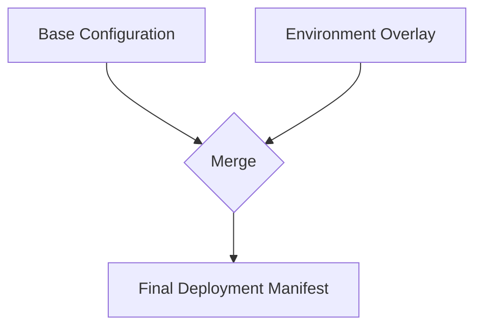
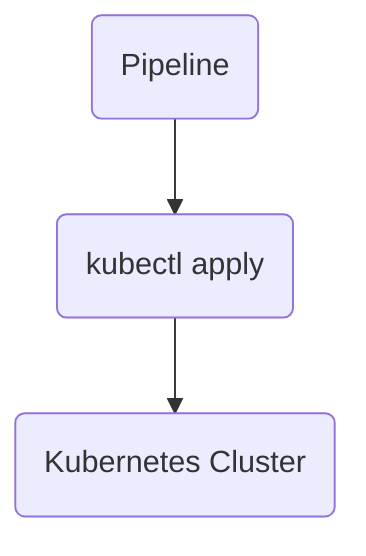
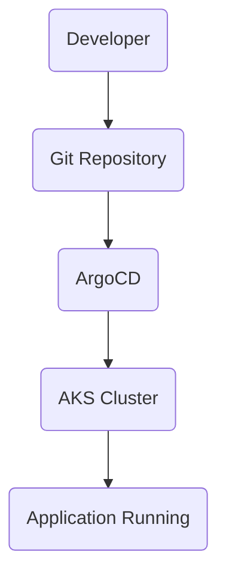
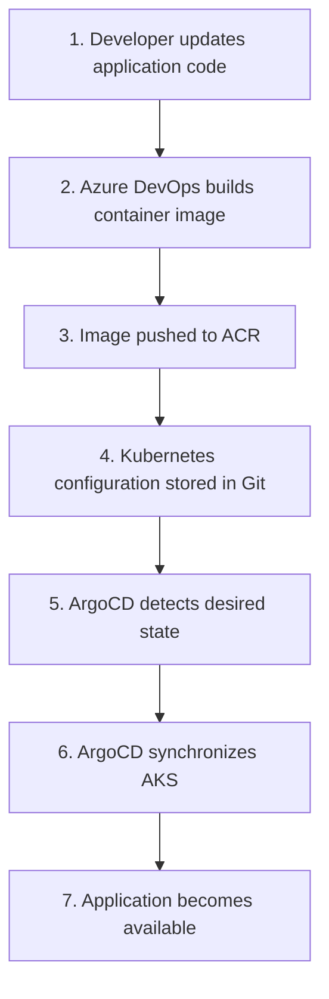
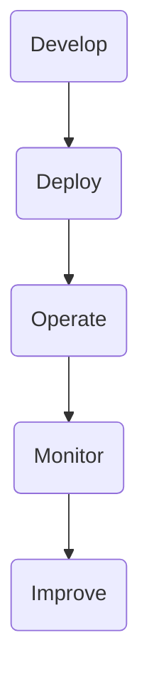
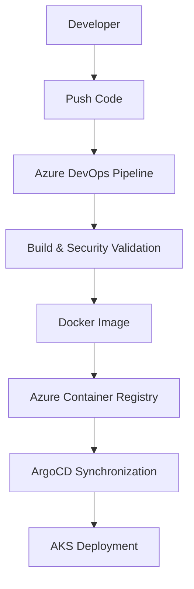
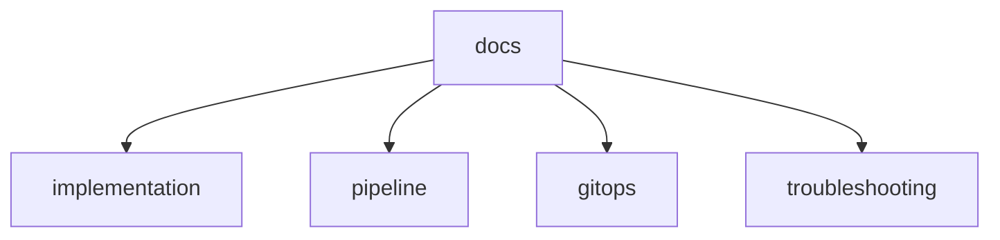
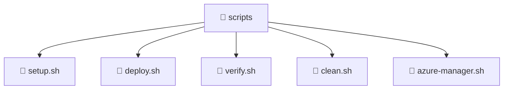
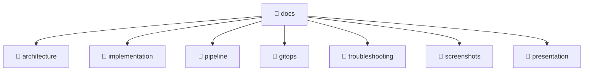
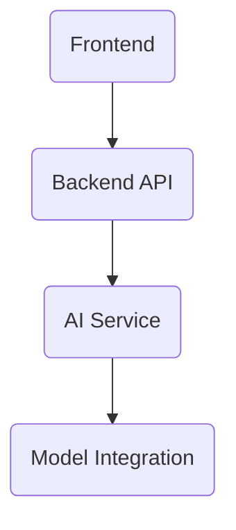

# 🍽️ FlavorForge
## From Recipe Ideas to a Production-Ready Cloud Platform


---

> 🍴 **Great recipes need the right ingredients.**  
> 🚀 **Great software needs the right engineering practices.**

---

# 👨‍🍳 The FlavorForge Story

FlavorForge started as a simple recipe-sharing application.

The idea was straightforward:

Create a platform where users can explore recipes through a modern web experience.

But the real engineering challenge was bigger:

**How do we transform a simple application into a production-style cloud platform that can be built, secured, deployed, monitored, and operated using modern DevOps practices?**

This project represents that transformation journey.

From the first Git commit to a running application on Azure Kubernetes Service (AKS), FlavorForge demonstrates how modern engineering teams deliver software:

```

Code → Quality → Security → Container → Cloud → Kubernetes → GitOps → Monitoring

```

The application is the product.

The DevSecOps platform behind it is the engineering story.

---

# 🍴 Meet FlavorForge

FlavorForge is a full-stack recipe-sharing platform built as an **Azure DevSecOps Capstone Project**.

The application consists of:

- A React-based frontend experience
- A Node.js and Express backend API
- Containerized application services
- Kubernetes-based deployment
- Cloud-native delivery practices

However, the main focus of this project is not only building an application.

It is demonstrating the complete software delivery lifecycle used by modern DevOps teams.

---

# 🎯 Project Overview

In real-world software engineering, writing application code is only one part of the journey.

Teams must also solve important challenges:

- How can developers release changes safely?
- How can security issues be detected before production?
- How can deployments remain consistent across environments?
- How can applications recover from failures?
- How can teams monitor application health?

FlavorForge addresses these challenges by implementing an enterprise-inspired DevSecOps workflow.

The project demonstrates:

✅ Automated CI/CD delivery  
✅ Containerized application deployment  
✅ Security integrated into the development lifecycle  
✅ Kubernetes orchestration  
✅ GitOps-based continuous delivery  
✅ Cloud monitoring and operational practices  

---

# 🧩 The Engineering Challenge

A traditional application deployment flow may look like:

```

Developer writes code
|
↓
Manual build
|
↓
Manual deployment
|
↓
Application running

```

While this works for small projects, production systems require stronger engineering practices.

FlavorForge follows a modern approach:

```

Developer
|
↓
GitHub Repository
|
↓
Automated Pipeline
|
↓
Quality Validation
|
↓
Security Scanning
|
↓
Container Image
|
↓
Cloud Deployment
|
↓
GitOps Management
|
↓
Monitoring

```

Every stage adds reliability, security, and operational confidence.

---

# ⭐ What Makes FlavorForge Different?

Many projects demonstrate individual DevOps tools.

FlavorForge focuses on connecting the complete engineering lifecycle.

Instead of only deploying an application, this project demonstrates:

| Engineering Practice | Implementation |
|---|---|
| Source Control | GitHub |
| CI/CD Automation | Azure DevOps Pipelines |
| Code Quality | SonarCloud |
| Security Scanning | Trivy |
| Containerization | Docker |
| Container Registry | Azure Container Registry |
| Cloud Platform | Azure Kubernetes Service |
| Continuous Delivery | ArgoCD GitOps |
| Monitoring | Azure Monitor |

The goal is not simply:

> "The application is running."

The goal is:

> "The application can be delivered, secured, operated, and improved continuously."

---

# 🔄 The FlavorForge Transformation Journey

## Phase 1 — Application Foundation

A full-stack recipe application was designed with frontend and backend services.

↓

## Phase 2 — Container Transformation

Application components were packaged into Docker containers to create portable deployment units.

↓

## Phase 3 — Cloud Deployment

The application was deployed to Azure Kubernetes Service (AKS) using Kubernetes best practices.

↓

## Phase 4 — DevSecOps Integration

Automated quality and security validation were introduced into the delivery pipeline.

↓

## Phase 5 — GitOps Evolution

ArgoCD was introduced to manage Kubernetes deployments using Git as the source of truth.

↓

## Phase 6 — Operational Excellence

Monitoring, documentation, troubleshooting guides, and automation completed the engineering lifecycle.

---

# 🏗️ Architecture Foundation

FlavorForge follows a cloud-native architecture designed around modern DevOps principles.

The platform separates application development, delivery automation, deployment management, and operational monitoring into independent but connected layers.

The complete journey looks like:

```

Developer
|
| Code Commit
↓
GitHub Repository
|
↓
Azure DevOps Multi-Stage Pipeline
|
|----------------------|
|                      |
↓                      ↓
SonarCloud              Trivy
Code Quality            Security Scan
|                      |
|----------------------|
|
↓
Docker Image Build
|
↓
Azure Container Registry (ACR)
|
↓
Azure Kubernetes Service (AKS)
|
↓
ArgoCD GitOps
|
↓
Kubernetes Workloads
|
↓
Azure Monitor

```

---

# 🚀 From Code Commit to Running Application

Every change follows a controlled delivery path.

## 1. Source Control

Developers push application changes to GitHub.

GitHub acts as the central collaboration platform and maintains application source code, Kubernetes manifests, and automation scripts.

```

Developer
↓
Git Push
↓
GitHub Repository

```

---

## 2. Continuous Integration Pipeline

Azure DevOps automatically validates every change through a multi-stage pipeline.

The pipeline performs:

- Application build
- Automated validation
- Code quality analysis
- Security scanning
- Docker image creation
- Image publishing

```

Commit
|
↓
Azure DevOps Pipeline
|
├── Build
|
├── SonarCloud Analysis
|
├── Trivy Security Scan
|
└── Docker Image Push

```

---

## 3. Container Registry

Docker images are stored securely in Azure Container Registry (ACR).

ACR provides:

- Private image storage
- Version-controlled images
- Secure integration with AKS

```

Docker Image
|
↓
Azure Container Registry

```

---

## 4. Kubernetes Deployment Platform

Azure Kubernetes Service (AKS) provides the production-style runtime environment.

Kubernetes manages:

- Application availability
- Container scheduling
- Scaling
- Service discovery
- Rolling updates

```

AKS Cluster

├── Frontend Pods
|
├── Backend Pods
|
├── Services
|
├── Configurations
|
└── Autoscaling

```

---

## 5. GitOps Continuous Delivery

After introducing ArgoCD, deployment responsibility moves from traditional push-based deployment to GitOps-based delivery.

Before GitOps:

```

Pipeline
|
↓
Direct Kubernetes Deployment

```

After GitOps:

```

Pipeline
|
↓
Container Image Update

Git Repository
|
↓
ArgoCD
|
↓
Kubernetes Cluster

```

Git becomes the single source of truth for the desired application state.

---

# 🧱 Application Architecture

FlavorForge follows a simple full-stack application architecture.

```

```
             User
              |
              ↓
      React Frontend
              |
              ↓
      Node.js API Layer
              |
              ↓
         Application Data
```

```

---

## Frontend Layer

Technology:

- React
- Vite
- Nginx container

Responsibilities:

- User interface
- Recipe presentation
- API communication
- Client-side interaction


---

## Backend Layer

Technology:

- Node.js
- Express

Responsibilities:

- REST API services
- Business logic
- Health endpoints
- Application services


---

# 🔄 DevSecOps Lifecycle

FlavorForge implements security and automation throughout the software lifecycle.

```

PLAN
|
↓
CODE
|
↓
BUILD
|
↓
TEST
|
↓
SECURE
|
↓
PACKAGE
|
↓
DEPLOY
|
↓
OPERATE

```

Mapping:

| Stage | Implementation |
|---|---|
| Plan | Architecture & Documentation |
| Code | GitHub Repository |
| Build | Azure DevOps Pipeline |
| Test | Application Validation |
| Secure | SonarCloud + Trivy |
| Package | Docker Containers |
| Deploy | AKS + Kubernetes |
| Operate | ArgoCD + Azure Monitor |

---

# 🛠️ Technology Stack

| Category | Technology | Purpose |
|---|---|---|
| Frontend | React | User interface |
| Backend | Node.js + Express | API services |
| Database | SQLite | Application data storage |
| Source Control | GitHub | Code management |
| CI/CD | Azure DevOps | Automated delivery pipeline |
| Code Quality | SonarCloud | Static code analysis |
| Security | Trivy | Container vulnerability scanning |
| Containerization | Docker | Application packaging |
| Registry | Azure Container Registry | Private image storage |
| Cloud Platform | Azure | Infrastructure hosting |
| Orchestration | AKS | Kubernetes management |
| Deployment Strategy | ArgoCD | GitOps continuous delivery |
| Monitoring | Azure Monitor | Application and cluster visibility |

---

# 📂 Repository Structure

The repository is organized to separate application code, infrastructure, automation, and engineering documentation.

```

flavorforge-azure-devsecops-capstone
│
├── frontend/              # React frontend application
│
├── backend/               # Node.js backend API
│
├── docker/                # Docker documentation
│
├── kubernetes/            # Kubernetes manifests
│   ├── base/
│   └── overlays/
│
├── argocd/                # GitOps application definitions
│
├── scripts/               # Automation and lifecycle scripts
│
├── docs/                  # Engineering documentation
│   ├── architecture/
│   ├── pipeline/
│   ├── gitops/
│   ├── troubleshooting/
│   └── screenshots/
│
├── azure-pipelines.yml    # Application CI/CD pipeline
│
├── argocd-pipeline.yml    # GitOps bootstrap pipeline
│
└── sonar-project.properties

```

---

# 📌 Current Implementation Status

| Component | Status |
|---|---|
| Frontend Application | ✅ Completed |
| Backend API | ✅ Completed |
| Docker Containers | ✅ Completed |
| Azure Container Registry | ✅ Completed |
| AKS Deployment | ✅ Completed |
| Azure DevOps Pipeline | ✅ Completed |
| SonarCloud Integration | ✅ Completed |
| Trivy Security Scan | ✅ Completed |
| ArgoCD GitOps | ✅ Completed |
| Azure Monitor | ✅ Completed |
| Documentation | 🔄 Finalizing |

---

# 🔐 DevSecOps Implementation Deep Dive

Building an application is only the beginning.

In production environments, software delivery requires more than compiling code and deploying containers.

A reliable engineering workflow must answer:

- Is the code quality acceptable?
- Are there security vulnerabilities?
- Is the application packaged consistently?
- Can deployments be repeated safely?
- Can failures be detected quickly?

FlavorForge implements a DevSecOps approach where quality, security, and automation are integrated throughout the delivery lifecycle.

---

# 🔄 Azure DevOps Multi-Stage Pipeline

The CI/CD pipeline is designed to automate the journey from source code to a deployable container image.

The pipeline follows this flow:

```

Developer Commit
|
↓
Azure DevOps Trigger
|
↓
Build & Validation
|
↓
Code Quality Analysis
|
↓
Security Scanning
|
↓
Docker Image Build
|
↓
Push Image to ACR
|
↓
GitOps Deployment Flow

```

---

# 🚦 Pipeline Stages

## Stage 1 — Source Validation

The pipeline begins when changes are pushed to GitHub.

Activities:

- Checkout source code
- Install dependencies
- Validate project structure

Purpose:

Ensure only valid changes continue through the delivery process.

---

## Stage 2 — Application Build & Testing

The application is prepared for deployment.

Activities:

- Install frontend dependencies
- Install backend dependencies
- Execute validation steps
- Generate build artifacts

Purpose:

Detect application issues before packaging.

---

## Stage 3 — Code Quality Gate with SonarCloud

Quality checks are integrated into the pipeline using SonarCloud.

SonarCloud analyzes:

- Code maintainability
- Code smells
- Bugs
- Security hotspots
- Technical debt

Pipeline principle:

```

Poor Quality Code
|
↓
Quality Gate Failure
|
↓
Deployment Blocked

```

This follows the DevSecOps practice of detecting issues early rather than after production deployment.

---

# 🛡️ Stage 4 — Container Security with Trivy

Security scanning is performed before publishing container images.

Trivy scans Docker images for:

- OS vulnerabilities
- Package vulnerabilities
- Known security issues

Flow:

```

Application Code

```
  ↓
```

Docker Image Created

```
  ↓
```

Trivy Security Scan

```
  ↓
```

Approved Image

```
  ↓
```

Azure Container Registry

```

Security becomes part of the delivery pipeline instead of a separate manual activity.

---

# 🐳 Docker Containerization Strategy

FlavorForge uses Docker to package application components into portable deployment units.

Containerization provides:

- Consistent environments
- Faster deployments
- Easier scaling
- Improved application portability

Architecture:

```

Frontend Container

React Application
|
↓
Nginx Runtime

Backend Container

Node.js Application
|
↓
Express API

```

---

# 📦 Azure Container Registry Integration

After successful validation, Docker images are pushed to Azure Container Registry.

ACR provides:

- Private container image storage
- Secure authentication
- Version management
- Integration with Azure services

Flow:

```

Docker Build

```
  ↓
```

Security Scan

```
  ↓
```

Docker Push

```
  ↓
```

Azure Container Registry

```

---

# 🔀 CI/CD and GitOps Responsibility Separation

One important design decision in FlavorForge is separating application delivery from deployment management.

## Continuous Integration Responsibility

Azure DevOps handles:

```

Code
|
↓
Build
|
↓
Test
|
↓
Security Scan
|
↓
Container Image

```

---

## Continuous Delivery Responsibility

ArgoCD handles:

```

Git Desired State

```
    ↓
```

ArgoCD Synchronization

```
    ↓
```

Kubernetes Deployment

```

---

This separation provides:

✅ Clear ownership  
✅ Safer deployments  
✅ Better auditability  
✅ Git-based deployment history  

---

# 🌱 GitOps Deployment Model

Traditional deployment:

```

Pipeline
|
↓
kubectl apply
|
↓
Kubernetes

```

GitOps deployment:

```

Developer

↓

Git Repository

↓

ArgoCD

↓

Kubernetes Cluster

```

With GitOps:

- Git becomes the source of truth
- Kubernetes state is version controlled
- Changes are traceable
- Rollbacks become easier

---

# 🔒 Security-First Engineering Approach

Security was considered throughout the application lifecycle.

| Security Layer | Implementation |
|---|---|
| Source Code Security | SonarCloud Analysis |
| Container Security | Trivy Scanning |
| Image Security | ACR Private Registry |
| Deployment Security | Kubernetes Controls |
| Operational Security | Azure Monitoring |

---

# 📊 DevSecOps Maturity Journey

FlavorForge evolved through multiple maturity levels:

```

Level 1
Manual Development

```
    ↓
```

Level 2
Containerized Application

```
    ↓
```

Level 3
Automated CI/CD

```
    ↓
```

Level 4
Security Integrated Pipeline

```
    ↓
```

Level 5
GitOps-Based Cloud Operations

```

The final implementation represents a production-inspired DevSecOps workflow.

```

---


# ☁️ Cloud Deployment & GitOps Operations

A modern application is not complete when the container image is created.

The real engineering challenge begins when the application must run reliably in a cloud environment.

FlavorForge uses Azure Kubernetes Service (AKS) as the production-style runtime platform and ArgoCD as the GitOps continuous delivery controller.

The deployment philosophy is:

> Build once, deploy consistently, and allow Git to control the desired state.

---

# ☁️ Azure Cloud Architecture

FlavorForge is deployed using Microsoft Azure cloud services.

The main Azure components are:

| Azure Service | Purpose |
|---|---|
| Azure Resource Group | Logical resource management |
| Azure Container Registry (ACR) | Private Docker image storage |
| Azure Kubernetes Service (AKS) | Kubernetes application platform |
| Azure Monitor | Application and cluster visibility |

High-level flow:

```

Application Code

```
    ↓
```

Docker Image

```
    ↓
```

Azure Container Registry

```
    ↓
```

Azure Kubernetes Service

```
    ↓
```

Running Application

```
    ↓
```

Azure Monitor

```

---

# ☸️ Azure Kubernetes Service (AKS)

AKS provides the managed Kubernetes environment where FlavorForge workloads run.

Kubernetes responsibilities include:

- Container scheduling
- Application availability
- Service discovery
- Scaling
- Rolling updates
- Desired state management

The AKS cluster acts as the foundation for running cloud-native workloads.

---

# 🧱 Kubernetes Deployment Architecture

FlavorForge Kubernetes resources are organized using a structured manifest approach.

Repository design:

```

kubernetes/

├── base/
│
│   ├── frontend/
│   ├── backend/
│   ├── services/
│   ├── config/
│   ├── autoscaling/
│   └── ingress/
│
└── overlays/

```
├── dev/
├── qa/
└── prod/
```

```

This follows the Kubernetes principle of separating reusable configurations from environment-specific changes.

---

# 🔧 Kubernetes Components

FlavorForge uses multiple Kubernetes resources:

## Deployments

Manage application replicas and rolling updates.

Example:

```

Frontend Deployment
|
↓
Frontend Pods

Backend Deployment
|
↓
Backend Pods

```

---

## Services

Provide stable networking between components.

Example:

```

User Request

```
 ↓
```

Frontend Service

```
 ↓
```

Frontend Pods

```
 ↓
```

Backend Service

```
 ↓
```

Backend Pods

```

---

## ConfigMaps

Used for non-sensitive configuration values.

Examples:

- Application settings
- Environment configuration

---

## Secrets

Used for sensitive information.

Examples:

- Credentials
- Tokens
- Private configuration values

---

## Horizontal Pod Autoscaler (HPA)

FlavorForge includes Kubernetes autoscaling capability.

Purpose:

- Handle increased traffic
- Maintain application availability
- Scale workloads automatically

Concept:

```

Low Traffic

Frontend Pods: 2

High Traffic

Frontend Pods: 5

```

---

# 🌍 Application Exposure with Ingress

To make the application accessible externally, Kubernetes Ingress provides routing.

Traffic flow:

```

User

↓

Ingress Controller

↓

Frontend Service

↓

Frontend Pods

Backend API Requests

↓

Backend Service

↓

Backend Pods

```

Ingress provides:

- Centralized routing
- External access management
- Cleaner service exposure

---

# 🔄 Kustomize Environment Management

FlavorForge uses Kustomize to manage different deployment environments.

Structure:



Example:

```

base/

Common Kubernetes configuration

overlays/dev/

Development-specific settings

overlays/qa/

QA-specific settings

overlays/prod/

Production-specific settings

```

Benefits:

✅ No duplicate YAML files  
✅ Environment consistency  
✅ Easier configuration management  

---

#  GitOps with ArgoCD

Before implementing GitOps:



This creates a direct deployment dependency.

---

After ArgoCD:



ArgoCD continuously monitors Git and ensures Kubernetes matches the declared desired state.

---

# 🧭 ArgoCD Deployment Workflow

The FlavorForge GitOps workflow:



---

# 🔍 Deployment Verification

After deployment, Kubernetes health can be verified using:

```bash
# Check cluster resources

kubectl get nodes


# Check namespaces

kubectl get namespaces


# Check running workloads

kubectl get pods -A


# Check services

kubectl get svc


# Check deployments

kubectl get deployments
````

---

# 🔍 ArgoCD Verification

ArgoCD application health can be checked using:

```bash
argocd app list

argocd app get flavorforge-app
```

Expected state:

```
Health: Healthy

Sync Status: Synced
```

This confirms:

✅ Git desired state matches Kubernetes state
✅ Application deployment is successful
✅ GitOps workflow is active

---

# 📊 Monitoring & Operations

Running applications require visibility.

FlavorForge integrates Azure Monitor capabilities to observe:

* Kubernetes cluster health
* Application workloads
* Container performance
* Operational events

Monitoring completes the lifecycle:



---

# 🏆 Cloud-Native Engineering Outcome

With AKS + Kubernetes + ArgoCD, FlavorForge demonstrates:

✅ Cloud-native deployment
✅ Container orchestration
✅ Environment management
✅ Git-controlled operations
✅ Production-inspired delivery practices

The application is no longer just deployed.

It is managed as a cloud-native platform.

```

---


# 📘 Developer Handbook

A production-quality project is not complete with code alone.

Engineering teams need clear documentation for development, deployment, operations, troubleshooting, and future improvements.

This section provides a quick guide for working with FlavorForge.

---

# 💻 Local Development Setup

## Prerequisites

Before running FlavorForge locally, install:

- Git
- Node.js
- npm
- Docker Desktop

Verify installations:

```bash
git --version

node --version

npm --version

docker --version
````

---

# 📥 Clone Repository

```bash
git clone https://github.com/shettymalathib/flavorforge-azure-devsecops-capstone.git

cd flavorforge-azure-devsecops-capstone
```

---

# 🎨 Run Frontend Application

Navigate to frontend:

```bash
cd frontend
```

Install dependencies:

```bash
npm install
```

Start application:

```bash
npm run dev
```

The frontend application will start locally.

---

# ⚙️ Run Backend Application

Navigate to backend:

```bash
cd backend
```

Install dependencies:

```bash
npm install
```

Start backend service:

```bash
npm run dev
```

Backend health verification:

```bash
curl http://localhost:3000/health
```

Expected response:

```json
{
  "status": "healthy"
}
```

---

# 🐳 Run Using Docker

Docker provides a consistent runtime environment.

Build images:

```bash
docker build -t flavorforge-backend ./backend

docker build -t flavorforge-frontend ./frontend
```

Run containers:

```bash
docker run flavorforge-backend

docker run flavorforge-frontend
```

---

# 🚀 Deployment Guide

FlavorForge deployment follows a GitOps-based workflow.

High-level process:



Detailed deployment instructions are maintained inside:



---

# 🧪 Verification Checklist

After deployment, verify each layer.

## Application Layer

```bash
kubectl get pods
```

Expected:

```
Running
```

---

## Service Layer

```bash
kubectl get services
```

Verify:

* Frontend service available
* Backend service available

---

## Kubernetes Layer

```bash
kubectl get deployments
```

Verify:

* Desired replicas available
* No failed deployments

---

## GitOps Layer

```bash
argocd app get flavorforge-app
```

Expected:

```
Health: Healthy

Sync: Synced
```

---

# 🛠️ Troubleshooting Guide

Production systems require troubleshooting knowledge.

Common issues and solutions are documented in:

```
docs/troubleshooting/
```

Examples:

## Pod Not Starting

Check:

```bash
kubectl describe pod <pod-name>
```

Review:

* Image errors
* Configuration issues
* Resource limitations

---

## Image Pull Failure

Check:

```bash
kubectl describe pod <pod-name>
```

Possible causes:

* Incorrect image name
* Registry authentication issue
* Missing image tag

---

## ArgoCD Sync Issues

Check:

```bash
argocd app get flavorforge-app
```

Review:

* Git changes
* Kubernetes manifest errors
* Cluster connectivity

---

# 🧹 Cleanup & Azure Cost Management

Cloud resources continue consuming cost even when not actively used.

FlavorForge includes automation scripts for lifecycle management.

Available scripts:



Cleanup example:

```bash
./scripts/clean.sh
```

Cost management practices:

✅ Remove unused resources
✅ Stop development environments
✅ Monitor Azure spending
✅ Use appropriate resource sizing

---

# 📚 Project Documentation Map

Detailed engineering documentation is available under:



Documentation includes:

* Architecture decisions
* Implementation steps
* Pipeline explanation
* GitOps workflow
* Troubleshooting knowledge
* Demo materials

---

# 🔮 Future Enhancements

FlavorForge is designed to evolve beyond the current implementation.

Future roadmap:

---

## 📊 Advanced Observability

Planned additions:

* Prometheus
* Grafana dashboards
* Application metrics
* Custom alerts

Goal:

Move from monitoring infrastructure health to understanding application behavior.

---

## 🤖 AI Recipe Assistant

Future enhancement:

An AI-powered recipe assistant that can help users:

* Discover recipes
* Suggest ingredients
* Generate meal ideas
* Provide personalized recommendations

Potential architecture:


---

## 🧠 AIOps Style Reporting

Future operational intelligence:

* Deployment trend analysis
* Failure pattern detection
* Resource optimization suggestions
* Automated operational insights

---

# 🎥 Demo Day Walkthrough

A complete FlavorForge demonstration can be presented in this order:

## 1. Application Experience

Show:

* Frontend application
* Backend API health

---

## 2. DevOps Pipeline

Explain:

* Git commit trigger
* Azure DevOps stages
* Quality checks
* Security scanning

---

## 3. Container Platform

Demonstrate:

* Docker images
* ACR repository
* AKS workloads

---

## 4. GitOps Deployment

Show:

* ArgoCD dashboard
* Application sync
* Kubernetes state

---

## 5. Engineering Practices

Highlight:

* Automation
* Security
* Documentation
* Cloud-native design

---

# 🏆 Learning Journey

FlavorForge represents the transition from writing and testing software to understanding how modern applications are delivered and operated.

Key engineering areas explored:

* Cloud platforms
* Containers
* Kubernetes
* CI/CD automation
* DevSecOps practices
* GitOps workflows
* Production documentation

The project demonstrates the mindset required to build reliable software delivery systems.

---

# 📄 License

This project is licensed under the MIT License.

---

# 👩‍💻 Author

## Malathi Shetty

Built as part of an Azure DevSecOps learning journey and cloud engineering portfolio.


