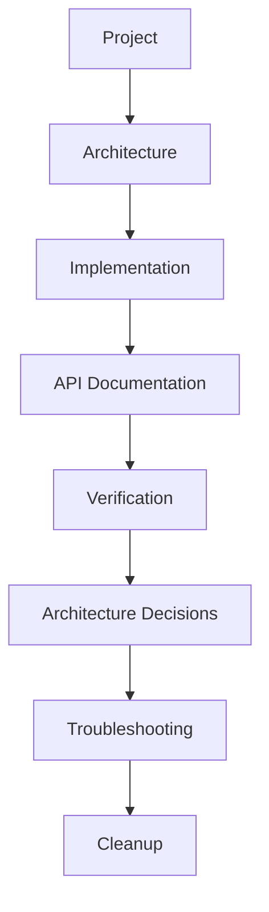

# FlavorForge Documentation

Welcome to the FlavorForge Azure DevSecOps Capstone documentation.

This documentation is organized into logical sections covering project implementation, architecture, deployment, verification, troubleshooting, and operational guidance.

---

## Documentation Roadmap

The documentation is organized to follow the complete lifecycle of the FlavorForge project.

```text
Project
    │
    ▼
Architecture
    │
    ▼
Implementation
    │
    ▼
API Documentation
    │
    ▼
Verification & Validation
    │
    ▼
Architecture Decisions
    │
    ▼
Troubleshooting
    │
    ▼
Cleanup
```



---

## Documentation Structure

### Project

- 01 Problem Statement
- 02 Project Objectives
- 03 Solution Overview

---

### Architecture

- System Architecture
- Application Architecture
- Cloud Architecture
- Security Architecture

---

### Implementation

- Project Planning
- Environment Setup
- Project Structure
- Application Architecture
- Frontend Development
- Backend Development
- Dockerization

---

### API

- API Overview (`README.md`)
- Backend API Reference
- Authentication
- Health Check
- API Examples

---

### Verification & Validation

- Source Code Verification
- CI/CD Verification
- Security Verification
- Container Verification
- Azure Infrastructure Verification
- Kubernetes Verification
- GitOps Verification
- Application Verification
- Monitoring Verification
- Final Acceptance Summary

---

### ADR (Architecture Decision Records)

- GitOps Adoption
- Kubernetes Deployment
- Kustomize Environment Management

---

### Troubleshooting

- Application Issues
- Docker Issues
- Pipeline Issues
- Security Issues
- Kubernetes Issues
- Argo CD Issues
- Azure Issues

---

### Cleanup

- Local Cleanup
- Azure Resource Cleanup
- Cost Management

---

### Pipeline

Azure DevOps CI/CD Pipeline

---

### Presentation

Presentation materials and demo guides.

---

## Repository Highlights

This project demonstrates modern cloud-native software engineering practices, including:

- React frontend
- Node.js and Express backend
- Docker containerization
- Azure Kubernetes Service (AKS)
- Azure DevOps CI/CD
- GitOps with Argo CD
- Kustomize environment management
- DevSecOps security integration
- Kubernetes health monitoring
- Production-oriented documentation

---


## Project Repository

FlavorForge is an end-to-end Azure DevSecOps capstone project demonstrating how a modern cloud-native application can be designed, containerized, secured, continuously integrated, deployed to Kubernetes, and managed using GitOps principles.

The documentation captures not only the implementation details but also the architectural decisions, operational procedures, verification activities, and troubleshooting guidance required to support a production-oriented software delivery lifecycle.

---

# 📚 FlavorForge Documentation

Welcome to the FlavorForge documentation.

## Project Documentation

| Document | Description |
|----------|-------------|
| [Implementation Guide](implementation/README.md) | End-to-end implementation |
| [Pipeline Documentation](pipeline/README.md) | Azure DevOps CI/CD |
| [Architecture](architecture/) | System architecture |
| [API Documentation](api/README.md) | Backend APIs |
| [Troubleshooting](troubleshooting/README.md) | Common issues |
| [Cleanup Guide](cleanup/README.md) | Azure cleanup |
| [Verification Reports](project/04-verification-and-validation-report/) | Project verification |
| [Presentation Guide](presentation/) | Demo preparation and presentation |
| [Week 4 Submission](week-4/) | Internship deliverables |
| [ADR](adr/) | Architecture Decision Records |
| [Build Journey](BUILD-JOURNEY/BUILD-JOURNEY.md) | Complete build log |