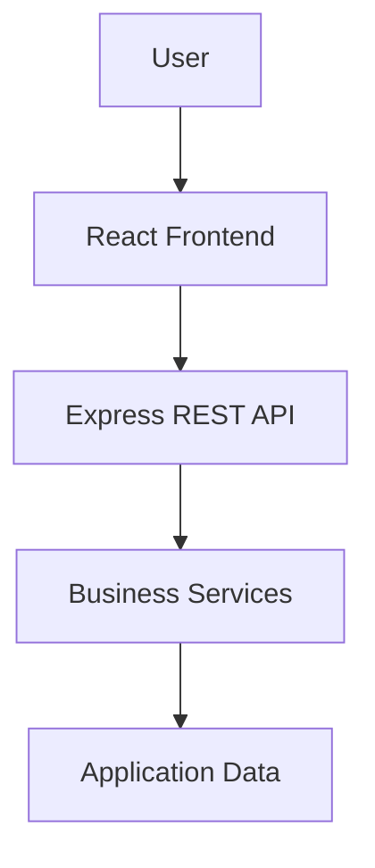
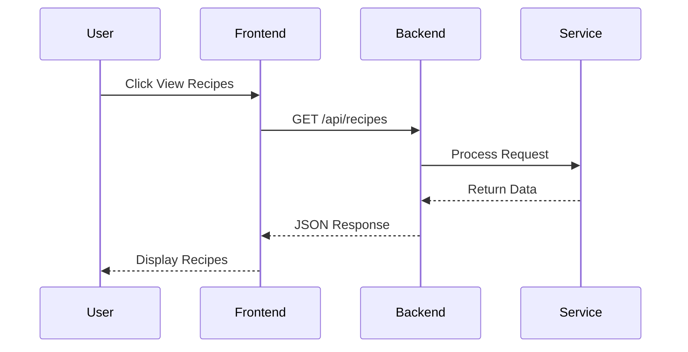

# 🔌 FlavorForge API Documentation

> **Purpose:** This document serves as the entry point for the FlavorForge API documentation. It provides a high-level overview of the API, explains how it fits within the application architecture, and guides developers to the appropriate documentation for implementation, security, health monitoring, and usage examples.

---

# Table of Contents

1. Introduction
2. Backend API Architecture
3. API Design Principles
4. Base URLs
5. API Endpoint Overview
6. Request Format
7. API Conventions
8. Content Negotiation
9. Common Headers
10. Response Format
11. HTTP Status Codes
12. Error Handling
13. Input Validation
14. API Versioning
15. Reference Summary

---

# 1. Introduction

Modern web applications are typically built using multiple components that communicate with one another. In FlavorForge, users interact with a React frontend, while the application logic is processed by a Node.js and Express.js backend.

Communication between these components is achieved through **REST APIs**.

The FlavorForge API provides a structured and secure interface that allows the frontend to request data, submit information, and receive responses from backend services. Rather than accessing backend resources directly, all interactions occur through well-defined HTTP endpoints.

This documentation introduces the overall API architecture before guiding readers to detailed technical references.

---

# 2. Understanding APIs

## What is an API?

An **Application Programming Interface (API)** is a set of rules that enables two software systems to communicate with each other.

Instead of directly accessing backend services or databases, applications exchange requests and responses through predefined endpoints.

### Real-World Analogy

Imagine ordering food at a restaurant.

```
Customer
    │
    ▼
Waiter (API)
    │
    ▼
Kitchen (Backend)
    │
    ▼
Prepared Meal
```

You communicate with the waiter rather than entering the kitchen yourself.

Similarly, the frontend communicates with the backend through the API, while the backend performs the requested work and returns the results.

---

# 3. Purpose of the FlavorForge API

The FlavorForge API serves as the communication layer between the frontend application and backend services.

Its primary responsibilities include:

- Receiving requests from the frontend.
- Processing application logic.
- Returning structured JSON responses.
- Providing standardized communication.
- Supporting monitoring and operational verification.
- Enabling future application expansion without changing frontend architecture.

Without the API, the frontend would have no standardized mechanism to communicate with backend services.

---

# 4. API Architecture Overview

FlavorForge follows a layered REST architecture.

```
+----------------------+
|    User Browser      |
+----------+-----------+
           │
           ▼
+----------------------+
|   React Frontend     |
+----------+-----------+
           │
           │ HTTP Request
           ▼
+----------------------+
|  Express REST API    |
+----------+-----------+
           │
           ▼
+----------------------+
| Business Services    |
+----------+-----------+
           │
           ▼
+----------------------+
| Application Data     |
+----------------------+
```

### Mermaid Diagram



---

# 5. API Communication Flow

Every user interaction follows a request-response lifecycle.

Example:

```
User clicks "View Recipes"

        │
        ▼

React Frontend

        │
        ▼

GET /api/recipes

        │
        ▼

Express Backend

        │
        ▼

Business Logic

        │
        ▼

JSON Response

        │
        ▼

React Updates UI
```

### Mermaid Sequence Diagram



---

# 6. Technology Stack

The API layer is implemented using the following technologies.

| Component | Technology |
|-----------|------------|
| Runtime | Node.js |
| Framework | Express.js |
| API Style | REST |
| Protocol | HTTP / HTTPS |
| Data Format | JSON |
| Container Platform | Docker |
| Orchestration | Kubernetes (AKS) |

---

# 7. API Overview

The current implementation exposes APIs that support application functionality and operational monitoring.

| API Category | Purpose |
|--------------|---------|
| Health API | Verify backend availability |
| Recipe APIs | Manage recipe-related operations |
| Future APIs | Authentication, user management, favorites, search, and additional platform features |

Detailed information about these APIs is provided in the corresponding documents within this directory.

---

# 8. Documentation Structure

Each document within the `docs/api` directory focuses on a specific aspect of the backend.

| Document | Description |
|----------|-------------|
| `README.md` | API overview and documentation guide |
| `backend-api.md` | Complete API reference including endpoints, requests, responses, status codes, and versioning |
| `authentication.md` | Current authentication status and future security architecture |
| `health-check.md` | Health endpoint, Kubernetes probes, monitoring, and operational verification |
| `api-examples.md` | Practical request and response examples for developers |

---

# 9. Getting Started

A recommended reading order for new contributors is:

1. Read this document to understand the API architecture.
2. Review `backend-api.md` to learn the available endpoints.
3. Read `authentication.md` to understand the security model.
4. Review `health-check.md` to understand operational health verification.
5. Explore `api-examples.md` for practical request and response examples.

This progression provides a gradual learning path from high-level concepts to implementation details.

---

# 10. Summary

The FlavorForge API provides a standardized communication layer between the frontend and backend components of the application.

By adopting REST principles, JSON-based communication, and a modular documentation structure, the project remains maintainable, scalable, and easy for developers to understand. The remaining documents in this directory provide detailed guidance on API implementation, security, operational health, and practical usage.

---

## Related Documentation

| Document | Description |
|----------|-------------|
| [Backend Documentation](../../backend/README.md) | Backend implementation |
| [Implementation Guide](../implementation/README.md) | Project implementation |
| [Pipeline Documentation](../pipeline/README.md) | CI/CD pipeline |
| [Troubleshooting](../troubleshooting/README.md) | Common issues |