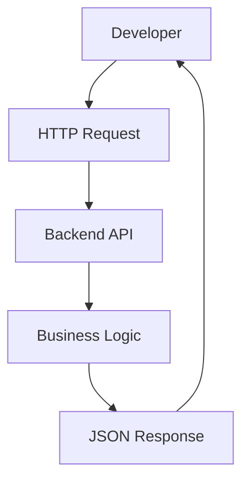
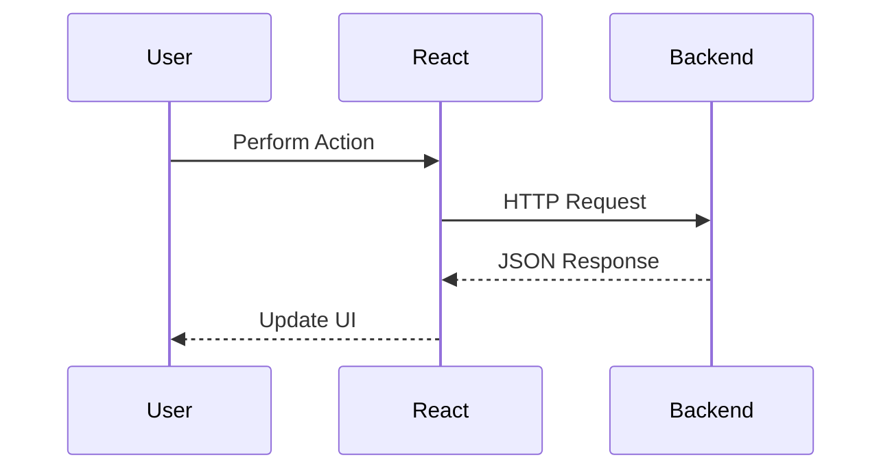
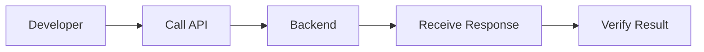

# 📚 FlavorForge API Usage Examples

> **Purpose:** This document provides practical examples of interacting with the FlavorForge backend APIs. It demonstrates common request and response patterns, manual testing methods, frontend integration concepts, and developer workflows to simplify API consumption and verification.

---

# Table of Contents

1. Introduction
2. API Testing Workflow
3. Health Check Examples
4. Request and Response Examples
5. Frontend Integration Example
6. Manual Testing Methods
7. Common API Workflows
8. Best Practices
9. Summary

---

# 1. Introduction

Understanding an API is easier when supported by practical examples.

This document demonstrates how developers can interact with the FlavorForge backend using HTTP requests, command-line tools, browsers, and frontend applications.

These examples are intended for development, testing, troubleshooting, and learning purposes.

> **Note:** Replace any example endpoints with the actual endpoints implemented in your project.

---

# 2. API Testing Workflow

A typical API request follows a simple lifecycle.

```
Developer

     │

Create Request

     │

     ▼

Backend API

     │

Process Request

     │

     ▼

JSON Response

     │

     ▼

Developer Reviews Result
```

### Mermaid Diagram



### Real-World Analogy

Think of sending a parcel.

```
You

↓

Courier

↓

Destination

↓

Delivery Confirmation
```

The request is the parcel, the API is the courier, and the response is the delivery confirmation.

---

# 3. Health Check Examples

## Browser

Open the following URL in a web browser.

```
http://localhost:3000/api/health
```

---

## cURL

```bash
curl http://localhost:3000/api/health
```

---

## HTTP Request

```http
GET /api/health HTTP/1.1
Host: localhost:3000
```

---

## Successful Response

```json
{
  "status": "UP",
  "application": "FlavorForge Backend",
  "version": "1.3"
}
```

---

# 4. Request and Response Examples

## Example GET Request

```http
GET /api/example
```

Example response

```json
{
  "message": "Success"
}
```

---

## Example POST Request

```http
POST /api/example
Content-Type: application/json
```

```json
{
  "name": "Sample"
}
```

Example response

```json
{
  "status": "success",
  "message": "Resource created successfully"
}
```

> **Important:** Replace these examples with the actual requests and responses implemented by your application.

---

# 5. Frontend Integration Example

The frontend communicates with the backend by sending HTTP requests and processing JSON responses.

```
React Component

       │

       ▼

API Service

       │

       ▼

Backend Endpoint

       │

       ▼

JSON Response

       │

       ▼

Update User Interface
```

### Mermaid Diagram



---

# 6. Manual Testing Methods

Developers can verify the backend using multiple tools.

| Tool | Purpose |
|------|---------|
| Browser | Simple GET requests |
| cURL | Command-line testing |
| Postman | Interactive API testing |
| VS Code REST Client | API development |
| Browser Developer Tools | Inspect network traffic |

### Example Verification

```bash
curl http://localhost:3000/api/health
```

Expected result

```json
{
  "status": "UP"
}
```

---

# 7. Common API Workflows

A typical request-response cycle is shown below.

```
User Action

     │

     ▼

Frontend

     │

     ▼

HTTP Request

     │

     ▼

Backend API

     │

Business Logic

     │

     ▼

JSON Response

     │

     ▼

Frontend Updates Screen
```

### Developer Workflow



---

# 8. Best Practices

When working with the FlavorForge APIs:

- Use the correct HTTP method.
- Send valid JSON payloads.
- Verify HTTP status codes.
- Handle error responses gracefully.
- Test APIs before frontend integration.
- Keep request and response formats consistent.
- Document new endpoints as they are introduced.
- Validate API changes before deployment.

---

# 9. Summary

Practical examples make it easier to understand how the FlavorForge backend behaves in real-world scenarios.

By combining browser testing, cURL, HTTP requests, frontend integration examples, and structured workflows, developers can quickly learn, verify, and troubleshoot API interactions throughout the development lifecycle.