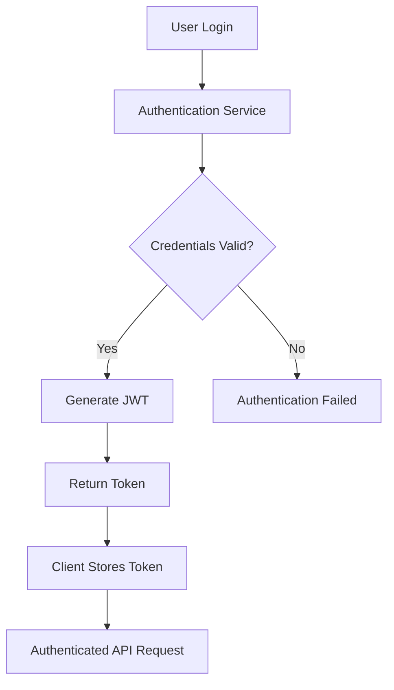
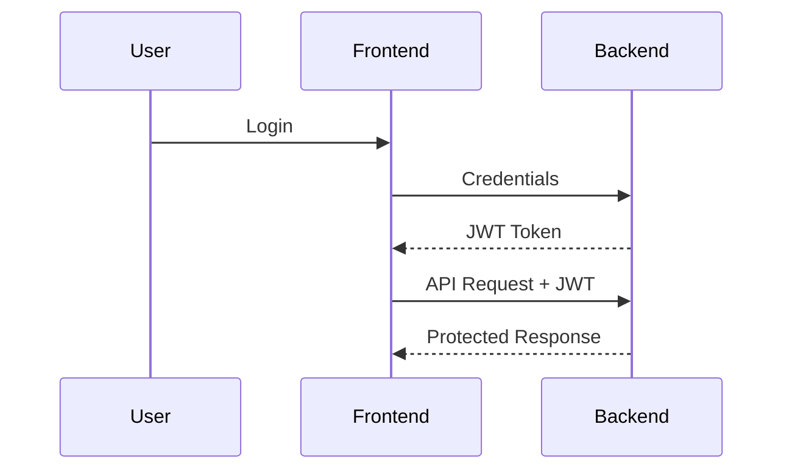

# 🔐 FlavorForge API Authentication

> **Purpose:** This document describes the current authentication status of the FlavorForge API, the planned authentication architecture, and the security principles that will be followed as the application evolves.

---

# Table of Contents

1. Introduction
2. Why Authentication Matters
3. Current Authentication Status
4. Future Authentication Architecture
5. JWT Authentication Flow
6. Role-Based Access Control (RBAC)
7. Security Best Practices
8. Future Enhancements
9. Summary

---

# 1. Introduction

Authentication is the process of verifying the identity of a user or system before granting access to protected resources.

In any modern web application, authentication ensures that only authorized users can access sensitive functionality and data.

Although the current version of FlavorForge focuses on application deployment and DevSecOps practices, the API has been designed with future authentication capabilities in mind.

This document explains both the current implementation and the planned security architecture.

---

# 2. Why Authentication Matters

Without authentication, anyone who knows an API endpoint could potentially send requests to the application.

Authentication helps protect:

- User accounts
- Personal information
- Application data
- Administrative functions
- Backend resources

It also provides a foundation for authorization, auditing, and secure communication.

### Real-World Analogy

Imagine entering a secure office building.

```
Visitor

    │

    ▼

Security Guard

    │

Identity Verified?

 ├── Yes → Entry Allowed

 └── No  → Access Denied
```

Similarly, an API verifies the identity of a client before allowing access to protected resources.

---

# 3. Current Authentication Status

At the time of writing, the FlavorForge API does **not** implement user authentication.

The current backend focuses on:

- Core application functionality
- Health monitoring
- DevSecOps pipeline integration
- Kubernetes deployment

This allows the project to concentrate on infrastructure, automation, and deployment while maintaining a clear path for future security enhancements.

> **Note:** Public endpoints such as the health check are intentionally accessible without authentication to support Kubernetes probes and monitoring systems.

---

# 4. Future Authentication Architecture

Future versions of FlavorForge may implement authentication using **JSON Web Tokens (JWT)**.

The proposed architecture is illustrated below.

```
User

    │

Login Request

    │

    ▼

Authentication Service

    │

Credentials Verified

    │

    ▼

JWT Token Issued

    │

    ▼

Client Stores Token

    │

    ▼

Authenticated API Requests
```

### Mermaid Diagram



---

# 5. JWT Authentication Flow

A JWT (JSON Web Token) is a signed token that proves a user's identity.

After a successful login:

1. The user submits credentials.
2. The backend validates the credentials.
3. A JWT is generated.
4. The client stores the token.
5. The token is included in future API requests.
6. The backend validates the token before processing each request.

Example HTTP Header

```http
Authorization: Bearer <jwt-token>
```

### Authentication Flow



---

# 6. Role-Based Access Control (RBAC)

Authentication verifies **who** the user is.

Authorization determines **what** the user is allowed to do.

Future versions of FlavorForge may implement Role-Based Access Control (RBAC).

Example roles:

| Role | Permissions |
|------|-------------|
| User | View recipes, manage personal data |
| Editor | Create and update recipes |
| Administrator | Full application management |

### Authorization Flow

```
Authenticated User

        │

        ▼

Determine Role

        │

        ▼

Apply Permissions

        │

        ▼

Grant or Deny Access
```

---

# 7. Security Best Practices

The following security practices are recommended for future development.

- Always use HTTPS in production.
- Never store passwords in plain text.
- Hash passwords using a strong algorithm such as bcrypt.
- Store JWT secrets securely.
- Validate all incoming requests.
- Apply the principle of least privilege.
- Rotate secrets and credentials regularly.
- Log authentication failures for auditing.
- Keep dependencies updated to address known vulnerabilities.

These practices contribute to a more secure and maintainable API.

---

# 8. Future Enhancements

Future releases may include:

- JWT authentication
- Refresh tokens
- Multi-factor authentication (MFA)
- OAuth 2.0 integration
- OpenID Connect (OIDC)
- Password reset functionality
- Email verification
- Account lockout after repeated failed login attempts
- Fine-grained permissions
- Audit logging

These enhancements would strengthen the overall security posture of the application.

---

# 9. Summary

The current FlavorForge API does not implement user authentication, allowing the project to focus on infrastructure automation and deployment practices.

However, the application has been designed with a clear security roadmap. Future enhancements such as JWT authentication, RBAC, and secure authorization mechanisms will enable the API to support protected resources while following modern security best practices.