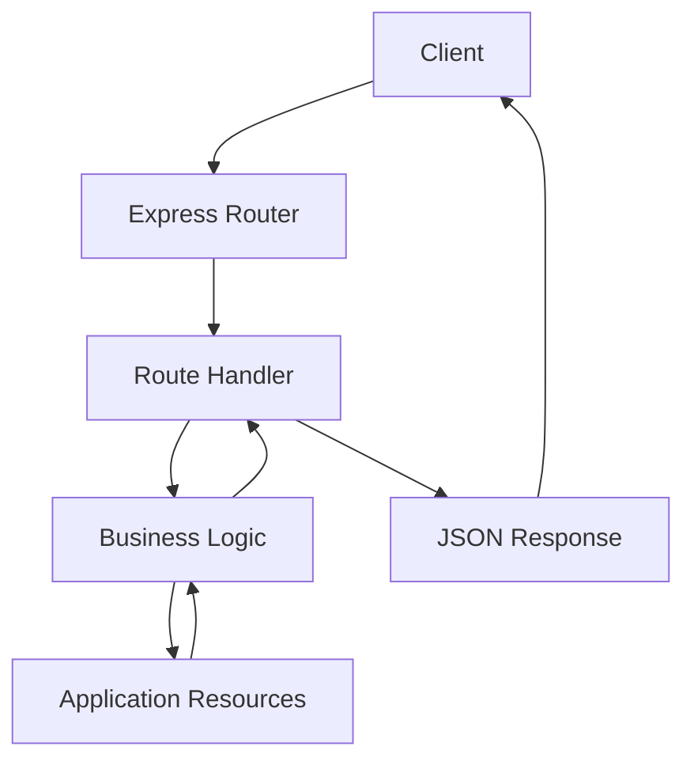
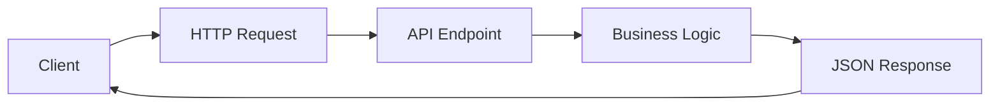
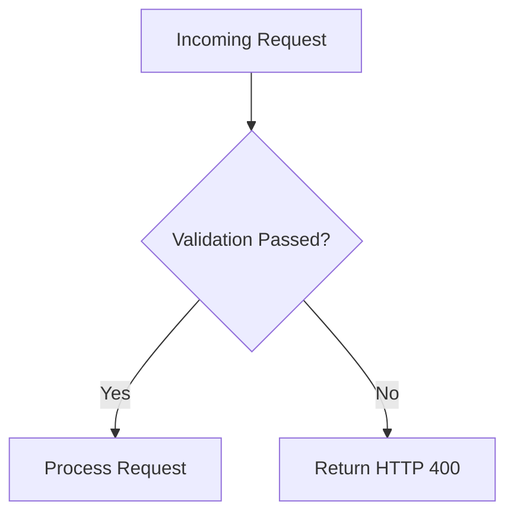
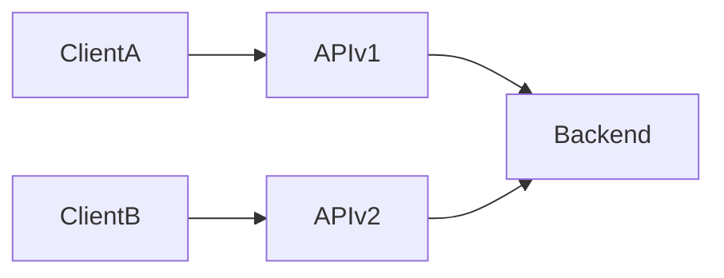

# 📡 FlavorForge Backend API Reference

> **Purpose:** This document provides the complete technical reference for the FlavorForge backend APIs. It describes the API architecture, endpoint structure, request and response formats, HTTP status codes, validation, error handling, and versioning strategy for developers integrating with the backend.

---

# Table of Contents

1. Introduction
2. Backend API Architecture
3. API Design Principles
4. Base URLs
5. API Endpoint Overview
6. Request Format
7. Response Format
8. HTTP Status Codes
9. Error Handling
10. Input Validation
11. API Versioning
12. Reference Summary

---

# 1. Introduction

The FlavorForge backend exposes RESTful APIs that allow the frontend application to communicate with backend services through standardized HTTP requests.

Each API endpoint performs a specific function, such as retrieving application data, submitting information, or verifying application health.

The backend follows REST architectural principles, uses JSON for data exchange, and is designed to provide predictable, scalable, and maintainable communication between clients and backend services.

Unlike the API overview provided in `README.md`, this document serves as the technical reference for developers working with the backend.

---

# 2. Backend API Architecture

The backend follows a layered architecture that separates routing, business logic, and application resources.

```
                HTTP Request
                     │
                     ▼
+--------------------------------------+
|         Express Router               |
+------------------+-------------------+
                   │
                   ▼
+--------------------------------------+
|        API Route Handler             |
+------------------+-------------------+
                   │
                   ▼
+--------------------------------------+
|      Business Logic / Services       |
+------------------+-------------------+
                   │
                   ▼
+--------------------------------------+
|     Application Data / Resources     |
+--------------------------------------+
                   │
                   ▼
             JSON Response
```

### Mermaid Diagram



### Analogy

Think of the backend as a **customer service desk**.

```
Customer

↓

Support Desk

↓

Internal Departments

↓

Requested Information

↓

Customer
```

The customer communicates with the support desk rather than every internal department.

Similarly, clients communicate only with API endpoints, while the backend performs the required processing internally.

---

# 3. API Design Principles

The FlavorForge backend follows RESTful API design principles to ensure consistency and maintainability.

The API is designed to:

- Use resource-oriented endpoints.
- Exchange information using JSON.
- Use standard HTTP methods.
- Return meaningful HTTP status codes.
- Maintain consistent request and response formats.
- Support future scalability.
- Minimize breaking changes through versioning.

### REST Request Flow

```
Client

↓

HTTP Request

↓

REST Endpoint

↓

Application Logic

↓

JSON Response
```

---

# 4. Base URLs

API requests are sent to different base URLs depending on the deployment environment.

## Development

```
http://localhost:3000
```

## Production

```
http://<application-url>
```

Example

```
GET /api/health
```

Development request:

```
http://localhost:3000/api/health
```

---

# 5. API Endpoint Overview

The following endpoints are available within the current project.

| Method | Endpoint | Purpose |
|---------|----------|---------|
| GET | `/api/health` | Verify backend health |
| GET | `/api/recipes`* | Retrieve recipes |
| POST | `/api/recipes`* | Create recipe |


### Endpoint Lifecycle



---

# 6. Request Format

Clients communicate with the backend using HTTP requests.

Common request components include:

- Request method
- URL
- Headers
- Query parameters
- Request body

Example

```http
POST /api/example

Content-Type: application/json
```

```json
{
  "name": "Example"
}
```

### Supported HTTP Methods

| Method | Purpose |
|---------|----------|
| GET | Retrieve data |
| POST | Create resource |
| PUT | Replace resource |
| PATCH | Update resource |
| DELETE | Remove resource |

---

# 7. API Conventions

To maintain consistency across the FlavorForge backend, all APIs follow a common set of conventions.

## Resource Naming

Endpoints use nouns to represent resources rather than actions.

Examples:

```http
GET /api/recipes

POST /api/recipes

PUT /api/recipes/{id}

DELETE /api/recipes/{id}
```

## JSON Formatting

Requests and responses use JSON with consistent field names and structure.

## URI Design

URIs identify resources rather than describing operations.

Good:

```http
GET /api/recipes
```

Avoid:

```http
GET /api/getRecipes
```


---

# 8. Content Negotiation

Content negotiation defines the format used when clients send requests and receive responses.

FlavorForge exchanges data using JSON.

Typical headers include:

```http
Accept: application/json

Content-Type: application/json
```

| Header | Purpose |
|---------|---------|
| Accept | Specifies the response format expected by the client |
| Content-Type | Specifies the format of the request body |

---

# 9. Common Headers

| Header        | Purpose                   |
| ------------- | ------------------------- |
| Accept        | Expected response format  |
| Content-Type  | Format of request payload |
| Authorization | Future JWT authentication |

Example:
```text
Accept: application/json

Content-Type: application/json

Authorization: Bearer <token>
```

Even if authentication isn't implemented yet, note that the `Authorization` header is reserved for future JWT-based authentication.

---

# 10. Response Format

The backend returns JSON responses for successful operations.

Example

```json
{
  "status": "success",
  "message": "Request completed successfully",
  "data": {}
}
```

Collection example

```json
[
  {
    "id": 1,
    "name": "Pasta"
  }
]
```

Responses typically include:

- A status indicating the outcome of the request.
- A descriptive message for the client.
- A data object or collection containing the requested information.
- Appropriate HTTP status codes to indicate success or failure.

Maintaining a consistent response structure simplifies frontend integration and improves troubleshooting.

### Response Flow

```
Client Request

↓

Backend Processing

↓

JSON Response

↓

Frontend Rendering
```

---

# 11. HTTP Status Codes

HTTP status codes indicate the outcome of every request.

| Code | Meaning | Description |
|------|----------|-------------|
| 200 | OK | Request successful |
| 201 | Created | Resource created |
| 204 | No Content | Successful without body |
| 400 | Bad Request | Invalid request |
| 401 | Unauthorized | Authentication required |
| 403 | Forbidden | Access denied |
| 404 | Not Found | Resource unavailable |
| 409 | Conflict | Resource conflict |
| 500 | Internal Server Error | Unexpected server error |

### Analogy

Status codes are similar to delivery updates.

```
Order Delivered

↓

200 OK

--------------------

Wrong Address

↓

404 Not Found

--------------------

Warehouse Error

↓

500 Internal Server Error
```

---

# 12. Error Handling

The backend returns standardized error responses whenever a request cannot be processed.

Example

```json
{
  "status": "error",
  "message": "Recipe not found",
  "timestamp": "2026-07-31T10:15:00Z"
}
```

Consistent error responses provide several benefits:

- Easier debugging
- Better frontend integration
- Improved monitoring
- Predictable API behavior

A standardized error response should clearly communicate:

- What went wrong.
- Why the request failed.
- Whether the issue can be corrected by the client.
- When appropriate, additional diagnostic information for troubleshooting.

Consistent error payloads improve developer experience and simplify frontend error handling.

---

# 13. Input Validation

Input validation protects the application by ensuring that incoming requests contain valid data before processing.

Typical validation includes:

- Required fields
- Data types
- Value ranges
- Input length
- Invalid characters

Example

```
Incoming Request

↓

Validation

↓

Valid?

├── Yes → Continue Processing
└── No  → Return HTTP 400
```

### Mermaid Diagram



---

# 14. API Versioning

API versioning allows new functionality to be introduced without disrupting existing clients.

Current Version

```
v1
```

Future example

```
/api/v1/recipes

/api/v2/recipes
```

### Versioning Strategy

- Preserve backward compatibility whenever possible.
- Introduce breaking changes only in a new major version.
- Deprecate older versions gradually.
- Maintain consistent API contracts.




> Multiple API versions allow existing clients to continue functioning while newer clients adopt additional functionality.


---

# 15. Reference Summary

| Item | Value |
|------|-------|
| API Style | REST |
| Data Format | JSON |
| Protocol | HTTP / HTTPS |
| Current Version | v1 |
| Backend Framework | Express.js |
| Runtime | Node.js |

For authentication details, refer to **authentication.md**.

For health verification, refer to **health-check.md**.

For request and response examples, refer to **api-examples.md**.