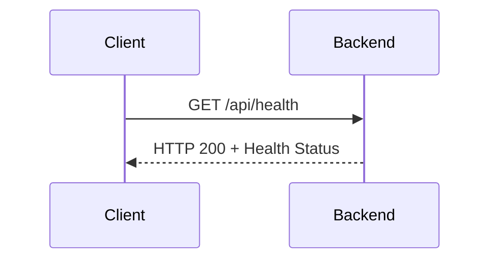
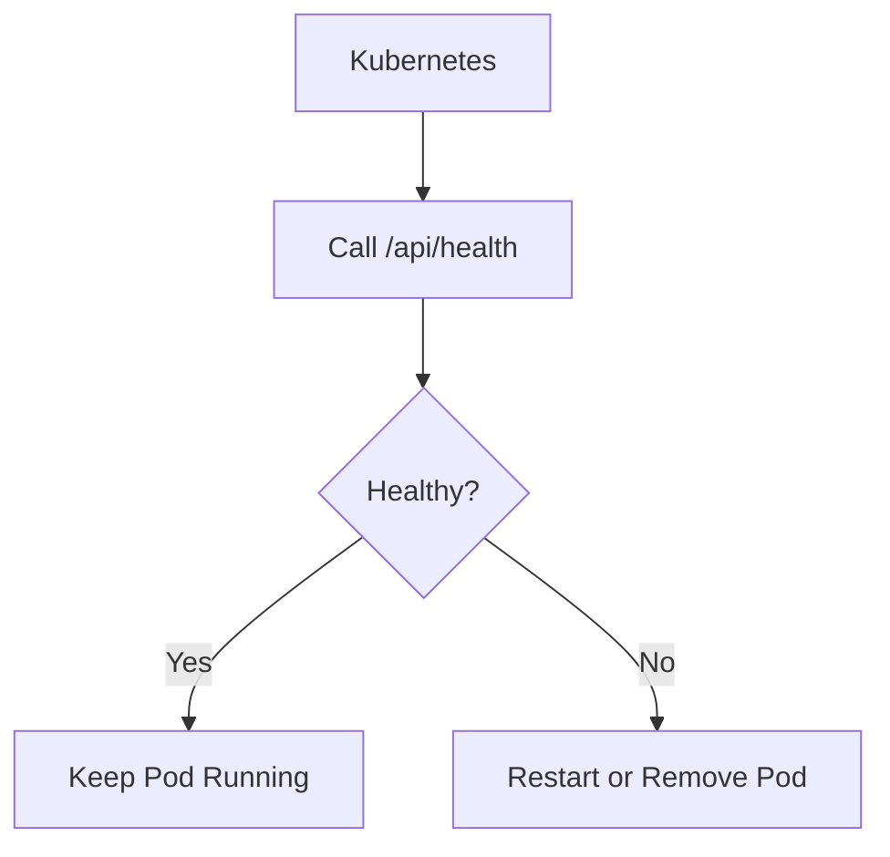
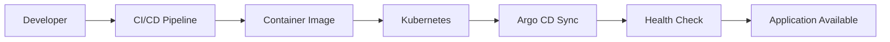

# ❤️ FlavorForge API Health Check

> **Purpose:** This document explains how the FlavorForge health endpoint is used to verify application availability. It covers health verification, Kubernetes liveness and readiness probes, monitoring integration, and manual verification techniques used throughout the DevSecOps lifecycle.

---

# Table of Contents

1. Introduction
2. Why Health Checks Matter
3. Health Check Endpoint
4. Health Check Response
5. Kubernetes Integration
6. Monitoring and DevSecOps Integration
7. Verification Methods
8. Best Practices
9. Summary

---

# 1. Introduction

A healthy application should be able to demonstrate that it is available and capable of serving requests.

To achieve this, FlavorForge exposes a dedicated health endpoint that returns the operational status of the backend application.

This endpoint is used by:

- Kubernetes
- Monitoring platforms
- CI/CD pipelines
- GitOps deployments
- Developers performing manual verification

Rather than checking every application feature, the health endpoint provides a quick indication that the service is running correctly.

---

# 2. Why Health Checks Matter

Imagine calling a restaurant before visiting.

You are not asking for the full menu.

You simply want to know:

> **"Are you open?"**

The health endpoint answers the same question for software.

```
User

   │

   ▼

Health Request

   │

   ▼

Application

   │

Healthy?

├── Yes → Accept Requests

└── No → Restart / Investigate
```

Health checks allow automated systems to detect problems before users experience failures.

---

# 3. Health Check Endpoint

The FlavorForge backend exposes the following endpoint.

| Method | Endpoint | Purpose |
|---------|----------|---------|
| GET | `/api/health` | Verify application availability |

Example request

```http
GET /api/health
```

Example response

```json
{
  "status": "UP",
  "application": "FlavorForge Backend",
  "version": "1.3"
}
```

### Response Fields

| Field | Description |
|--------|-------------|
| status | Current application status |
| application | Application name |
| version | Running application version |

---

# 4. Health Check Response

A successful response indicates that the backend is available to receive requests.

### Request Flow

```
Client

    │

GET /api/health

    │

    ▼

Backend

    │

Health Verification

    │

    ▼

JSON Response

    │

    ▼

Client
```

### Mermaid Diagram



---

# 5. Kubernetes Integration

One of Kubernetes' responsibilities is to ensure that application containers remain healthy.

FlavorForge integrates its health endpoint with Kubernetes probes.

## Liveness Probe

The liveness probe determines whether the application is still running correctly.

If repeated health checks fail, Kubernetes automatically restarts the container.

```
Application Running

        │

Health Check

        │

Healthy?

├── Yes → Continue Running

└── No → Restart Pod
```

Example configuration

```yaml
livenessProbe:
  httpGet:
    path: /api/health
    port: 3000
```

---

## Readiness Probe

The readiness probe determines whether the application is ready to receive traffic.

If the application is not ready, Kubernetes temporarily removes the Pod from the Service until it becomes available again.

```
Pod Started

     │

Ready?

├── Yes → Receive Traffic

└── No → Wait
```

Example configuration

```yaml
readinessProbe:
  httpGet:
    path: /api/health
    port: 3000
```

### Kubernetes Health Flow



---

# 6. Monitoring and DevSecOps Integration

The health endpoint plays an important role throughout the DevSecOps lifecycle.

### Monitoring

Monitoring systems periodically call the health endpoint to verify service availability.

### CI/CD Verification

Following deployment, automated pipelines can call the health endpoint to confirm that the application started successfully.

### GitOps Verification

After Argo CD synchronizes the desired state to the Kubernetes cluster, the health endpoint provides an additional validation that the deployed application is operational.

### Operational Workflow

```
Developer

     │

Deploy Application

     │

CI/CD Pipeline

     │

Deploy to Kubernetes

     │

Argo CD Synchronization

     │

Health Verification

     │

Application Available
```

### Mermaid Diagram



---

# 7. Verification Methods

The health endpoint can be verified manually or automatically.

## Browser

```
http://localhost:3000/api/health
```

---

## cURL

```bash
curl http://localhost:3000/api/health
```

---

## Kubernetes

```bash
kubectl get pods

kubectl describe pod <pod-name>

kubectl logs <pod-name>
```

---

## Argo CD

```bash
argocd app get <application-name>
```

---

## Expected Result

```json
{
  "status": "UP",
  "application": "FlavorForge Backend",
  "version": "1.3"
}
```

---

# 8. Best Practices

To maintain reliable health verification:

- Keep the endpoint lightweight and fast.
- Avoid expensive database operations.
- Return consistent JSON responses.
- Use HTTP 200 only when the application is healthy.
- Integrate health checks with Kubernetes probes.
- Include health verification in deployment validation.
- Monitor endpoint availability continuously.
- Document health responses for developers and operations teams.

---

# 9. Summary

The FlavorForge health endpoint provides a simple yet essential mechanism for verifying application availability.

It supports Kubernetes liveness and readiness probes, enables monitoring systems to detect service failures, assists CI/CD and GitOps deployment validation, and provides developers with a reliable method for confirming that the backend is operational.

By integrating health checks throughout the software delivery lifecycle, the project improves reliability, observability, and operational resilience.