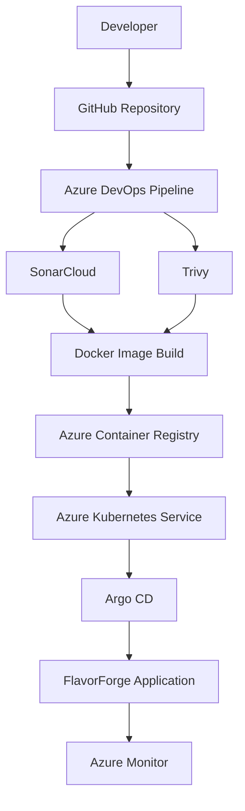

# 🏗️ FlavorForge System Architecture

## Overview

FlavorForge is designed as a cloud-native DevSecOps platform that demonstrates the complete software delivery lifecycle.

The architecture combines:

- Full-stack application development
- Containerization
- Automated CI/CD
- Security validation
- Kubernetes orchestration
- GitOps-based deployment
- Cloud monitoring

The objective is to transform application source code into a reliable, secure, and observable cloud workload.

---

# High-Level Architecture

---

# Architecture Components

## 1. Source Control Layer

Technology:

- GitHub

Responsibilities:

- Application source management
- Kubernetes manifest storage
- Version control
- Collaboration

---

## 2. CI/CD Automation Layer

Technology:

- Azure DevOps Pipelines

Responsibilities:

- Automated builds
- Testing
- Security validation
- Docker image creation
- Image publishing

---

## 3. Security Layer

Technologies:

- SonarCloud
- Trivy

Responsibilities:

SonarCloud:

- Code quality analysis
- Maintainability checks
- Security hotspots

Trivy:

- Container vulnerability scanning
- Dependency security analysis

---

## 4. Container Platform Layer

Technology:

- Docker
- Azure Container Registry

Responsibilities:

Docker:

- Package applications into containers

ACR:

- Secure image storage
- Version management

---

## 5. Runtime Platform Layer

Technology:

- Azure Kubernetes Service

Responsibilities:

- Container orchestration
- Scaling
- Service discovery
- Self-healing workloads

---

## 6. Deployment Management Layer

Technology:

- ArgoCD

Responsibilities:

- GitOps deployment
- Desired state management
- Kubernetes synchronization

---

## 7. Observability Layer

Technology:

- Azure Monitor

Responsibilities:

- Cluster monitoring
- Application visibility
- Operational insights

---

# Architecture Principles

FlavorForge follows these engineering principles:

| Principle | Implementation |
|---|---|
| Automation | Azure DevOps Pipeline |
| Security First | SonarCloud + Trivy |
| Immutable Deployment | Docker Images |
| Desired State Management | ArgoCD |
| Scalability | Kubernetes |
| Documentation Driven | Engineering Docs |

---

# Design Outcome

The final architecture provides:

✅ Repeatable deployments  
✅ Secure delivery workflow  
✅ Cloud-native application hosting  
✅ Git-controlled operations  
✅ Production-inspired practices
