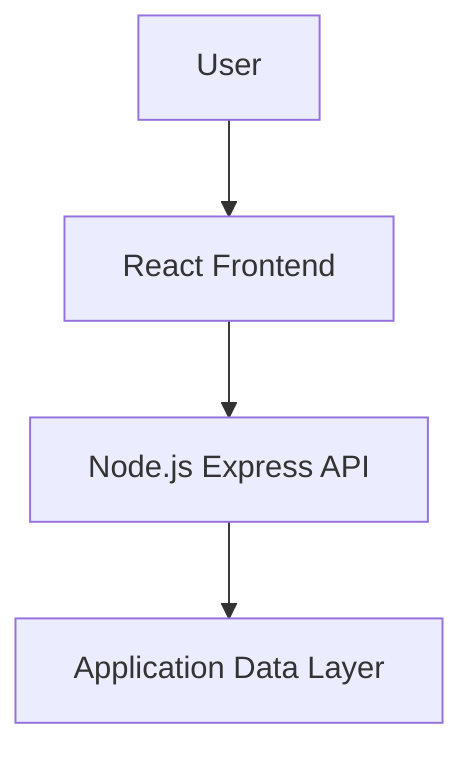
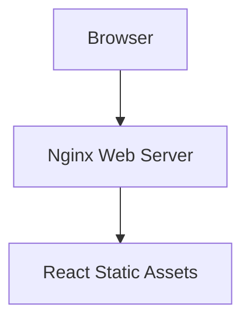
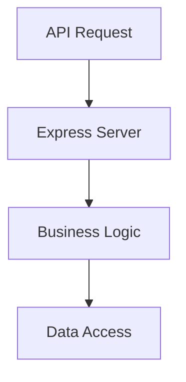
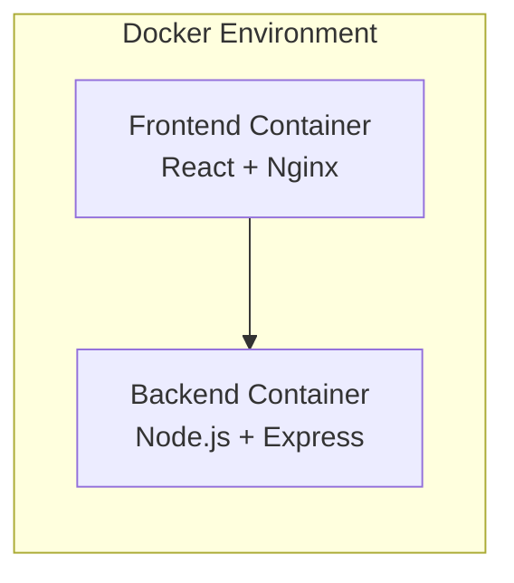

# 🍽️ FlavorForge Application Architecture

## Overview

FlavorForge follows a modern frontend-backend architecture.

The application is divided into independent services:

- Frontend presentation layer
- Backend API layer
- Data layer

---

# Application Flow

---

# Frontend Architecture

## Technology

- React
- Vite
- Nginx

## Responsibilities

The frontend handles:

- User interface rendering
- User interaction
- API communication
- Recipe presentation

## Architecture:

---

## Backend Architecture

## Technology

- Node.js
- Express

## Responsibilities

Backend provides:

- REST API endpoints
- Business logic
- Health checks
- Application services

## Architecture:

---

## Container Architecture

Each application component runs independently.

---

## Benefits of This Architecture

- Independent scaling
- Easier deployment
- Clear separation of responsibilities
- Container portability
