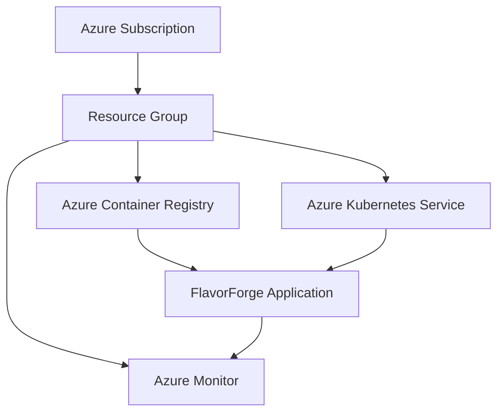

# ☁️ FlavorForge Azure Cloud Architecture

## Overview

FlavorForge is deployed on Microsoft Azure using managed cloud services to provide a scalable, reliable, and cloud-native runtime environment.

The architecture uses:

- Azure Container Registry (ACR)
- Azure Kubernetes Service (AKS)
- Azure Monitor

---

## Azure Resource Flow

---

## Azure Container Registry

### Purpose

Store and manage application container images securely.

### Responsibilities

- Private container image repository
- Image version management
- Secure image access for AKS
- Container image storage

---

## Azure Kubernetes Service

### Purpose

Host and manage the FlavorForge application using Kubernetes.

### Responsibilities

- Container orchestration
- Automatic scaling
- Service discovery
- Self-healing workloads
- High availability

---

## Azure Monitor

### Purpose

Provide monitoring and operational visibility across the application and Kubernetes cluster.

### Monitors

- Cluster health
- Application performance
- Logs
- Metrics
- Resource utilization

---

## Cloud Design Principles

| Principle | Implementation |
|-----------|----------------|
| Managed Services | Azure Kubernetes Service |
| Secure Image Storage | Azure Container Registry |
| Operational Visibility | Azure Monitor |
| Scalable Runtime | Kubernetes |
| Cloud-Native Deployment | AKS + ACR |
