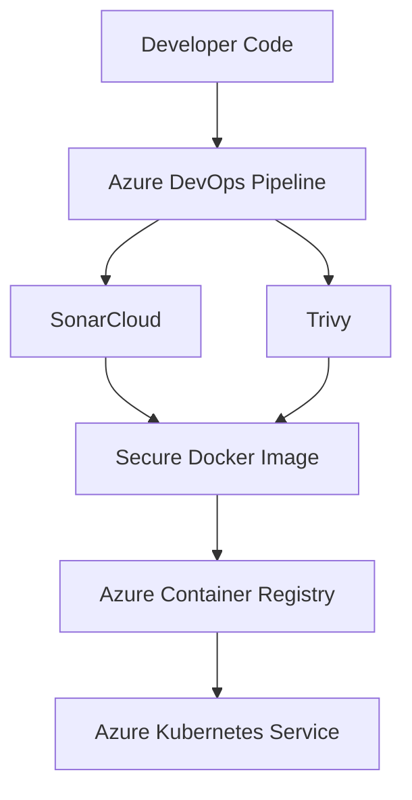

# 🔐 FlavorForge Security Architecture

## Overview

FlavorForge follows a **DevSecOps** approach where security is integrated throughout the entire software delivery lifecycle rather than being performed only before deployment.

Security controls are embedded into the CI/CD pipeline to ensure that code quality, dependency vulnerabilities, and deployment practices are continuously validated from development through production.

---

## Security Flow

---

## Application Security

### Code Quality

**Tool:** SonarCloud

### Security Checks

- Code quality analysis
- Bug detection
- Code smell identification
- Maintainability assessment
- Security hotspot detection

---

## Container Security

### Tool

Trivy

### Security Checks

- Container image vulnerability scanning
- Dependency vulnerability analysis
- Known CVE detection
- Package security validation

---

## Deployment Security

Security is maintained during deployment through:

- Private Azure Container Registry (ACR)
- GitOps-based deployments using Argo CD
- Kubernetes configuration management
- Immutable container images
- Controlled deployment workflow

---

## Security Principles

| Principle | Implementation |
|-----------|----------------|
| Shift-Left Security | SonarCloud |
| Container Image Scanning | Trivy |
| Secure Image Storage | Azure Container Registry |
| GitOps Deployment | Argo CD |
| Configuration Management | Kubernetes |
| Continuous Security Validation | Azure DevOps Pipeline |

---

## Security Outcome

FlavorForge demonstrates a modern DevSecOps architecture where security is integrated into every stage of the software delivery lifecycle.

This approach helps ensure:

- Continuous code quality validation
- Automated vulnerability detection
- Secure container image management
- Controlled GitOps deployments
- Production-inspired security practices
