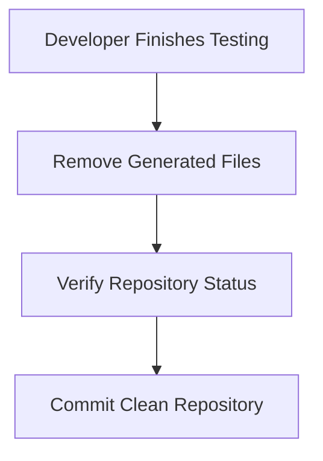

# 🧹 FlavorForge Local Cleanup Guide

## Overview

During development, temporary files, dependencies, Docker resources, and test artifacts are created.

Regular cleanup helps maintain:

- Clean development environments
- Faster builds
- Smaller repositories
- Reduced local storage usage

---

# Node.js Cleanup

Remove installed dependencies:

```bash
rm -rf node_modules
````

Remove generated build files:

```bash
rm -rf dist
```

Clean npm cache:

```bash
npm cache clean --force
```

---

# Docker Cleanup

View unused resources:

```bash
docker system df
```

Remove stopped containers:

```bash
docker container prune
```

Remove unused images:

```bash
docker image prune
```

Remove unused volumes:

```bash
docker volume prune
```

---

# Git Cleanup

Check repository status:

```bash
git status
```

Remove unwanted files:

```bash
git clean -fd
```

Verify history:

```bash
git log
```

---

# Test Artifact Cleanup

Remove:

* Test reports
* Coverage files
* Temporary logs
* Generated files

Example:

```bash
rm -rf coverage
rm -rf logs
```

---

# IDE Cleanup

Remove:

* `.vscode` temporary settings
* IDE cache files
* Local configuration files

Ensure `.gitignore` contains:

```
node_modules/
dist/
coverage/
.env
.vscode/
```

---

# Cleanup Workflow


