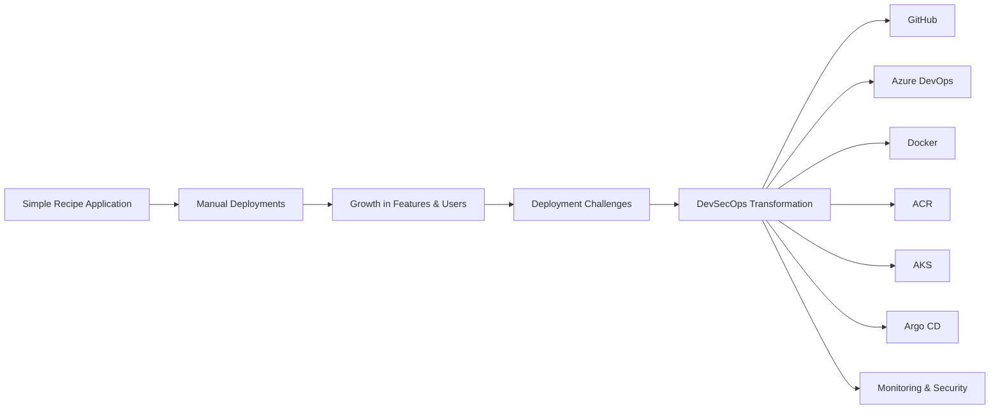

# Problem Statement

## Introduction

FlavorForge began as a simple web application designed to help users discover, create, and share recipes. During the early stages of development, the application was deployed using straightforward manual processes that were sufficient for a small team and infrequent releases.

As development progressed, new features were introduced, release frequency increased, and multiple environments became necessary for development, testing, and production. The manual deployment approach that once worked well gradually became difficult to manage.

These challenges highlighted the need for a more reliable, secure, and scalable software delivery process.

---

## Business Challenges

Several operational issues became apparent as the project evolved:

- Manual deployment steps increased the possibility of human error.
- Application releases were slow and difficult to repeat consistently.
- Different environments often contained configuration differences.
- Rollbacks required manual intervention and increased downtime.
- Security validation was not integrated into the delivery process.
- There was limited visibility into application health after deployment.

As the application continued to grow, these issues began affecting development efficiency and release confidence.

---

## Technical Challenges

From an engineering perspective, the project faced additional challenges:

- No standardized container build process.
- Inconsistent application environments across development and production.
- Lack of automated quality checks before deployment.
- No integrated vulnerability scanning for container images.
- Manual Kubernetes deployments without continuous reconciliation.
- Limited monitoring and operational visibility.
- Risk of frontend and backend image version mismatches during deployments.

These challenges reduced deployment reliability and increased operational effort.

---

## Why Modern DevSecOps?

To address these limitations, FlavorForge required a modern software delivery platform capable of providing:

- Automated build and deployment pipelines.
- Consistent containerized environments.
- Integrated code quality and security validation.
- Infrastructure managed through Kubernetes.
- Git-based continuous delivery using GitOps principles.
- Centralized monitoring and operational visibility.
- Reliable, repeatable, and traceable software releases.

---

## Project Vision

The objective of this project is not simply to deploy an application to the cloud.

Instead, it demonstrates how a traditional deployment workflow can be transformed into an enterprise-grade DevSecOps platform using modern cloud-native technologies and industry best practices.

The following documents describe each stage of this transformation, the architectural decisions made, the technologies adopted, and the operational improvements achieved throughout the project.


---


---

BEFORE

```text
Developer
    │
    ▼
Manual Build
    │
    ▼
Manual Docker Image
    │
    ▼
Manual Kubernetes Deployment
    │
    ▼
Production
```

AFTER

```text
Developer
    │
    ▼
GitHub
    │
    ▼
Azure DevOps Pipeline
    │
    ▼
Quality & Security Checks
    │
    ▼
Docker → ACR
    │
    ▼
Argo CD
    │
    ▼
AKS
    │
    ▼
Users
```