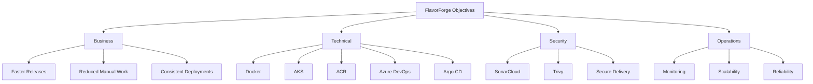

# Project Objectives

## Overview

Following the challenges identified in the Problem Statement, the primary objective of the FlavorForge project was to transform a manually deployed web application into a secure, automated, and cloud-native DevSecOps platform.

Rather than focusing on a single deployment, the project aimed to establish a repeatable software delivery process that improves reliability, security, scalability, and operational efficiency.

---

## Business Objectives

The project was designed to achieve the following business outcomes:

- Reduce manual effort during application deployments.
- Increase release consistency across environments.
- Improve developer productivity through automation.
- Enable faster and more reliable software delivery.
- Build a deployment process that can support future application growth.

---

## Technical Objectives

The technical goals focused on modernizing the application delivery pipeline:

- Containerize the frontend and backend applications using Docker.
- Store container images securely in Azure Container Registry (ACR).
- Deploy the application on Azure Kubernetes Service (AKS).
- Standardize deployments using Kubernetes manifests and Kustomize overlays.
- Automate build, test, and deployment processes using Azure DevOps Pipelines.
- Adopt GitOps practices with Argo CD for continuous delivery.

---

## Security Objectives

Security was integrated throughout the software delivery lifecycle by aiming to:

- Perform automated code quality analysis using SonarCloud.
- Scan container images for known vulnerabilities using Trivy.
- Reduce deployment risks through automated validation.
- Promote secure and repeatable release practices.

---

## Operational Objectives

To improve day-to-day operations, the project aimed to:

- Support multiple deployment environments.
- Enable rolling updates with minimal downtime.
- Improve application availability and scalability.
- Enhance observability using Azure Monitor.
- Reduce configuration inconsistencies between environments.

---

---

## Learning Objectives

In addition to building a production-style platform, the project served as a practical learning experience by providing hands-on exposure to:

- Cloud-native application deployment.
- CI/CD pipeline design.
- Kubernetes orchestration.
- GitOps workflows.
- DevSecOps best practices.
- Infrastructure automation concepts.

---

## Success Criteria

The project would be considered successful when it could:

- Build the application automatically.
- Execute quality and security checks.
- Package applications into Docker images.
- Push images to Azure Container Registry.
- Deploy consistently to Azure Kubernetes Service.
- Synchronize deployments using Argo CD.
- Monitor the deployed application.
- Support reliable and repeatable software releases.

---

## Looking Ahead

With the project objectives clearly defined, the next document explains how these objectives were achieved through the overall solution architecture and technology choices that transformed FlavorForge into a modern DevSecOps platform.