```mermaid
flowchart LR

A[Developer]
--> B[GitHub]

B --> C[Azure DevOps Pipeline]

C --> D[Build & Test]

D --> E[SonarCloud]

E --> F[Trivy]

F --> G[Docker Build]

G --> H[Azure Container Registry]

H --> I[GitOps Repository]

I --> J[Argo CD]

J --> K[Azure Kubernetes Service]

K --> L[FlavorForge Application]

L --> M[Azure Monitor]
```

# Solution Overview

## Overview

To address the operational, deployment, and security challenges identified in the previous sections, FlavorForge was modernized using a cloud-native DevSecOps architecture.

Instead of relying on manual deployment activities, the application now follows an automated software delivery workflow where code changes are validated, containerized, securely stored, deployed to Kubernetes, and continuously synchronized using GitOps principles.

The solution combines industry-standard DevSecOps tools to improve software quality, deployment reliability, security, and operational visibility.

---

## Modernization Journey

The transformation was introduced incrementally rather than replacing the entire deployment process at once.

Each technology solved a specific problem while preparing the platform for the next stage of modernization.

| Challenge | Solution |
|-----------|----------|
| Manual source management | GitHub |
| Manual build process | Azure DevOps Pipelines |
| Inconsistent environments | Docker |
| Image distribution | Azure Container Registry |
| Manual Kubernetes deployment | Argo CD |
| Infrastructure scalability | Azure Kubernetes Service |
| Code quality validation | SonarCloud |
| Container security | Trivy |
| Operational monitoring | Azure Monitor |

Together, these technologies form a complete DevSecOps platform.

---

## End-to-End Workflow

The modern deployment workflow follows these high-level steps:

1. Developers push code changes to GitHub.
2. Azure DevOps automatically triggers the CI pipeline.
3. The application is built and tested.
4. SonarCloud analyzes code quality.
5. Trivy scans container images for vulnerabilities.
6. Docker images are pushed to Azure Container Registry.
7. Kubernetes manifests stored in Git are updated.
8. Argo CD detects the Git changes and synchronizes the cluster.
9. Azure Kubernetes Service deploys the updated application.
10. Azure Monitor provides operational visibility into the running platform.

This workflow minimizes manual intervention while improving deployment consistency and traceability.

---

## Key Benefits

The modernized platform provides several advantages:

- Automated software delivery
- Repeatable deployments
- Improved application security
- Reduced deployment errors
- Better scalability
- Faster recovery from failures
- Continuous synchronization between Git and Kubernetes
- Improved operational monitoring

These improvements create a reliable foundation for future application growth.

---

---

## Technology Stack

| Layer | Technology |
|--------|------------|
| Source Control | GitHub |
| CI/CD | Azure DevOps Pipelines |
| Code Quality | SonarCloud |
| Security Scanning | Trivy |
| Containerization | Docker |
| Container Registry | Azure Container Registry |
| Container Orchestration | Azure Kubernetes Service (AKS) |
| Continuous Delivery | Argo CD |
| Monitoring | Azure Monitor |

Each technology was selected to solve a specific engineering challenge while integrating seamlessly into the overall DevSecOps workflow.

---

## Conclusion

The FlavorForge platform evolved from a manually managed application into a secure, automated, and cloud-native delivery platform.

The remaining documentation explores each component of this solution in greater detail, including architecture, implementation, deployment, verification, operations, and lessons learned throughout the modernization journey.