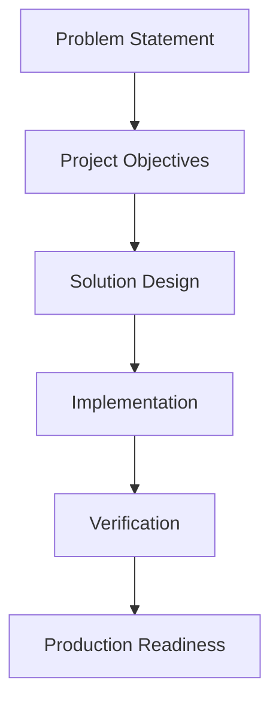

# FlavorForge Verification & Validation Report

**Version:** 1.0

**Project:** FlavorForge Azure DevSecOps Capstone

**Document Type:** Verification & Validation Report

**Last Updated:** July 2026

---

## Verification Lifecycle

---

# Solution Verification

## Introduction

The FlavorForge platform has evolved from a manually deployed web application into a cloud-native DevSecOps platform through the adoption of automation, containerization, Kubernetes orchestration, GitOps, integrated security, and cloud-native operational practices.

Designing and implementing the platform marked significant milestones in the modernization journey. However, implementation alone does not guarantee that a solution is reliable, secure, or production-ready. Every component of the platform must be systematically validated to ensure it performs as expected and integrates correctly with the surrounding ecosystem.

This document presents the verification phase of the project. It provides a structured validation of each major layer of the DevSecOps platform, beginning with source control and continuing through continuous integration, security validation, containerization, cloud infrastructure, Kubernetes orchestration, GitOps synchronization, application functionality, and operational monitoring.

Rather than serving as a simple checklist, this document acts as an engineering verification report. Each section defines the verification objective, explains why the component is important, describes the validation approach, records supporting evidence, and summarizes the outcome.

By the end of this verification process, the FlavorForge platform demonstrates that its software delivery pipeline, deployment architecture, security controls, operational capabilities, and application functionality operate together as a complete and reliable DevSecOps solution.

---

## Related Documents

This verification report validates the implementation described in:

- 01-problem-statement.md
- 02-project-objectives.md
- 03-solution-overview.md
- architecture/
- implementation/

