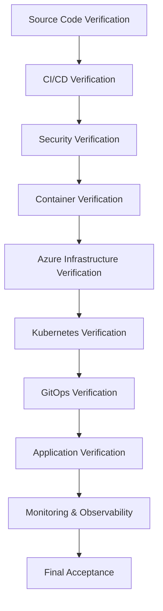

## Verification Strategy

Verifying a modern DevSecOps platform requires more than confirming that individual technologies are operational. Each component must be validated in a logical sequence because every stage depends on the successful completion of the previous one.

For example, a Kubernetes deployment cannot be verified until container images have been successfully built and published. Similarly, GitOps synchronization cannot be validated until the Kubernetes platform is operational and the deployment manifests are available in the Git repository.

To ensure a structured and repeatable verification process, FlavorForge is validated layer by layer, following the same lifecycle used to deliver the application.

The verification begins with the source code repository, where the project structure, configuration, and documentation are confirmed. It then progresses through the continuous integration pipeline, validating automated builds, testing, code quality analysis, and security scanning.

Once the software delivery pipeline has been verified, the focus shifts to containerization and Azure cloud infrastructure. Docker images, Azure Container Registry (ACR), Azure Kubernetes Service (AKS), and supporting cloud resources are validated to confirm that the deployment platform is functioning correctly.

The next phase verifies Kubernetes resources, ensuring that namespaces, deployments, services, ingress, configuration, autoscaling, and networking operate as expected. This is followed by GitOps validation, where Argo CD continuously synchronizes the desired state stored in Git with the live state running in the Kubernetes cluster.

Finally, the deployed application is verified from an end-user perspective by validating frontend accessibility, backend API communication, health endpoints, and application configuration. The verification concludes with monitoring and observability checks to ensure that operational metrics, logs, and platform health can be monitored effectively.

This structured approach ensures that every layer of the DevSecOps platform is validated individually while also confirming that all components function together as a complete, secure, and reliable software delivery system.

