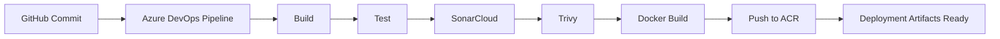

# 7. CI/CD Verification

## Objective

Verify that the Azure DevOps CI pipeline successfully automates the software delivery process from source code commit to deployment artifact preparation, ensuring a consistent, repeatable, and reliable build workflow.

---

## Why This Verification Matters

A CI pipeline is the backbone of a modern DevSecOps platform. Manual build processes are prone to errors, inconsistencies, and delays. By automating these activities, the pipeline ensures that every code change follows the same validation and build process before it is considered ready for deployment.

Verifying the pipeline confirms that automation is functioning correctly and that every release is built using a standardized workflow and produces deployment-ready artifacts for GitOps.

---

## Pipeline Overview

The FlavorForge Azure DevOps pipeline performs the following high-level activities:

1. Trigger pipeline execution.
2. Restore project dependencies.
3. Build frontend and backend applications.
4. Execute automated tests.
5. Perform code quality analysis using SonarCloud.
6. Scan container images using Trivy.
7. Build Docker images.
8. Push versioned images to Azure Container Registry (ACR).
9. Prepare deployment artifacts for GitOps.

The deployment of these artifacts and continuous reconciliation are verified separately in the GitOps Verification section.

Each stage was verified individually and as part of the complete end-to-end pipeline execution.

---

## Pipeline Stages Verified

| Stage | Purpose | Status |
|--------|---------|:------:|
| Source Checkout | Retrieve latest code | ✅ |
| Dependency Installation | Restore project dependencies | ✅ |
| Application Build | Compile frontend and backend | ✅ |
| Automated Testing | Execute unit tests | ✅ |
| Code Quality Analysis | SonarCloud Quality Gate | ✅ |
| Security Scanning | Trivy vulnerability scan | ✅ |
| Docker Build | Create versioned images | ✅ |
| Image Push | Publish images to ACR | ✅ |
| Deployment Artifact Preparation | Generate GitOps deployment artifacts | ✅ |

---

## Verification Process

The pipeline was triggered from Azure DevOps following a source code update.

Each stage was monitored to verify:

- Successful execution.
- Correct execution order.
- Expected outputs.
- Error-free completion.
- Integration with downstream stages.

Special attention was given to quality and security gates to ensure that application validation occurred before container images and deployment artifacts were produced.

---

## Verification Commands

```bash
# Azure DevOps pipeline triggered from GitHub

# Build logs reviewed

# Test results reviewed

# Pipeline stages validated
```

---

## Evidence

### Pipeline Run Summary

> **Screenshot Placeholder**

```text
images/verification/pipeline-run-summary.png
```

### Pipeline Stage View

> **Screenshot Placeholder**

```text
images/verification/pipeline-stage-view.png
```

### Successful Build Logs

> **Screenshot Placeholder**

```text
images/verification/build-logs.png
```

### Test Execution Results

> **Screenshot Placeholder**

```text
images/verification/test-results.png
```

### Docker Build Stage

> **Screenshot Placeholder**

```text
images/verification/docker-build.png
```

### Image Push to Azure Container Registry

> **Screenshot Placeholder**

```text
images/verification/acr-image-push.png
```

---

## Expected Result

The pipeline should execute automatically, complete every stage successfully, produce versioned Docker images, and generate deployment-ready artifacts for GitOps without requiring manual intervention.

---

## Actual Result

The Azure DevOps pipeline executed successfully from source code retrieval through container image publication and deployment artifact preparation. Build, testing, code quality analysis, security scanning, image creation, and artifact generation completed in the expected sequence, demonstrating a reliable and repeatable CI workflow. Deployment and continuous synchronization were verified separately during GitOps validation.

---

## Verification Observations

The pipeline completed successfully without requiring manual intervention.

Each stage executed in the expected sequence.

Pipeline artifacts were generated successfully.

---

## Conclusion

The CI pipeline verification confirms that FlavorForge successfully automates application validation, security checks, image creation, and deployment artifact generation. The pipeline provides a consistent software delivery process, reducing manual effort while ensuring every release is fully prepared for GitOps-based deployment.


