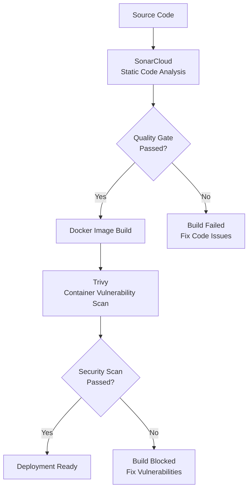
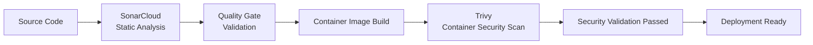

# 8. Security Verification

## Objective

Verify that security validation is integrated into the software delivery pipeline and that application code and container images are automatically assessed before being considered ready for deployment.

---

## Why This Verification Matters

In a DevSecOps approach, security is embedded throughout the software delivery lifecycle rather than being treated as a separate activity performed after deployment.

FlavorForge implements a security validation pipeline where source code quality, application risks, and container vulnerabilities are continuously evaluated during the CI/CD process.

The security pipeline follows three key stages:

1. **Source Code Security → SonarCloud**
2. **Container Security → Trivy**
3. **Deployment Decision → Only after automated validation**

This approach ensures that security checks become an automated quality control mechanism before release artifacts are promoted for deployment.

Verifying these controls demonstrates that every build passes through defined security and quality validation steps before deployment preparation.

---

## Security Verification Process

The security verification focused on validating the complete DevSecOps security pipeline.

---

### Stage 1 — Source Code Security Validation

Source code was analyzed using SonarCloud to verify application quality and identify potential issues before container creation.

The validation included:

- Successful execution of static code analysis.
- Code quality assessment.
- Detection of bugs and reliability issues.
- Identification of code smells affecting maintainability.
- Detection of security hotspots.
- Validation against the configured Quality Gate.

SonarCloud acts as the first security checkpoint by ensuring that application source code meets defined quality standards before progressing further in the pipeline.

---

### Stage 2 — Container Security Validation

After successful source code validation, container images were generated and scanned using Trivy.

The validation included:

- Successful container image vulnerability scanning.
- Detection of known operating system vulnerabilities.
- Identification of vulnerable application dependencies.
- Verification of image security before release preparation.
- Integration of vulnerability scanning into the CI/CD workflow.

Trivy provides the second security checkpoint by validating that the packaged application artifact does not contain known security risks.

---

### Stage 3 — Deployment Decision

Deployment readiness is determined only after successful completion of automated security validation.

The release flow follows:




This ensures that only validated application artifacts progress toward deployment.

---

## Security Pipeline Flow



---

## Security Controls Verified

| Security Control        | Purpose                                     | Status |
| ----------------------- | ------------------------------------------- | :----: |
| SonarCloud Analysis     | Source code security and quality validation |    ✅   |
| Quality Gate            | Automated code quality decision             |    ✅   |
| Bug Detection           | Identify reliability issues                 |    ✅   |
| Code Smell Detection    | Improve maintainability                     |    ✅   |
| Security Hotspot Review | Identify potential security risks           |    ✅   |
| Trivy Image Scan        | Container vulnerability assessment          |    ✅   |
| Pipeline Integration    | Automated DevSecOps security checks         |    ✅   |
| Deployment Gate         | Allow progression only after validation     |    ✅   |

---

## Evidence

### SonarCloud Project Dashboard

> **Screenshot Placeholder**

```
images/verification/sonar-dashboard.png
```

---

### SonarCloud Quality Gate

> **Screenshot Placeholder**

```
images/verification/sonar-quality-gate.png
```

---

### Code Quality Metrics

> **Screenshot Placeholder**

```
images/verification/sonar-metrics.png
```

---

### Trivy Container Scan Results

> **Screenshot Placeholder**

```
images/verification/trivy-results.png
```

---

### Security Validation in CI/CD Pipeline

> **Screenshot Placeholder**

```
images/verification/security-stage-pipeline.png
```

---

## Verification Commands

```bash
trivy image <image-name>

SonarCloud Dashboard
```

---

## Expected Result

The CI/CD pipeline should automatically execute security validation stages during every build.

Expected outcomes:

* Source code should successfully pass SonarCloud analysis.
* Quality Gate evaluation should complete successfully.
* Container images should be scanned using Trivy.
* Known vulnerabilities should be identified before release.
* Only validated artifacts should proceed toward deployment preparation.

---

## Actual Result

SonarCloud successfully completed source code analysis and generated quality metrics as part of the automated CI/CD workflow.

The Quality Gate validation confirmed that the application code met the defined quality standards.

After container image creation, Trivy successfully performed vulnerability scanning and evaluated the image for known security issues.

The security pipeline was successfully integrated into the delivery workflow, ensuring that every build was automatically validated before deployment preparation.

---

## Verification Observations

No critical security vulnerabilities prevented deployment.

Security validation was successfully integrated into the CI/CD workflow.

---

## Conclusion

Security verification completed successfully.

The FlavorForge platform implements a DevSecOps security pipeline where source code security, container security, and deployment decisions are connected through automated validation.

By integrating SonarCloud and Trivy into the CI/CD workflow, security becomes a continuous engineering practice that prevents vulnerable artifacts from progressing toward deployment.

This establishes a secure foundation for the next verification stage: **Containerization Verification**, where the generated container artifacts and runtime packaging process are validated.

