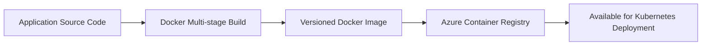

# 9. Container Verification

## Objective

Verify that the FlavorForge frontend and backend applications are successfully containerized, versioned, and stored in Azure Container Registry (ACR), ensuring consistent and portable deployments across environments.

---

## Why This Verification Matters

Containerization is a fundamental capability of a cloud-native platform. Instead of relying on environment-specific application installations, Docker packages the application together with its runtime and dependencies into standardized container images.

This approach ensures that the same application image tested during the CI/CD pipeline is the one deployed to Kubernetes, reducing configuration drift and improving deployment consistency.

Verifying containerization confirms that the application can be built once and deployed consistently across different environments.

---

## Verification Process

Container verification focused on validating the complete container lifecycle, including image creation, versioning, registry storage, and deployment readiness.

The following activities were verified:

- Docker image creation for frontend and backend applications.
- Multi-stage Docker builds.
- Successful image versioning and tagging.
- Image publication to Azure Container Registry (ACR).
- Image availability for Kubernetes deployments.
- Consistent image references across deployment manifests.

The verification ensured that container images were reproducible, traceable, and accessible for automated deployments.

---


---

## Verification Commands

```bash
docker images

docker build

az acr repository list
```

---

## Components Verified

| Component | Verification | Status |
|-----------|--------------|:------:|
| Frontend Docker Image | Built Successfully | ✅ |
| Backend Docker Image | Built Successfully | ✅ |
| Multi-stage Docker Build | Verified | ✅ |
| Image Tagging | Verified | ✅ |
| Azure Container Registry | Accessible | ✅ |
| Image Push | Successful | ✅ |
| Image Availability | Verified | ✅ |
| Deployment Readiness | Confirmed | ✅ |

---

## Deployment Consistency Verification

One important aspect of container verification was ensuring that the frontend and backend were deployed using compatible image versions.

Version-controlled Docker images and Git-managed Kubernetes manifests help reduce the risk of frontend and backend version mismatches by ensuring that deployments reference the intended image versions.

This verification confirms that the deployment process supports consistent application releases.

---

## Evidence

### Frontend Docker Build

> **Screenshot Placeholder**

```
images/verification/frontend-docker-build.png
```

---

### Backend Docker Build

> **Screenshot Placeholder**

```
images/verification/backend-docker-build.png
```

---

### Azure Container Registry Repository

> **Screenshot Placeholder**

```
images/verification/acr-repositories.png
```

---

### Available Image Tags

> **Screenshot Placeholder**

```
images/verification/acr-image-tags.png
```

---

### Docker Images Ready for Deployment

> **Screenshot Placeholder**

```
images/verification/docker-images-ready.png
```

---

## Expected Result

The platform should successfully produce versioned Docker images for both application components and publish them to Azure Container Registry. The images should be available for deployment without requiring additional manual modifications.

---

## Actual Result

Frontend and backend Docker images were successfully built using multi-stage Dockerfiles and published to Azure Container Registry with versioned tags. The images were available for Kubernetes deployments and aligned with the automated software delivery workflow.

---

## Verification Observations

Container images were versioned consistently.

Images were successfully stored in Azure Container Registry.

---


## Conclusion

Container verification completed successfully.

The FlavorForge platform demonstrates a consistent and repeatable containerization process, providing standardized application artifacts that support reliable Kubernetes deployments and GitOps-based continuous delivery.