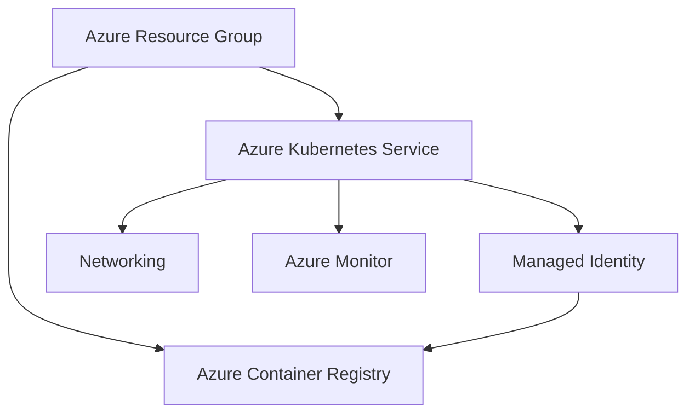

# 10. Azure Infrastructure Verification

## Objective

Verify that the Azure cloud infrastructure required to host the FlavorForge platform has been provisioned correctly and that all supporting services are operational, connected, and ready to support application deployments.

---

## Why This Verification Matters

Cloud infrastructure provides the foundation upon which the entire DevSecOps platform operates. Services such as Azure Kubernetes Service (AKS), Azure Container Registry (ACR), networking, identities, and monitoring must function together to enable secure and reliable application deployment.

Verifying the infrastructure ensures that cloud resources are correctly configured before validating workloads running on the Kubernetes cluster.

---

## Verification Process

The Azure environment was validated to confirm that the required cloud resources had been successfully provisioned and integrated.

The verification included:

- Azure Resource Group availability.
- Azure Kubernetes Service (AKS) cluster health.
- Azure Container Registry (ACR) accessibility.
- Managed Identity configuration.
- AKS to ACR image pull permissions.
- Networking components required for application access.
- Azure Monitor integration.

Each resource was verified individually and then reviewed as part of the overall cloud environment.




---

## Infrastructure Components Verified

| Azure Resource | Verification | Status |
|----------------|--------------|:------:|
| Resource Group | Available | ✅ |
| Azure Kubernetes Service | Running | ✅ |
| Azure Container Registry | Accessible | ✅ |
| Managed Identity | Configured | ✅ |
| AKS ↔ ACR Integration | Verified | ✅ |
| Networking | Operational | ✅ |
| Azure Monitor | Connected | ✅ |

---

## Evidence

### Azure Resource Group

> **Screenshot Placeholder**

```
images/verification/azure-resource-group.png
```

---

### Azure Kubernetes Service

> **Screenshot Placeholder**

```
images/verification/aks-overview.png
```

---

### Azure Container Registry

> **Screenshot Placeholder**

```
images/verification/acr-overview.png
```

---

### Managed Identity Configuration

> **Screenshot Placeholder**

```
images/verification/managed-identity.png
```

---

### AKS Access to ACR

> **Screenshot Placeholder**

```
images/verification/aks-acr-integration.png
```

---

### Azure Monitor

> **Screenshot Placeholder**

```
images/verification/azure-monitor-overview.png
```

---


## Verification Commands

```bash
az group show

az aks show

az acr show
```

---

## Expected Result

All required Azure resources should be successfully provisioned, correctly configured, and capable of supporting automated container deployment and Kubernetes operations.

The Kubernetes cluster should have secure access to container images stored in Azure Container Registry, and operational monitoring should be available through Azure Monitor.

---

## Actual Result

The Azure infrastructure was successfully provisioned and integrated. The resource group, AKS cluster, Azure Container Registry, networking, managed identity, and monitoring services operated as expected, providing a stable cloud foundation for the FlavorForge platform.

---

## Verification Observations

Azure resources were healthy and correctly integrated.

No infrastructure issues were observed.

---

## Conclusion

Azure infrastructure verification completed successfully.

The supporting cloud services required for container orchestration, image management, security, and monitoring are operational and ready to support production-style application deployments.