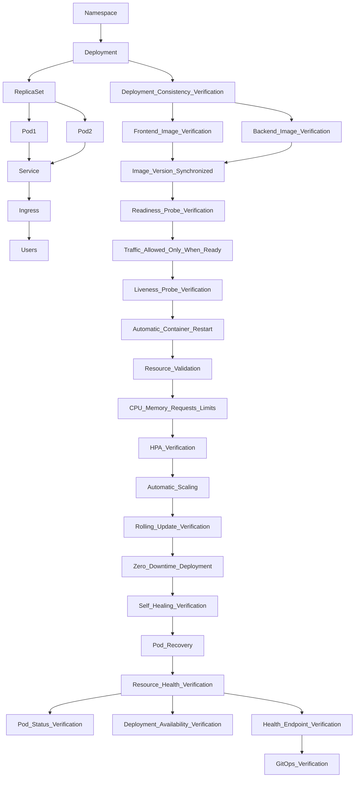

# 11. Kubernetes Verification

## Objective

Verify that the FlavorForge application is successfully deployed and operating within Azure Kubernetes Service (AKS), with all Kubernetes resources functioning together to provide a reliable, scalable, and highly available application platform.

---

## Why This Verification Matters

Kubernetes is the runtime environment for the FlavorForge platform. While previous sections verified source code, CI/CD, security, containerization, and cloud infrastructure, this section validates that the application is correctly orchestrated and managed inside the Kubernetes cluster.

Successful verification confirms that workloads are deployed correctly, networking is operational, configuration is applied consistently, scaling mechanisms are available, and Kubernetes continuously maintains the desired application state.

---

## Verification Process

The Kubernetes platform was validated by inspecting each core resource involved in application deployment and operation.

Verification included:

- Namespace organization
- Deployments
- ReplicaSets
- Pods
- Services
- ConfigMaps
- Secrets
- Ingress
- Horizontal Pod Autoscaler (HPA)
- Rolling update capability
- Self-healing behavior
- Application health
- Deployment image consistency
- Resource health validation

Each resource was verified individually before validating the complete application deployment.



---

# Kubernetes Resource Summary

| Resource | Purpose | Status |
|----------|---------|:------:|
| Namespace | Resource isolation | ✅ |
| Deployment | Application management | ✅ |
| ReplicaSet | Replica management | ✅ |
| Pods | Running workloads | ✅ |
| Services | Internal communication | ✅ |
| ConfigMaps | Configuration management | ✅ |
| Secrets | Sensitive configuration | ✅ |
| Ingress | External access | ✅ |
| Horizontal Pod Autoscaler | Automatic scaling | ✅ |
| Rolling Updates | Zero/low downtime deployment | ✅ |
| Readiness Probes | Traffic routing validation | ✅ |
| Liveness Probes | Automatic container recovery | ✅ |
| Resource Requests & Limits | Resource management | ✅ |

---

# 11.1 Namespace Verification

### Objective

Verify that Kubernetes namespaces isolate application resources appropriately.

### Evidence

> **Screenshot Placeholder**

```
images/verification/kubernetes-namespaces.png
```

### Expected Result

Application resources are deployed into the intended namespaces.

### Actual Result

Namespaces were created successfully and resources were isolated as designed.

### Conclusion

Namespace verification completed successfully.

---

# 11.2 Deployment Verification

### Objective

Verify that Kubernetes Deployments maintain the desired application state.

### Evidence

```
images/verification/kubernetes-deployments.png
```

### Expected Result

Deployments are available and report the desired number of replicas.

### Actual Result

Frontend and backend deployments were healthy and available.

### Conclusion

Deployment verification completed successfully.

---

# 11.3 Pod Verification

### Objective

Verify that application Pods are running successfully.

### Evidence

```
images/verification/kubernetes-pods.png
```

### Expected Result

Pods remain in the Running state without unexpected failures.

### Actual Result

Application pods were running successfully.

### Conclusion

Pod verification completed successfully.

---

# 11.4 Service Verification

Verify Kubernetes Services expose application components correctly.

### Evidence

```
images/verification/kubernetes-services.png
```

---

# 11.5 ConfigMap Verification

Verify application configuration is externalized successfully.

### Evidence

```
images/verification/configmaps.png
```

---

# 11.6 Secret Verification

Verify sensitive configuration is managed securely.

### Evidence

```
images/verification/secrets.png
```

---

# 11.7 Ingress Verification

Verify external traffic reaches the application.

### Evidence

```
images/verification/ingress.png
```

---

# 11.8 Horizontal Pod Autoscaler Verification

Verify workload scaling configuration.

### Evidence

```
images/verification/hpa.png
```

---

# 11.9 Rolling Update Verification

Verify application updates occur with minimal disruption.

### Evidence

```
images/verification/rolling-update.png
```

---

# 11.10 Readiness Probe Verification

### Objective

Verify that Kubernetes only routes application traffic to Pods that have successfully passed their readiness checks.

### Why This Verification Matters

A Pod may be running but not yet ready to serve application requests.

Readiness probes ensure that Kubernetes verifies application availability before adding Pods behind a Service.

This prevents users from receiving traffic from containers that are still starting, initializing, or temporarily unavailable.

### Verification Process

The readiness probe configuration was verified using:

```bash
kubectl describe deployment <deployment-name>
````

The Pod readiness status was monitored using:

```bash
kubectl get pods
```

Pods were checked to confirm that they transitioned from:

```
ContainerCreating
        |
        ▼
Running
        |
        ▼
Ready
```

Only Pods reporting Ready status were allowed to receive application traffic through Kubernetes Services.

### Evidence

```
images/verification/readiness-probe.png
```

### Expected Result

* Pods become Ready only after successful health validation.
* Service traffic is routed only to healthy Pods.

### Actual Result

Readiness checks successfully validated application availability before allowing traffic routing.

### Conclusion

Readiness probe verification completed successfully.

---

# 11.11 Liveness Probe Verification

### Objective

Verify that Kubernetes automatically detects unhealthy containers and restarts them when required.

### Why This Verification Matters

A running container does not always indicate a healthy application.

Liveness probes continuously monitor container health and allow Kubernetes to automatically recover workloads that become unresponsive.

This improves application reliability by reducing manual intervention.

### Verification Process

The liveness probe configuration was inspected using:

```bash
kubectl describe deployment <deployment-name>
```

Container health status was monitored using:

```bash
kubectl get pods
```

The Kubernetes kubelet continuously evaluated the container health checks.

If a container failed the liveness check, Kubernetes automatically restarted the unhealthy container.

### Evidence

```
images/verification/liveness-probe.png
```

### Expected Result

* Kubernetes detects unhealthy containers.
* Failed containers are automatically restarted.

### Actual Result

Liveness probe configuration was verified successfully, and Kubernetes maintained container availability through automatic health monitoring.

### Conclusion

Liveness probe verification completed successfully.

---

# 11.12 Resource Requests & Limits Verification

### Objective

Verify that Kubernetes workloads have defined CPU and memory resource requests and limits.

### Why This Verification Matters

Resource requests and limits ensure predictable workload behavior inside the Kubernetes cluster.

Requests guarantee minimum resources required by Pods, while limits prevent a single workload from consuming excessive cluster resources and affecting other applications.

### Verification Process

Resource configurations were verified using:

```bash
kubectl describe deployment <deployment-name>
```

and:

```bash
kubectl get pods
```

The following configurations were validated:

* CPU requests
* Memory requests
* CPU limits
* Memory limits

Example resource configuration:

```yaml
resources:
  requests:
    cpu: "250m"
    memory: "256Mi"
  limits:
    cpu: "500m"
    memory: "512Mi"
```

### Evidence

```
images/verification/resource-requests-limits.png
```

### Expected Result

* Each workload has defined resource requirements.
* Resource consumption remains within configured boundaries.

### Actual Result

CPU and memory requests and limits were configured successfully, preventing resource starvation and improving cluster stability.

### Conclusion

Resource requests and limits verification completed successfully.

---

# 11.13 Self-Healing Verification

### Objective

Verify Kubernetes automatically restores application availability after a pod failure.

### Verification Process

A running application pod is intentionally deleted using:

```bash
kubectl delete pod <pod-name>
```

Kubernetes continuously monitors the desired state through the Deployment controller.

When the deleted pod is detected, a replacement pod is automatically scheduled and started without requiring manual intervention.

### Evidence

```
images/verification/self-healing-before.png

images/verification/self-healing-after.png
```

### Expected Result

A replacement pod is created automatically and the desired replica count is restored.

### Actual Result

Kubernetes detected the missing pod and successfully recreated it, maintaining the application's desired state.

### Conclusion

Self-healing verification completed successfully.

---

# 11.11 Deployment Consistency Verification

### Objective

Verify that frontend and backend Kubernetes deployments reference the intended container image versions and remain synchronized during application releases.

### Why This Verification Matters

During application delivery, frontend and backend components must use compatible image versions.

A mismatch between deployed image versions can cause unexpected application behavior even when individual Kubernetes resources appear healthy.

This verification ensures that Kubernetes workloads are running the expected container images generated through the CI/CD pipeline.

### Verification Process

The deployed container images were inspected using:

```bash
kubectl get deployments -o yaml
```

and:

```bash
kubectl describe deployment <deployment-name>
```

Frontend and backend deployment image references were compared against the expected release versions.

### Evidence

```
images/verification/deployment-image-versions.png
```

### Expected Result

Frontend and backend deployments reference the correct container image versions.

### Actual Result

The deployed workloads were verified to use the intended image versions, ensuring consistency between application components.

### Conclusion

Deployment consistency verification completed successfully.

---

# 11.12 Resource Health Verification

### Objective

Verify the overall health and availability of Kubernetes workloads by validating pod status, deployment availability, and application health responses.

### Why This Verification Matters

Successful Kubernetes deployment requires more than creating resources.

Workloads must remain healthy, available, and capable of responding to application requests.

This verification combines Kubernetes resource health checks with application-level validation.

### Verification Process

The following checks were performed:

```bash
kubectl get pods
```

```bash
kubectl get deployments
```

```bash
kubectl describe pod <pod-name>
```

Application health endpoints were also validated to confirm that services were responding correctly.

### Evidence

```
images/verification/resource-health-status.png

images/verification/application-health-check.png
```

## Verification Commands

```bash
kubectl get pods

kubectl get svc

kubectl get ingress

kubectl describe deployment
```

### Expected Result

- Pods remain in the Running state
- Deployments report available replicas
- Health endpoints return successful responses

### Actual Result

All application workloads were healthy, deployment replicas were available, and application health checks returned successful responses.


## Verification Observations

All workloads remained healthy.

No unexpected pod failures occurred during verification.

Cluster resources operated within expected limits.

### Conclusion

Resource health verification completed successfully.

---

# Overall Kubernetes Verification

All Kubernetes resources operated as expected throughout the verification process.

The cluster successfully managed application deployment, networking, configuration, scaling, ingress, rolling updates, workload recovery, deployment consistency, and application health validation.

These results demonstrate that Azure Kubernetes Service provides a stable and reliable orchestration platform for the FlavorForge application.

The successful Kubernetes verification establishes the foundation for the next stage: GitOps Verification, where Argo CD synchronization and continuous reconciliation of the desired application state will be validated.