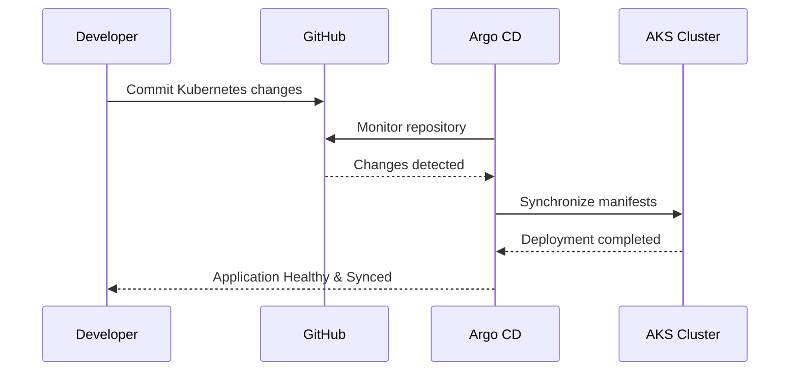

# 12. GitOps Verification

## Objective

Verify that Argo CD successfully implements GitOps by continuously synchronizing the desired application state stored in Git with the live state running in the Azure Kubernetes Service (AKS) cluster.

---

## Why This Verification Matters

GitOps extends automation beyond continuous integration by making Git the single source of truth for application deployment. Instead of manually applying Kubernetes manifests, Argo CD continuously monitors the Git repository and reconciles the cluster whenever changes are detected.

This approach improves deployment consistency, enables version-controlled infrastructure, simplifies rollbacks, and reduces configuration drift between the desired and actual cluster state.

Verifying GitOps confirms that application deployments remain automated, repeatable, and continuously aligned with the repository.

---

## Verification Process

The GitOps workflow was validated by confirming that Argo CD successfully:

- Connected to the Git repository.
- Detected application manifests.
- Created the application within Argo CD.
- Compared the desired state with the live cluster state.
- Synchronized Kubernetes resources automatically.
- Reported application health.
- Maintained synchronization after repository updates.

Each stage was verified to ensure that Git remained the authoritative source for Kubernetes deployments.




---

## GitOps Capabilities Verified

| Capability | Verification | Status |
|------------|--------------|:------:|
| Repository Connection | Successful | ✅ |
| Application Creation | Verified | ✅ |
| Desired State Detection | Verified | ✅ |
| Live State Comparison | Verified | ✅ |
| Automatic Synchronization | Verified | ✅ |
| Application Health | Healthy | ✅ |
| Synchronization Status | Synced | ✅ |

---

## Evidence

### Argo CD Dashboard

> **Screenshot Placeholder**

```
images/verification/argocd-dashboard.png
```

---

### Application Status

> **Screenshot Placeholder**

```
images/verification/argocd-application-health.png
```

---

### Synchronization Status

> **Screenshot Placeholder**

```
images/verification/argocd-sync-status.png
```

---

### Git Repository Configuration

> **Screenshot Placeholder**

```
images/verification/argocd-repository.png
```

---

## Desired State vs Live State Verification

One of the primary responsibilities of Argo CD is to ensure that the running Kubernetes cluster matches the deployment configuration stored in Git.

During verification, the application remained in a **Synced** and **Healthy** state, confirming that the live resources matched the desired configuration defined in the repository.

This demonstrates that Git serves as the authoritative source for application deployment.

---

## Drift Detection Verification

### Objective

Verify that Argo CD detects differences between the desired application state stored in Git and the actual state running inside the Kubernetes cluster.

### Why This Verification Matters

Configuration drift can occur when the live Kubernetes environment differs from the approved configuration stored in Git.

Argo CD continuously compares the Git repository state with the live cluster state and identifies any differences.

This verification confirms that Argo CD can detect unexpected changes and maintain visibility of application consistency.

### Verification Process

A controlled change was introduced in the Kubernetes cluster to create a temporary difference between the Git-defined configuration and the live environment.

Argo CD detected the difference and reported the application status as:

```

Synced → OutOfSync

```

The detected difference was reviewed through the Argo CD application status.

### Evidence

```

images/verification/argocd-drift-detection.png

```

### Expected Result

Argo CD identifies differences between:

- Desired state stored in Git
- Live state running in Kubernetes

### Actual Result

Argo CD successfully detected the configuration difference and reported the application as OutOfSync.

### Conclusion

Drift detection verification completed successfully.

---

## Auto Sync Verification

### Objective

Verify that Argo CD automatically synchronizes Kubernetes resources whenever changes are detected in the Git repository.

### Why This Verification Matters

Auto Sync removes the requirement for manual deployment commands by allowing Argo CD to automatically apply approved changes from Git.

This improves deployment consistency and ensures that the Kubernetes cluster continuously follows the desired state.

### Verification Process

A deployment configuration change was committed to the Git repository.

Argo CD detected the repository update and automatically synchronized the Kubernetes resources with the new desired configuration.

The synchronization process was monitored through the Argo CD application status.

### Evidence

```

images/verification/argocd-auto-sync.png

```

### Expected Result

Changes committed to Git should automatically synchronize with the Kubernetes cluster.

### Actual Result

Argo CD successfully detected the Git change and automatically updated the application resources.

### Conclusion

Auto Sync verification completed successfully.

---

## Self-Healing Verification

### Objective

Verify that Argo CD automatically reconciles the application when the live Kubernetes state differs from the desired state.

### Why This Verification Matters

Self-healing is a key GitOps capability that continuously restores the cluster to the approved configuration stored in Git.

If resources are manually modified or removed, Argo CD detects the difference and restores the expected state.

### Verification Process

A Kubernetes resource was intentionally modified to create a difference between the live state and Git configuration.

Argo CD detected the mismatch and automatically reapplied the desired configuration.

The application state changed from:

```

OutOfSync

```

to:

```

Synced

```

after reconciliation.

### Evidence

```

images/verification/argocd-self-healing.png

```

### Expected Result

Argo CD automatically restores resources to match the desired state stored in Git.

### Actual Result

Argo CD successfully reconciled the cluster state and restored the application configuration automatically.

### Conclusion

Self-healing verification completed successfully.

---

## Rollback Readiness Verification

### Objective

Verify that previous application states can be restored using version-controlled Kubernetes manifests stored in Git.

### Why This Verification Matters

Git provides complete history of application configuration changes.

If a deployment introduces unexpected behavior, previous known-good configurations can be restored by reverting Git commits.

This provides reliable rollback capability without manually recreating Kubernetes resources.

### Verification Process

The Git history was reviewed to identify previous deployment configurations.

A previous version of the Kubernetes manifest can be restored by reverting the corresponding Git commit.

Argo CD then detects the updated repository state and synchronizes the cluster back to the previous configuration.

### Evidence

```

images/verification/argocd-rollback-history.png

```

### Expected Result

Previous application configurations can be restored through Git version history.

### Actual Result

Git history provides a reliable rollback mechanism by allowing previous Kubernetes configurations to be restored and synchronized through Argo CD.

### Conclusion

Rollback readiness verification completed successfully.

---

## Automated Synchronization Verification

Argo CD continuously monitored the Git repository for deployment changes.

Whenever new manifests or configuration updates became available, Argo CD detected the changes and synchronized the Kubernetes cluster automatically, eliminating the need for manual deployment commands.

This behavior confirmed that the GitOps workflow was functioning as intended.

---

# Automatic Reconciliation Verification

## Objective

Verify that Argo CD automatically restores the desired application state whenever the live Kubernetes cluster configuration differs from the configuration defined in Git.

---

## Why This Verification Matters

One of the core principles of GitOps is continuous reconciliation.

Argo CD does not only deploy applications; it continuously compares the desired state stored in Git with the actual state running in Kubernetes.

If configuration drift occurs due to manual changes or unexpected modifications, Argo CD detects the difference and reapplies the desired configuration to restore consistency.

This capability ensures that the Kubernetes environment remains aligned with the approved deployment state stored in Git.

---

## Verification Process

A controlled configuration change was introduced in the Kubernetes cluster to simulate configuration drift.

The live cluster state temporarily differed from the desired state stored in Git.

Argo CD detected the mismatch and automatically reapplied the Git-defined configuration, restoring the application back to the expected state.

Verification steps included:

```bash
kubectl get application
```

Monitoring the Argo CD application status:

```
OutOfSync → Synced
```

and confirming that Kubernetes resources returned to the desired configuration.

---

## Evidence

### Before Reconciliation

> **Screenshot Placeholder**

```
images/verification/argocd-drift-detected.png
```

---

### After Automatic Reconciliation

> **Screenshot Placeholder**

```
images/verification/argocd-auto-sync-restored.png
```

---

## Expected Result

Argo CD should automatically detect differences between the Git repository configuration and the live Kubernetes cluster state.

The application should return from an **OutOfSync** state to a **Synced** state without requiring manual deployment intervention.

---

## Actual Result

Argo CD successfully detected configuration drift and automatically restored the Kubernetes resources to match the desired state defined in Git.

The application returned to a healthy and synchronized state, demonstrating continuous reconciliation capability.

---

## Conclusion

Automatic reconciliation verification completed successfully.

This confirms that Argo CD continuously maintains the desired application state by detecting drift, automatically synchronizing changes, and ensuring that the Kubernetes environment remains consistent with the Git repository.

---

## Expected Result

Argo CD should maintain continuous synchronization between the Git repository and the Kubernetes cluster, ensuring that deployed resources accurately reflect the desired configuration.

Application health should remain **Healthy**, and synchronization status should remain **Synced**.

---

## Actual Result

Argo CD successfully connected to the Git repository, synchronized the Kubernetes manifests, and maintained alignment between the desired and live states of the application.

The application remained healthy throughout the verification process, demonstrating reliable GitOps-based deployment management.

---

## Verification Commands

The following CLI commands can be used to verify Argo CD application status and Kubernetes resources.

```bash
argocd app get <application-name>

kubectl get applications
````

> Note:
>
> Verification in this project was performed using the Argo CD CLI.
> If verification is performed through the Argo CD web interface, the same validation can be completed by reviewing application status, synchronization state, health information, and resource details through the dashboard.

---

```text
Git Repository
        ↓
Argo CD Repository Connection
        ↓
Application Creation
        ↓
Desired State Detection
        ↓
Live State Comparison
        ↓
Drift Detection
        ↓
Auto Sync
        ↓
Self-Healing Reconciliation
        ↓
Rollback Readiness
        ↓
Healthy & Synced Application
````

---

* **Kubernetes Verification** → "Can AKS run the application?"
* **GitOps Verification** → "Can Argo CD continuously maintain the application state?"

---

## Conclusion

GitOps verification completed successfully.

The FlavorForge platform demonstrates a fully functional GitOps workflow in which Git serves as the single source of truth and Argo CD continuously maintains the desired application state within the Kubernetes cluster.