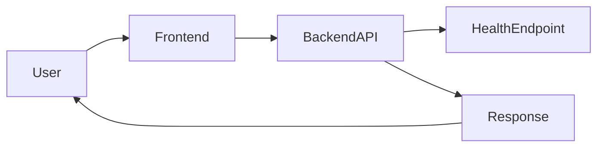

# 13. Application Verification

## Objective

Verify that the deployed FlavorForge application is fully functional by validating frontend accessibility, backend API availability, application configuration, and end-to-end communication between all application components.

---

## Why This Verification Matters

The successful deployment of infrastructure and Kubernetes resources does not, by itself, guarantee that the application is usable.

The ultimate goal of the DevSecOps platform is to deliver a working application to end users. Therefore, application verification confirms that the deployed system behaves as expected, responds correctly to user requests, and that all application components communicate successfully.

This verification provides the final functional validation before the platform is considered operational.

---

## Verification Process

The deployed application was validated from an end-user perspective by verifying:

- Frontend accessibility
- Backend API availability
- Frontend and backend communication
- Health endpoint response
- Application configuration
- End-to-end functionality
- Frontend and backend compatibility
- Application version consistency

Each verification step confirms that the application is not only deployed but also operating correctly within the Kubernetes environment.



---

## Functional Components Verified

| Component | Verification | Status |
|-----------|--------------|:------:|
| Frontend Application | Accessible | ✅ |
| Backend API | Responding | ✅ |
| Frontend ↔ Backend Communication | Successful | ✅ |
| Health Endpoint | Available | ✅ |
| Application Configuration | Loaded Correctly | ✅ |
| Frontend/Backend Compatibility | Verified | ✅ |
| End-to-End Functionality | Verified | ✅ |

---

## Evidence

### Frontend Application

> **Screenshot Placeholder**

```
images/verification/frontend-homepage.png
```

---

### Backend API Response

> **Screenshot Placeholder**

```
images/verification/backend-api-response.png
```

---

### Health Endpoint

> **Screenshot Placeholder**

```
images/verification/health-endpoint.png
```

---

### Browser Developer Tools (Network)

> **Screenshot Placeholder**

```
images/verification/browser-network-tab.png
```

---

### Application Running in Browser

> **Screenshot Placeholder**

```
images/verification/application-running.png
```

---

# Application Compatibility Verification

## Objective

Verify that frontend and backend application components remain compatible after deployment by validating API communication, image version alignment, and expected application behavior.

---

## Why This Verification Matters

During application delivery, frontend and backend components must work together using compatible versions.

A successful Kubernetes deployment does not guarantee application compatibility if frontend and backend images are not synchronized or if API contracts change between releases.

This verification ensures that the deployed application components communicate correctly and that the running version matches the intended release configuration.

---

## Verification Process

The following compatibility checks were performed:

- Verified that the frontend application communicates with the intended backend API endpoint.
- Confirmed that frontend and backend container images match the expected release versions.
- Validated that backend API responses match the data expected by the frontend.
- Checked application logs and browser network requests for version mismatch or communication errors.

Verification included checking deployed image versions:

```bash
kubectl get deployments -o yaml
```

and validating frontend-to-backend communication through browser network requests and API responses.

---

## Evidence

### Frontend and Backend Image Versions

> **Screenshot Placeholder**

```
images/verification/application-image-versions.png
```

---

### Frontend API Communication

> **Screenshot Placeholder**

```
images/verification/frontend-backend-communication.png
```

---

### API Response Validation

> **Screenshot Placeholder**

```
images/verification/api-response-validation.png
```

---

## Expected Result

- Frontend should communicate with the intended backend API.
- Frontend and backend deployments should use compatible image versions.
- API responses should match frontend expectations.
- No version mismatch or communication errors should occur after deployment.

---

## Actual Result

Frontend and backend components were successfully validated after deployment.

The frontend communicated with the intended backend API, deployed image versions were confirmed to be compatible, and API responses matched frontend requirements.

No frontend/backend version mismatch issues were observed during final application validation.

---

## Conclusion

Application compatibility verification completed successfully.

The FlavorForge platform was validated beyond basic application availability by confirming that deployed components operate together correctly as an integrated application.

---

## End-to-End Validation

The complete application workflow was verified by accessing the frontend through the configured endpoint.

The frontend successfully communicated with the backend API, which processed requests and returned the expected responses. The health endpoint confirmed that the backend service was operational, while application configuration was correctly loaded within the running environment.

These results demonstrate that all application components function together as an integrated system.

---

## Verification Commands

```bash
curl http://<application>/api/health
```

---

## Expected Result

The application should load successfully, backend APIs should respond correctly, frontend and backend communication should occur without errors, and health endpoints should indicate that the application is operational.

---

## Actual Result

The deployed FlavorForge application operated successfully throughout the verification process. Frontend pages loaded correctly, backend APIs responded as expected, and application components communicated reliably within the Kubernetes environment.

---

## Verification Observations

Frontend and backend communicated successfully.

The application responded correctly throughout the verification process.

---

## Conclusion

Application verification completed successfully.

The FlavorForge platform successfully delivers a functional web application, demonstrating that the complete DevSecOps pipeline—from source code to a running application—results in a working, user-accessible solution.