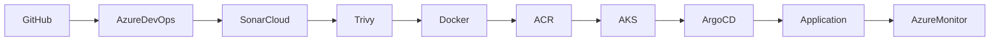

# 15. Final Acceptance Summary

## Overview

The verification activities described throughout this document confirm that the FlavorForge DevSecOps platform satisfies the functional, operational, security, and deployment objectives established at the beginning of the project.

Each layer of the platform was validated independently and then assessed as part of the complete end-to-end software delivery workflow. The verification demonstrates that the platform operates reliably as an integrated cloud-native solution rather than as a collection of individual technologies.

---

## Verification Results

| Platform Layer | Verification Status | Evidence |
|----------------|--------------------|----------|
| Source Code Management | ✅ Passed | GitHub Repository |
| Continuous Integration | ✅ Passed | Azure DevOps Pipeline |
| Code Quality | ✅ Passed | SonarCloud Analysis |
| Container Security | ✅ Passed | Trivy Scan Results |
| Containerization | ✅ Passed | Docker Images & ACR |
| Azure Infrastructure | ✅ Passed | Azure Resources |
| Kubernetes Platform | ✅ Passed | Running Cluster Resources |
| GitOps | ✅ Passed | Argo CD Synchronization |
| Application Functionality | ✅ Passed | Frontend, Backend & Health API |
| Monitoring & Observability | ✅ Passed | Azure Monitor & Container Insights |

---

## End-to-End Verification

The complete DevSecOps workflow was successfully verified from source code management through application delivery and operational monitoring.

The verification confirmed that:

- Source code is managed in GitHub.
- Azure DevOps automates the build and validation process.
- SonarCloud enforces code quality checks.
- Trivy validates container security.
- Docker packages the application into consistent, versioned images.
- Azure Container Registry stores deployment artifacts.
- Azure Kubernetes Service hosts the application reliably.
- Argo CD maintains the desired cluster state using GitOps.
- The deployed application is accessible and functional.
- Azure Monitor provides operational visibility into the running platform.

---

## Acceptance Statement

Based on the verification activities and supporting evidence presented in this document, the FlavorForge platform satisfies the defined project objectives and verification success criteria.

The platform demonstrates a complete DevSecOps implementation with automated software delivery, integrated quality and security validation, cloud-native deployment, GitOps-based continuous delivery, and operational monitoring.

The solution is therefore considered **successfully verified** for the scope of this project.

