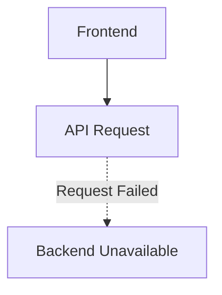
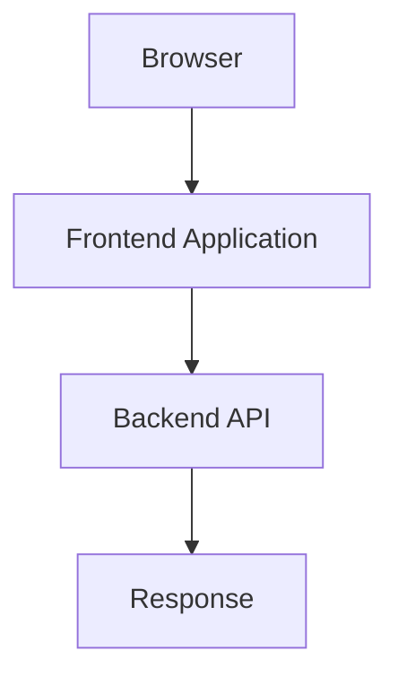
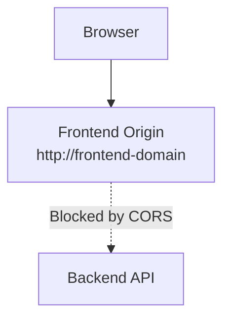
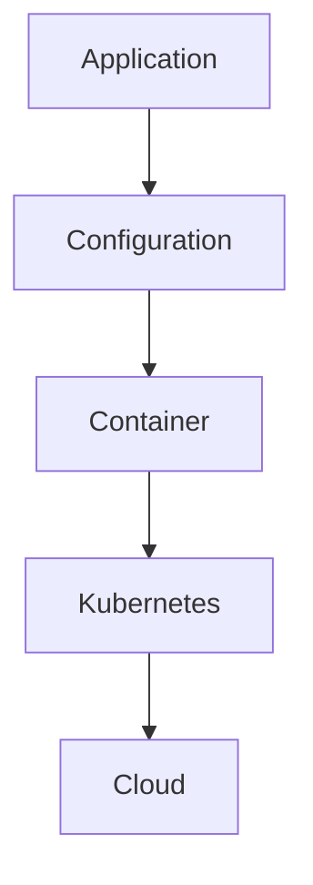

# 🖥️ Application Troubleshooting Guide

## Overview

Application-level issues are often the first problems encountered by users. Before investigating infrastructure components such as Kubernetes or Azure, verify that the application itself is functioning correctly.

Begin by confirming that:

- The frontend application is running.
- The backend API is responding.
- Application configuration is correct.
- Frontend and backend communication is working.

This guide documents common application issues encountered while developing and deploying FlavorForge.

---

## Issue 1 — Backend API Not Available

### Problem

The frontend application loads successfully, but API requests fail because the backend service is unavailable.

### Symptoms

Users may observe:

- Recipe data does not load.
- API requests fail.
- The frontend displays error messages.

Example:



### Investigation

#### Step 1 — Verify the Backend Process

For a local development environment:

```bash
npm run dev
```

Verify that the backend starts successfully.

Expected output:

```text
Server running on port 3000
```

#### Step 2 — Verify the Health Endpoint

Check the backend health endpoint:

```bash
curl http://localhost:3000/api/health
```

Expected response:

```json
{
  "status": "UP",
  "application": "FlavorForge Backend"
}
```

#### Step 3 — Review Backend Logs

Docker:

```bash
docker logs <backend-container>
```

Kubernetes:

```bash
kubectl logs <backend-pod>
```

### Possible Root Causes

Common causes include:

- Backend process stopped unexpectedly.
- Incorrect port configuration.
- Missing environment variables.
- Container startup failure.
- Kubernetes pod unavailable.

### Resolution

Verify that:

- The backend application is running.
- The configured port matches the deployment.
- Required environment variables are available.

Example:

```env
PORT=3000
NODE_ENV=production
```

### Prevention

Recommended practices:

- Health endpoints
- Kubernetes readiness probes
- Container monitoring

---

## Issue 2 — Frontend Cannot Communicate with Backend

### Problem

The frontend application loads correctly, but API requests fail.

### Symptoms

The browser console may display:

```text
CORS policy blocked request
```

or

```text
Failed to fetch API
```

### Architecture Check

Expected communication flow:



### Investigation

#### Step 1 — Verify the Backend URL

Check the frontend configuration.

Example:

```env
VITE_API_BASE_URL
```

Ensure that it points to the correct backend endpoint.

#### Step 2 — Verify Backend Availability

Run:

```bash
curl http://<backend-url>/api/health
```

If the request fails, investigate backend availability.

If the request succeeds, continue reviewing the frontend configuration.

### Root Cause Example

During deployment, the frontend and backend were deployed in different environments.

The frontend configuration referenced an incorrect backend endpoint.

### Resolution

Update the frontend environment configuration.

Example:

```env
VITE_API_BASE_URL=http://backend:3000
```

Rebuild and redeploy the frontend after updating the configuration.

### Prevention

Recommended practices:

- Environment-specific configuration
- Kubernetes ConfigMaps
- Deployment verification checks

---

## Issue 3 — CORS Configuration Failure

### Problem

The backend rejects requests originating from the frontend application.

### Symptoms

The browser displays an error similar to:

```text
Access-Control-Allow-Origin error
```

Example:



### Investigation

Review the backend CORS configuration.

Example:

```javascript
app.use(
  cors({
    origin: process.env.CORS_ORIGIN
  })
);
```

### Root Cause

The configured frontend origin did not match the deployed frontend URL.

Configured:

```text
http://localhost:5173
```

Actual:

```text
http://<production-url>
```

### Resolution

Update the backend configuration.

Example:

```env
CORS_ORIGIN=<frontend-url>
```

Restart the backend deployment.

Kubernetes:

```bash
kubectl rollout restart deployment backend
```

### Prevention

Recommended practices:

- Store configuration separately from application code.
- Use Kubernetes ConfigMaps.
- Maintain environment-specific configuration values.

---

## Issue 4 — Application Health Verification

### Purpose

Health checks provide confidence that the application and its supporting services are operating correctly.

### Backend Verification

Run:

```bash
curl http://<application-url>/api/health
```

Expected response:

```json
{
  "status": "UP",
  "application": "FlavorForge Backend",
  "environment": "production"
}
```

### Kubernetes Verification

Verify running pods:

```bash
kubectl get pods
```

Expected status:

```text
Running
```

### Verification Checklist

| Check | Expected Result |
|--------|-----------------|
| Frontend loads | Success |
| Backend API responds | HTTP 200 |
| Health endpoint responds | UP |
| Kubernetes pods | Ready |
| Application errors | None |

---

## Engineering Learning

Application issues should always be investigated before assuming an infrastructure failure.

Follow this troubleshooting order:



Following this layered approach helps identify root causes quickly and avoids unnecessary debugging of infrastructure when the issue originates within the application itself.
