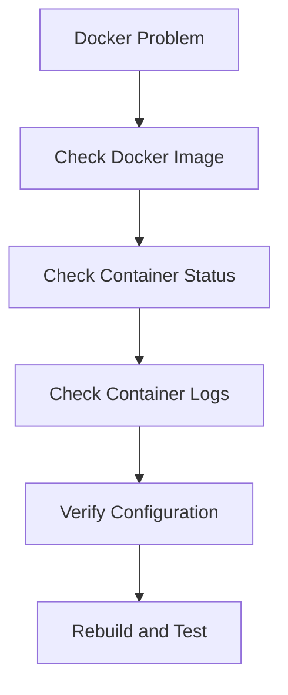
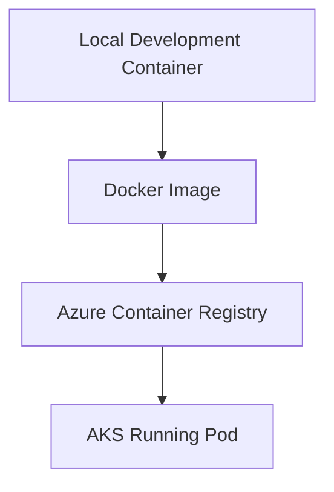
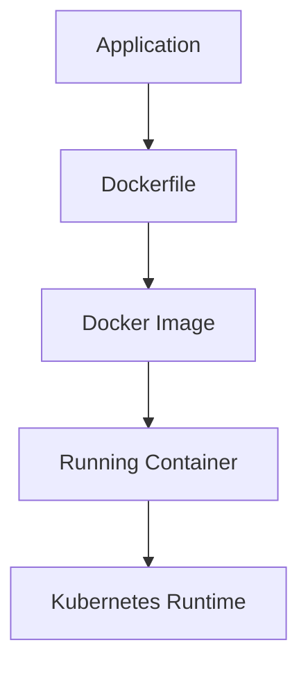

# 🐳 Docker Troubleshooting Guide

## Overview

Docker packages the FlavorForge frontend and backend applications into portable containers.

Container-related issues can occur during:

- Image building
- Dependency installation
- Container startup
- Environment configuration
- Runtime execution

This document covers common Docker issues encountered during FlavorForge development and deployment.

---

# Docker Troubleshooting Approach

When a container fails:




---

# Issue 1 — Docker Image Build Failure

## Problem

Docker image creation fails during the build process.

---

## Symptoms

Example:
```text
docker build failed

ERROR: failed to solve
```
or:

```text
npm install failed
```


---

## Investigation

### Step 1 — Review Build Logs

Run:

```bash
docker build -t flavorforge-backend .
```

Analyze the failed Docker layer.

---

### Step 2 — Check Dockerfile

Verify:

* Base image
* Dependency installation
* Application copy commands
* Build commands

Example:

```dockerfile
FROM node:22-alpine

WORKDIR /app

COPY package*.json .

RUN npm install

COPY . .

CMD ["npm","start"]
```

---

## Common Root Causes

| Cause                | Solution               |
| -------------------- | ---------------------- |
| Missing package.json | Verify source files    |
| Dependency failure   | Check package versions |
| Incorrect path       | Validate COPY commands |
| Wrong Node version   | Use compatible runtime |

---

## Resolution

Rebuild after correcting the Dockerfile:

```bash
docker build \
-t flavorforge-backend:v1 .
```

---

# Issue 2 — Frontend Docker Build Failure

## Problem

React frontend container fails during production build.

---

## Symptoms

Example:

```
npm run build failed
```

or:

```
vite build error
```

---

## Investigation

Check:

```bash
docker build \
-t flavorforge-frontend .
```

Review:

* Node version
* Environment variables
* Vite configuration

---

## Root Cause Example

Frontend build depends on:

* Correct Node.js version
* Correct VITE environment variables

Incorrect configuration can cause:

* API URL failures
* Build failures
* Runtime errors

---

## Resolution

Ensure:

```dockerfile
FROM node:22-alpine AS builder
```

and required environment variables exist:

```
VITE_API_BASE_URL
```

---

# Issue 3 — Container Starts But Application Is Not Accessible

## Problem

The container is running, but the application cannot be reached.

---

## Symptoms

Command:

```bash
docker ps
```

shows:

```
Container running
```

but browser/API request fails.

---

## Investigation

### Check Container Logs

```bash
docker logs <container-name>
```

---

### Check Port Mapping

Example:

```bash
docker run \
-p 3000:3000 \
flavorforge-backend
```

Verify:

```
Host Port → Container Port
```

---

## Common Causes

* Incorrect port mapping
* Application listening on wrong interface
* Missing environment variables
* Container crashed after startup

---

## Resolution

Verify application configuration:

Example:

```javascript
app.listen(PORT,"0.0.0.0")
```

Container applications must listen on all interfaces.

---

# Issue 4 — Container Works Locally But Fails in AKS

## Problem

The Docker image works on a developer machine but fails after Kubernetes deployment.

---

## Symptoms

Local:

```
docker run works
```

AKS:

```
Pod not ready
```

---

## Investigation Flow



Check each stage.

---

## Step 1 — Verify Image Exists

Azure Container Registry:

```bash
az acr repository list
```

---

## Step 2 — Check Kubernetes Pod

```bash
kubectl get pods
```

---

## Step 3 — Review Pod Logs

```bash
kubectl logs <pod-name>
```

---

## Common Root Causes

| Issue                         | Explanation                 |
| ----------------------------- | --------------------------- |
| Wrong image tag               | AKS pulls unavailable image |
| Missing environment variables | Application cannot start    |
| Port mismatch                 | Service cannot communicate  |
| Registry access issue         | AKS cannot pull image       |

---

# Issue 5 — Docker Image Size Optimization

## Problem

Large images increase:

* Deployment time
* Storage usage
* Network transfer time

---

## Optimization Techniques

FlavorForge uses:

### Multi-stage Docker Builds

Example:

```
Build Stage

    |
    ↓

Production Stage
```

Benefits:

* Smaller images
* Reduced attack surface
* Faster deployment

---

### Alpine Base Images

Example:

```dockerfile
node:22-alpine
```

Benefits:

* Lightweight
* Faster startup

---

### Remove Unnecessary Files

Avoid copying:

```
node_modules

coverage

logs

temporary files
```

Use:

```
.dockerignore
```

---

# Useful Docker Debugging Commands

## List Images

```bash
docker images
```

---

## List Containers

```bash
docker ps -a
```

---

## View Logs

```bash
docker logs <container>
```

---

## Enter Running Container

```bash
docker exec -it <container> sh
```

---

## Inspect Container

```bash
docker inspect <container>
```

---

# Docker Troubleshooting Checklist

| Check              | Command        |
| ------------------ | -------------- |
| Image exists       | docker images  |
| Container running  | docker ps      |
| Logs available     | docker logs    |
| Ports mapped       | docker port    |
| Environment loaded | docker inspect |
| Image optimized    | docker history |

---

# Engineering Learning

A Docker image is not just a package.

It represents the exact runtime environment of an application.

Successful container troubleshooting requires understanding:





A reliable DevOps engineer validates every layer before moving to the next.

