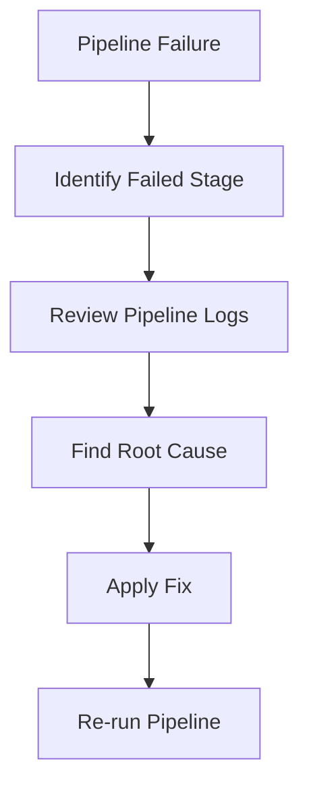
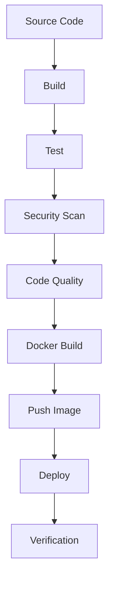
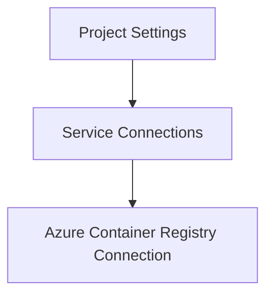
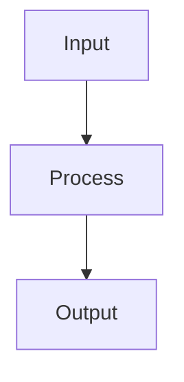

# 🔄 Azure DevOps Pipeline Troubleshooting Guide

## Overview

The Azure DevOps pipeline automates the complete software delivery workflow for FlavorForge.

The pipeline performs:

- Application build
- Testing
- Code quality analysis
- Security scanning
- Docker image creation
- Image publishing
- Kubernetes deployment

A pipeline failure can occur at any stage.

This document explains common Azure DevOps troubleshooting scenarios encountered during FlavorForge implementation.

---

# Pipeline Troubleshooting Approach

When a pipeline fails:



---

# Pipeline Stages

FlavorForge pipeline flow:



---

# Issue 1 — Node.js Version Mismatch in Azure Pipeline

## Problem

Frontend build failed in Azure DevOps even though the application worked locally.

---

## Symptoms

Pipeline failure:

```

npm run build failed

Vite build error

```

The failure occurred during the frontend build stage.

---

## Investigation

The pipeline logs showed:

```

Host Selected Node version: Node24

```

However, the application was developed and tested using:

```

Node.js 22

````

---

## Root Cause

Azure DevOps agent automatically selected a newer Node.js version.

The application dependencies were not compatible with the unexpected runtime version.

The pipeline environment did not match the development environment.

---

## Resolution

Explicitly define the required Node.js version in the pipeline.

Example:

```yaml
- task: NodeTool@0
  inputs:
    versionSpec: '22.x'
````

This ensures:

```
Developer Environment

        =

Pipeline Environment
```

---

## Prevention

Best practices:

✅ Pin runtime versions
✅ Avoid relying on agent defaults
✅ Document supported versions

Example:

```
Node.js: 22.x
npm: compatible version
```

---

# Issue 2 — Frontend Build Failure

## Problem

The Docker build stage failed because the React application could not generate the production build.

---

## Symptoms

Pipeline error:

```
npm run build failed
```

---

## Investigation

Debugging steps:

1. Verify Node.js version

```bash
node --version
```

2. Run build locally:

```bash
npm run build
```

3. Review Vite errors

---

## Common Causes

| Cause                        | Solution              |
| ---------------------------- | --------------------- |
| Wrong Node version           | Pin Node version      |
| Missing dependency           | Check package.json    |
| Environment variable missing | Verify VITE variables |
| Build configuration issue    | Check Vite config     |

---

## Resolution

Align:

* Local environment
* Pipeline environment
* Docker build environment

---

# Issue 3 — Pipeline Stage Failure Analysis

## Problem

A multi-stage pipeline fails and it is unclear where the problem occurred.

---

## Investigation Method

Start with the failed stage.

Example:

```
Pipeline

Build       ✅

Test        ✅

Security    ✅

Docker      ❌

Deploy      ⏸
```

The issue is isolated to Docker.

---

## Debugging Steps

### Step 1

Open failed stage logs.

---

### Step 2

Identify failing command.

Example:

```
docker build failed
```

---

### Step 3

Reproduce locally.

Example:

```bash
docker build -t test-image .
```

---

### Step 4

Apply correction and rerun pipeline.

---

# Issue 4 — Docker Image Push Failure

## Problem

Docker image build succeeds but publishing to Azure Container Registry fails.

---

## Symptoms

Example:

```
unauthorized:
authentication required
```

---

## Investigation

Check:

### Service Connection

Azure DevOps:



---

### Verify Registry Login

Example:

```bash
az acr login \
--name flavorforgeacr2026ms
```

---

## Common Root Causes

| Cause                        | Solution           |
| ---------------------------- | ------------------ |
| Incorrect service connection | Update connection  |
| Wrong registry name          | Verify ACR URL     |
| Permission issue             | Check Azure access |
| Expired credentials          | Re-authenticate    |

---

# Issue 5 — SonarCloud Stage Failure

## Problem

Code quality analysis does not complete successfully.

---

## Symptoms

Examples:

```
SonarCloud analysis failed
```

or:

```
Coverage report not found
```

---

## Investigation

Verify:

```
sonar-project.properties
```

Example:

```properties
sonar.sources=backend/src,frontend/src

sonar.tests=backend/tests
```

---

## Common Causes

| Problem                | Solution                   |
| ---------------------- | -------------------------- |
| Wrong source path      | Update sonar configuration |
| Missing test execution | Run tests before analysis  |
| Missing coverage file  | Generate coverage report   |
| Incorrect project key  | Verify SonarCloud settings |

---

# Issue 6 — Pipeline YAML Validation Errors

## Problem

Azure DevOps rejects pipeline configuration.

---

## Symptoms

Example:

```
YAML parsing error
```

---

## Investigation

Check:

* Indentation
* Task names
* Variable names
* Stage dependencies

Example:

Incorrect:

```yaml
steps:
- script:
 echo hello
```

Correct:

```yaml
steps:
- script: |
    echo hello
```

---

# Useful Azure DevOps Debug Commands

## Enable Detailed Logs

Pipeline variable:

```
system.debug=true
```

---

## Check Git Commit

```bash
git log
```

---

## Verify Local Build

```bash
npm run build
```

---

## Test Docker Build

```bash
docker build .
```

---

# Pipeline Troubleshooting Checklist

| Check                      | Status |
| -------------------------- | ------ |
| Source checkout successful | ✅      |
| Correct runtime version    | ✅      |
| Dependencies installed     | ✅      |
| Tests executed             | ✅      |
| Security scans passed      | ✅      |
| Docker image created       | ✅      |
| Image pushed to ACR        | ✅      |
| Deployment triggered       | ✅      |

---

# Engineering Learning

A CI/CD pipeline is a software system.

When it fails, debug it like an application:





A successful DevOps engineer does not just rerun pipelines.

They understand:

* Why it failed
* Where it failed
* How to prevent future failures


