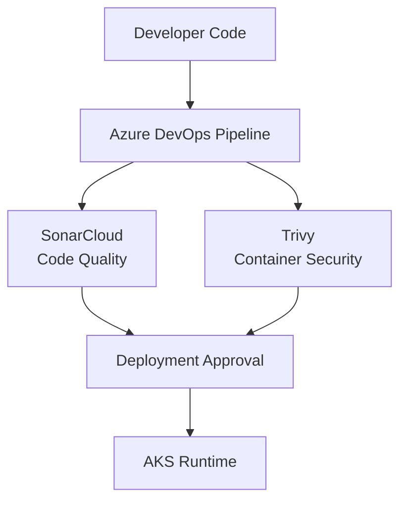
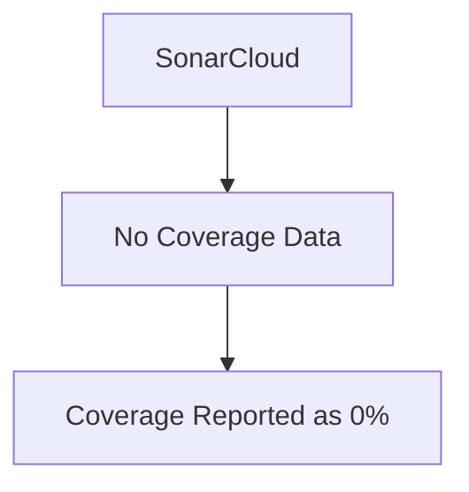
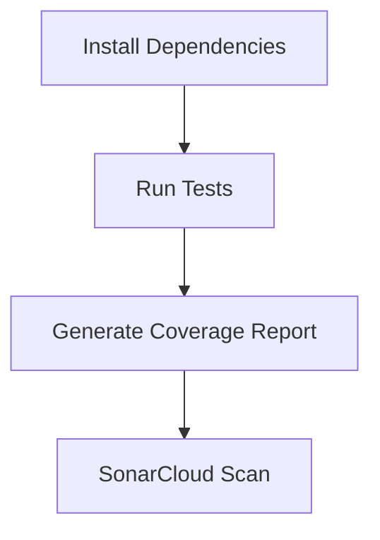
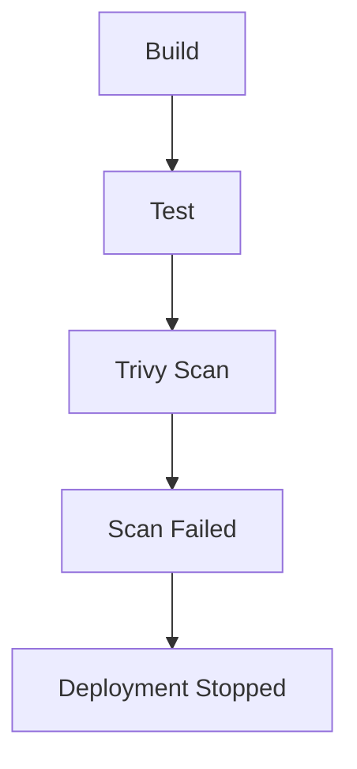
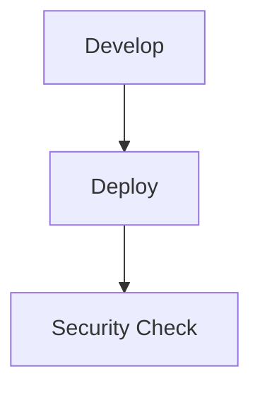
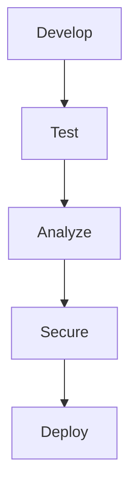

# 🔐 Security and Code Quality Troubleshooting Guide

## Overview

Security is integrated into the FlavorForge delivery lifecycle.

The pipeline performs continuous validation using:

- SonarCloud for code quality analysis
- Trivy for vulnerability scanning

The objective is to identify problems early before applications reach production.

This approach follows the DevSecOps principle:

> Security should be integrated into every stage of software delivery.

---

# Security Validation Flow



---

# Issue 1 — SonarCloud Coverage Shows 0%

## Problem

SonarCloud analysis completes, but code coverage displays:

```

Coverage on New Code: 0.0%

```

---

## Symptoms

Pipeline status:

```

SonarCloud Analysis

Successful

but

Coverage: 0%

````

---

## Investigation

The first step is verifying whether coverage reports are generated.

Run tests:

```bash
npm test -- --coverage
````

Verify generated files:

```
coverage/
 |
 └── lcov.info
```

---

## Root Cause

SonarCloud does not execute tests automatically.

It only reads coverage reports generated by the testing framework.

If the coverage file is missing or the path is incorrect:



---

## Resolution

Generate coverage before SonarCloud analysis.

Example pipeline flow:



---

Configure coverage path:

Example:

```properties
sonar.javascript.lcov.reportPaths=coverage/lcov.info
```

---

## Prevention

Best practices:

✅ Run tests before quality analysis  
✅ Verify coverage artifact generation  
✅ Maintain correct SonarCloud paths  
✅ Fail pipeline for critical quality issues  

---

# Issue 2 — SonarCloud Source Path Configuration Error

## Problem

SonarCloud cannot analyze source files correctly.

---

## Symptoms

Examples:

```
No files analyzed
```

or:

```
Source directory not found
```

---

## Investigation

Review:

```
sonar-project.properties
```

Example:

```properties
sonar.sources=backend/src,frontend/src

sonar.tests=backend/tests
```

---

## Common Root Causes

| Cause                             | Solution                   |
| --------------------------------- | -------------------------- |
| Wrong folder path                 | Update source location     |
| Repository structure changed      | Update configuration       |
| Test folders included incorrectly | Separate sources and tests |

---

## Resolution

Match SonarCloud configuration with repository structure.

Example:

```
Repository

├── backend
│   └── src

└── frontend
    └── src
```

---

# Issue 3 — Trivy Image Scan Failure

## Problem

Container vulnerability scanning fails.

---

## Symptoms

Example:

```
Trivy scan failed
Critical vulnerabilities found
```

---

## Investigation

Run scan locally:

```bash
trivy image flavorforge-backend:latest
```

Review:

* Vulnerability ID
* Severity
* Affected package
* Available fix

---

# Vulnerability Severity

Trivy categorizes issues:

| Severity | Meaning             |
| -------- | ------------------- |
| LOW      | Minor risk          |
| MEDIUM   | Moderate risk       |
| HIGH     | Significant risk    |
| CRITICAL | Immediate attention |

---

# Root Causes

Common reasons:

* Outdated base image
* Vulnerable dependency
* Old package version
* Unpatched operating system package

---

# Resolution

Possible solutions:

## Update Base Image

Example:

```dockerfile
FROM node:22-alpine
```

Use maintained versions.

---

## Update Dependencies

Example:

```bash
npm audit fix
```

Review changes before committing.

---

## Rebuild Image

After fixes:

```bash
docker build -t flavorforge-backend:v2 .
```

Run scan again.

---

# Issue 4 — Security Scan Blocks Deployment

## Problem

Pipeline stops because security checks fail.

---

## Example Flow



---

## Investigation

Do not bypass security checks.

Review:

1. Vulnerability details
2. Severity level
3. Recommended fix
4. Business impact

---

## Resolution Decision

| Situation               | Action                |
| ----------------------- | --------------------- |
| Critical vulnerability  | Fix before deployment |
| No available patch      | Risk assessment       |
| Development image issue | Update dependency     |
| False positive          | Document exception    |

---

# Issue 5 — Dependency Vulnerability

## Problem

Application dependencies contain known vulnerabilities.

---

## Investigation

Backend:

```bash
npm audit
```

Frontend:

```bash
npm audit
```

---

## Resolution

Update vulnerable packages:

```bash
npm update
```

or:

```bash
npm audit fix
```

---

# Security Debugging Checklist

| Check               | Command                  |
| ------------------- | ------------------------ |
| Tests executed      | npm test                 |
| Coverage generated  | coverage/lcov.info       |
| Sonar configuration | sonar-project.properties |
| Dependency audit    | npm audit                |
| Image scan          | trivy image              |
| Base image updated  | Dockerfile review        |

---

# DevSecOps Learning

Traditional approach:



Modern DevSecOps approach:



Security becomes part of the delivery pipeline instead of a final checkpoint.

---

# Engineering Outcome

FlavorForge demonstrates:

✅ Automated code quality checks
✅ Continuous vulnerability scanning
✅ Shift-left security practices
✅ Secure container delivery workflow

