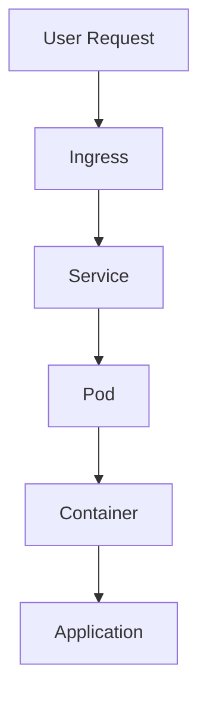
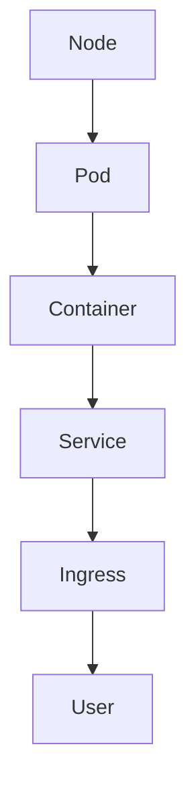
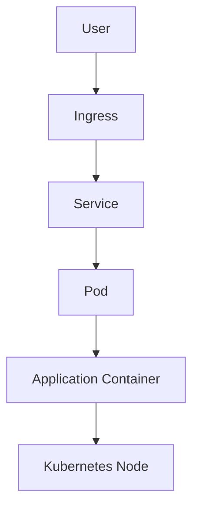

# ☸️ Kubernetes and AKS Troubleshooting Guide

## Overview

FlavorForge runs on Azure Kubernetes Service (AKS).

Kubernetes introduces multiple operational layers:

- Nodes
- Pods
- Deployments
- Services
- Ingress
- ConfigMaps
- Secrets
- Horizontal Pod Autoscaler

When an application fails in Kubernetes, troubleshooting requires checking each layer systematically.

---

# Kubernetes Troubleshooting Approach



---

# Essential Kubernetes Commands

## Check Cluster Status

```bash
kubectl cluster-info
````

---

## Check Nodes

```bash
kubectl get nodes
```

Expected:

```
STATUS

Ready
```

---

## Check All Resources

```bash
kubectl get all -A
```

---

## Check Pods

```bash
kubectl get pods -n <namespace>
```

---

## View Pod Details

```bash
kubectl describe pod <pod-name>
```

---

## View Logs

```bash
kubectl logs <pod-name>
```

---

# Issue 1 — Pod Stuck in ImagePullBackOff

## Problem

Kubernetes cannot download the container image from Azure Container Registry.

---

## Symptoms

Example:

```
kubectl get pods
```

Output:

```
frontend-prod

ImagePullBackOff
```

---

## Investigation

Check pod details:

```bash
kubectl describe pod <pod-name>
```

Look for:

```
Failed to pull image
```

---

## Common Root Causes

| Cause                    | Explanation                         |
| ------------------------ | ----------------------------------- |
| Wrong image tag          | Image does not exist                |
| Incorrect registry URL   | Kubernetes points to wrong location |
| ACR authentication issue | AKS cannot access registry          |
| Image not pushed         | Container image unavailable         |

---

## Verify Image Exists

Check ACR:

```bash
az acr repository list \
--name flavorforgeacr2026ms
```

Verify tags:

```bash
az acr repository show-tags \
--name flavorforgeacr2026ms \
--repository flavorforge-frontend
```

---

## Verify AKS ACR Access

Run:

```bash
az aks check-acr \
--resource-group flavorforge-rg \
--name flavorforge-aks \
--acr flavorforgeacr2026ms.azurecr.io
```

Expected:

```
SUCCEEDED
```

---

## Resolution

Correct:

* Image name
* Image tag
* Registry reference

Then restart deployment:

```bash
kubectl rollout restart deployment <deployment-name>
```

---

# Issue 2 — Pod Running But Application Not Working

## Problem

Pod status shows Running, but application is unavailable.

---

## Symptoms

Example:

```
READY   STATUS

1/1     Running
```

but:

```
Application unreachable
```

---

## Investigation

Check logs:

```bash
kubectl logs <pod-name>
```

---

Check container ports:

```bash
kubectl describe pod <pod-name>
```

Verify:

```
containerPort
```

matches application configuration.

---

## Common Causes

* Incorrect application port
* Missing environment variables
* Application startup failure
* Incorrect service configuration

---

## Resolution

Verify:

Deployment:

```yaml
ports:
- containerPort: 3000
```

Application:

```
PORT=3000
```

---

# Issue 3 — Kubernetes Service Not Accessible

## Problem

Pods are healthy but users cannot access the application.

---

## Investigation

Check services:

```bash
kubectl get svc
```

Example:

```
frontend-service

backend-service
```

---

Check endpoints:

```bash
kubectl get endpoints
```

---

## Common Causes

| Issue              | Solution          |
| ------------------ | ----------------- |
| Wrong selector     | Match labels      |
| Wrong port mapping | Verify targetPort |
| No endpoints       | Check pods        |

---

## Debug Service Internally

Run:

```bash
kubectl port-forward service/<service-name> 8080:80
```

Test:

```
localhost:8080
```

---

# Issue 4 — Ingress External IP Not Available

## Problem

Application is deployed but no public endpoint exists.

---

## Symptoms

Command:

```bash
kubectl get ingress
```

shows:

```
ADDRESS

pending
```

---

## Investigation

Check ingress controller:

```bash
kubectl get svc -n ingress-nginx
```

---

Expected:

```
TYPE

LoadBalancer
```

---

## Common Causes

* Load balancer provisioning delay
* Incorrect ingress configuration
* Missing ingress controller

---

## Resolution

Verify:

```bash
kubectl describe ingress
```

Check:

* Host rules
* Service names
* Ports

---

# Issue 5 — ConfigMap Configuration Problem

## Problem

Application starts with incorrect configuration.

---

## Symptoms

Examples:

* Wrong environment
* Incorrect API URL
* Backend connection failure

---

## Investigation

List ConfigMaps:

```bash
kubectl get configmaps
```

View:

```bash
kubectl describe configmap <name>
```

---

## Common Causes

* Incorrect value
* Old configuration
* Deployment not restarted after change

---

## Resolution

After updating ConfigMap:

Restart deployment:

```bash
kubectl rollout restart deployment <deployment-name>
```

---

# Issue 6 — Secret Configuration Problem

## Problem

Application cannot access required secrets.

---

## Investigation

Check secrets:

```bash
kubectl get secrets
```

---

Describe:

```bash
kubectl describe secret <secret-name>
```

---

## Important Note

Never store sensitive values directly in Git.

Use:

* Kubernetes Secrets
* Azure Key Vault integration (future enhancement)

---

# Issue 7 — Horizontal Pod Autoscaler Not Scaling

## Problem

Application load increases but replicas do not change.

---

## Investigation

Check HPA:

```bash
kubectl get hpa
```

---

Example:

```
NAME

backend-hpa
```

---

Check metrics:

```bash
kubectl top pods
```

---

## Common Causes

* Metrics server unavailable
* CPU threshold not reached
* Incorrect resource requests

---

## Resolution

Verify:

```yaml
resources:
 requests:
   cpu: 250m
```

---

# Kubernetes Verification Checklist

| Component | Command             | Expected         |
| --------- | ------------------- | ---------------- |
| Nodes     | kubectl get nodes   | Ready            |
| Pods      | kubectl get pods    | Running          |
| Services  | kubectl get svc     | Available        |
| Ingress   | kubectl get ingress | Address assigned |
| Logs      | kubectl logs        | No errors        |
| HPA       | kubectl get hpa     | Active           |

---

# Engineering Learning

Kubernetes troubleshooting follows dependency order:



> For Kubernetes, the request flow is typically shown in the opposite direction because traffic originates from the user:



A DevOps engineer should always troubleshoot from the inside out before changing configurations.

---

# FlavorForge Outcome

Through AKS troubleshooting, FlavorForge demonstrates:

✅ Container deployment debugging 
✅ Registry connectivity validation 
✅ Kubernetes networking understanding 
✅ Configuration management 
✅ Production-style operational practices 

