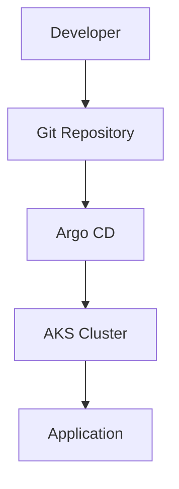
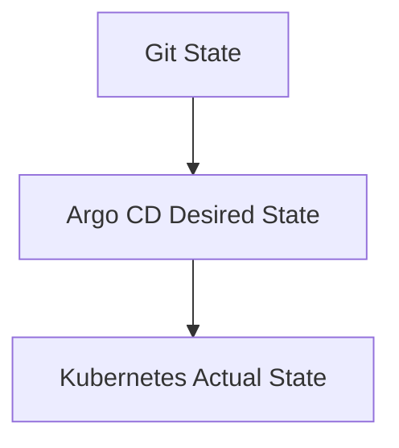
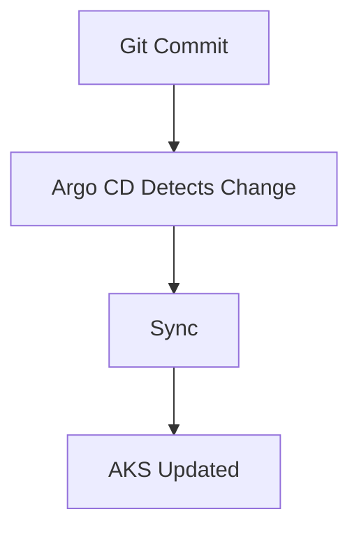
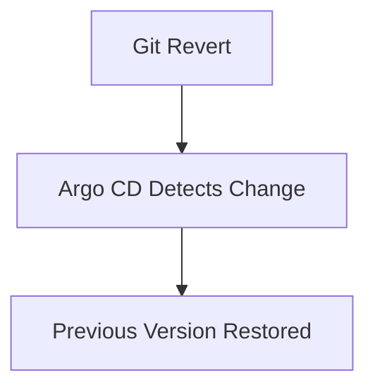
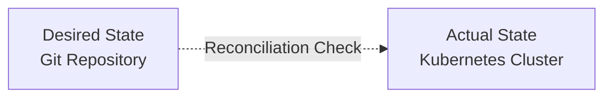

#  ArgoCD GitOps Troubleshooting Guide

## Overview

FlavorForge uses ArgoCD to implement GitOps-based continuous delivery.

In the GitOps model:

- Git repository contains the desired application state
- ArgoCD continuously monitors Git
- Kubernetes cluster maintains the desired state

The deployment flow is:



---

# GitOps Troubleshooting Philosophy

When a deployment issue occurs, compare three states:



The goal is to identify where the difference exists.

---

# Essential ArgoCD Commands

## Check Applications

```bash
argocd app list
````

---

## View Application Status

```bash
argocd app get flavorforge-app
```

---

## Check Synchronization

```bash
argocd app diff flavorforge-app
```

---

## Manual Sync

```bash
argocd app sync flavorforge-app
```

---

# Issue 1 — ArgoCD Application Shows OutOfSync

## Problem

ArgoCD detects that Kubernetes does not match the desired state stored in Git.

---

## Symptoms

ArgoCD UI shows:

```
Status:

OutOfSync
```

---

## Example Scenario

Git contains:

```yaml
replicas: 3
```

Kubernetes currently has:

```yaml
replicas: 2
```

ArgoCD detects the difference.

---

## Investigation

Run:

```bash
argocd app diff flavorforge-app
```

Review:

* Deployment changes
* Service changes
* Configuration differences

---

## Common Causes

| Cause                  | Explanation                        |
| ---------------------- | ---------------------------------- |
| Manual kubectl changes | Cluster drift                      |
| Git manifest updated   | New desired state                  |
| Wrong branch/path      | ArgoCD watching incorrect location |
| Invalid YAML           | Deployment cannot apply            |

---

## Resolution

If Git is correct:

Sync:

```bash
argocd app sync flavorforge-app
```

If Kubernetes is correct:

Update Git to match the desired state.

---

# Issue 2 — ArgoCD Sync Failed

## Problem

ArgoCD attempts deployment but Kubernetes rejects the changes.

---

## Symptoms

ArgoCD status:

```
Sync Failed
```

---

## Investigation

Check application details:

```bash
argocd app get flavorforge-app
```

Review:

* Error messages
* Failed resources
* Kubernetes events

---

## Check Kubernetes Events

```bash
kubectl get events
```

---

## Common Causes

### Invalid Kubernetes YAML

Example:

```yaml
replicas: abc
```

instead of:

```yaml
replicas: 3
```

---

### Invalid Image Reference

Example:

```
flavorforge-frontend:v99
```

when image does not exist.

---

### Missing Resource

Example:

Deployment references:

```
ConfigMap
```

but ConfigMap is unavailable.

---

## Resolution

Fix manifest in Git:



---

# Issue 3 — Application Stuck in Progressing State

## Problem

ArgoCD starts deployment but application never becomes healthy.

---

## Symptoms

ArgoCD:

```
Health:

Progressing
```

---

## Investigation

Check Kubernetes:

```bash
kubectl get pods
```

---

Check deployment:

```bash
kubectl describe deployment <deployment-name>
```

---

Check pod logs:

```bash
kubectl logs <pod-name>
```

---

## Common Causes

* Container startup failure
* Readiness probe failure
* Image pull issue
* Resource limitation

---

## Resolution

Fix the underlying Kubernetes issue.

ArgoCD only reports the state.

The actual problem exists inside Kubernetes.

---

# Issue 4 — Git Repository Updated But ArgoCD Does Not Deploy

## Problem

A change is committed to Git but Kubernetes does not update.

---

## Symptoms

Example:

Git:

```
New image tag: 1.4
```

Cluster:

```
Still running image: 1.3
```

---

## Investigation

Check application:

```bash
argocd app get flavorforge-app
```

Verify:

* Repository URL
* Branch
* Manifest path
* Sync status

---

## Common Causes

| Cause                 | Solution                  |
| --------------------- | ------------------------- |
| Auto-sync disabled    | Enable sync               |
| Wrong branch          | Correct repository config |
| Wrong path            | Verify manifest location  |
| Git commit not pushed | Push changes              |

---

## Resolution

Manual sync:

```bash
argocd app sync flavorforge-app
```

or enable automated synchronization.

---

# Issue 5 — Rollback Using GitOps

## Problem

A new deployment introduces issues.

---

## Traditional Approach

```
kubectl rollback

Manual cluster changes
```

---

## GitOps Approach

Revert Git commit:



---

## Example

Current:

```
frontend:v2
```

Problem detected.

Revert:

```
frontend:v1
```

ArgoCD restores previous state.

---

# Issue 6 — ArgoCD Cannot Connect To Kubernetes

## Problem

ArgoCD cannot manage the target cluster.

---

## Symptoms

Example:

```
Cluster connection failed
```

---

## Investigation

Check:

```bash
argocd cluster list
```

---

Verify Kubernetes access:

```bash
kubectl cluster-info
```

---

## Common Causes

* Invalid cluster credentials
* Network issue
* Expired authentication
* Incorrect cluster configuration

---

# GitOps Debugging Checklist

| Check             | Command              | Expected  |
| ----------------- | -------------------- | --------- |
| App exists        | argocd app list      | Available |
| Git connected     | app get              | Healthy   |
| Sync status       | app get              | Synced    |
| Cluster reachable | kubectl cluster-info | Success   |
| Pods healthy      | kubectl get pods     | Running   |

---

# GitOps Engineering Principles

ArgoCD follows these principles:

## Git as Source of Truth

The desired state lives in Git.

---

## Declarative Deployment

Configuration describes:

* What should exist
* Not how to create it

---

## Automated Reconciliation

ArgoCD continuously compares:



---

# FlavorForge Outcome

Through ArgoCD implementation, FlavorForge demonstrates:

✅ GitOps deployment model 

✅ Declarative Kubernetes management 

✅ Automated synchronization 

✅ Safer rollback strategy 

✅ Reduced manual cluster changes


After that your **entire troubleshooting folder is complete**.

