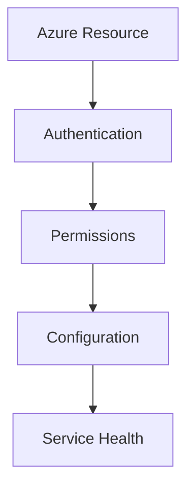
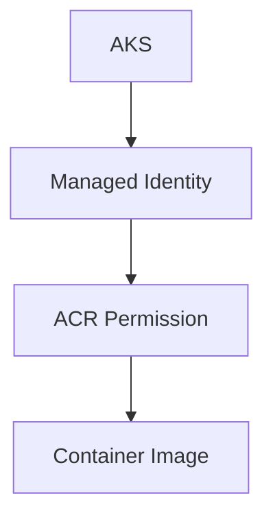
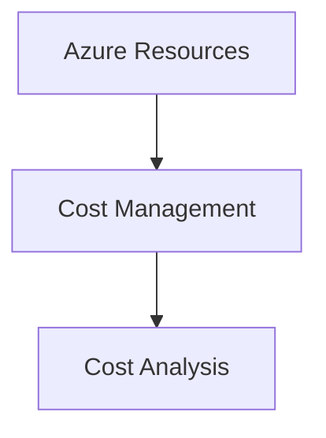
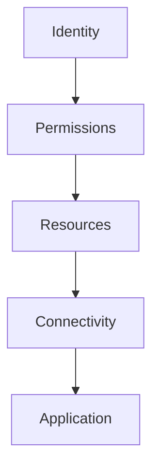

# Azure Cloud Troubleshooting Guide

## Overview

FlavorForge is deployed on Microsoft Azure using cloud-native services:

- Azure Resource Group
- Azure Container Registry (ACR)
- Azure Kubernetes Service (AKS)
- Azure Monitor

Azure provides the infrastructure foundation for running the application.

Cloud troubleshooting requires validating:

- Authentication
- Resource availability
- Service connectivity
- Permissions
- Configuration

---

# Azure Troubleshooting Approach

When an Azure issue occurs:



---

# Essential Azure Commands

## Verify Azure Login

```bash
az account show
````

Expected:

```text
Active subscription details
```

---

## List Resources

```bash
az resource list
```

---

## Check Resource Groups

```bash
az group list
```

---

## Check AKS Credentials

```bash
az aks get-credentials \
--resource-group flavorforge-rg \
--name flavorforge-aks
```

---

# Issue 1 — Azure Authentication Failure

## Problem

Azure CLI commands fail because authentication is missing or expired.

---

## Symptoms

Example:

```
Please run az login
```

---

## Investigation

Check current session:

```bash
az account show
```

---

## Resolution

Authenticate again:

```bash
az login
```

Verify:

```bash
az account list
```

Select correct subscription:

```bash
az account set \
--subscription <subscription-id>
```

---

## Prevention

Best practices:

✅ Use managed identities where possible 

✅ Avoid storing credentials locally 
 
✅ Review service connections regularly

---

# Issue 2 — AKS Cluster Access Failure

## Problem

Unable to connect to the Kubernetes cluster.

---

## Symptoms

Example:

```
Unable to connect to the server
```

or:

```
context not found
```

---

## Investigation

Check AKS:

```bash
az aks show \
--resource-group flavorforge-rg \
--name flavorforge-aks
```

---

Check Kubernetes context:

```bash
kubectl config get-contexts
```

---

## Resolution

Download credentials:

```bash
az aks get-credentials \
--resource-group flavorforge-rg \
--name flavorforge-aks
```

Verify:

```bash
kubectl get nodes
```

Expected:

```
STATUS

Ready
```

---

# Issue 3 — Azure Container Registry Access Failure

## Problem

AKS cannot pull images from Azure Container Registry.

---

## Symptoms

Kubernetes pod shows:

```
ImagePullBackOff
```

---

## Investigation

Verify ACR exists:

```bash
az acr list
```

---

Check AKS-ACR connection:

```bash
az aks check-acr \
--resource-group flavorforge-rg \
--name flavorforge-aks \
--acr flavorforgeacr2026ms.azurecr.io
```

Expected:

```
SUCCEEDED
```

---

## Common Root Causes

| Cause               | Solution               |
| ------------------- | ---------------------- |
| Missing permission  | Attach ACR access      |
| Wrong registry URL  | Verify image reference |
| Incorrect image tag | Check ACR repository   |
| Image unavailable   | Push image             |

---

## Resolution

Verify:



---

# Issue 4 — Azure Resource Not Found

## Problem

Azure command cannot locate a resource.

---

## Symptoms

Example:

```
ResourceNotFound
```

---

## Investigation

List resources:

```bash
az resource list
```

Check:

* Resource group name
* Resource name
* Azure subscription

---

## Common Causes

* Typo in resource name
* Wrong subscription selected
* Resource deleted
* Wrong Azure region

---

## Resolution

Set correct subscription:

```bash
az account set \
--subscription <id>
```

---

# Issue 5 — AKS Node Problems

## Problem

Kubernetes nodes are unhealthy.

---

## Symptoms

Command:

```bash
kubectl get nodes
```

Shows:

```
NotReady
```

---

## Investigation

Describe node:

```bash
kubectl describe node <node-name>
```

---

Check AKS status:

```bash
az aks show \
--resource-group flavorforge-rg \
--name flavorforge-aks
```

---

## Common Causes

* Node resource pressure
* Azure VM issue
* Networking problem
* Kubernetes component failure

---

## Resolution

Possible actions:

* Restart workload
* Scale node pool
* Review Azure health status

---

# Issue 6 — Azure Monitor Not Showing Data

## Problem

Container logs or metrics are missing.

---

## Investigation

Verify:

* Monitoring enabled
* Container Insights configured
* Correct workspace connected

---

Check:

```bash
az monitor log-analytics workspace list
```

---

## Common Causes

| Cause               | Solution                  |
| ------------------- | ------------------------- |
| Monitoring disabled | Enable Container Insights |
| Wrong workspace     | Update configuration      |
| Time delay          | Wait for ingestion        |

---

# Issue 7 — Unexpected Azure Cost Increase

## Problem

Azure resources continue generating cost.

---

## Common Causes

Unused resources:

* AKS cluster
* Load balancer
* Public IP
* Container registry storage

---

## Investigation

Review:



---

## Resolution

Remove unused resources.

Example:

```bash
az group delete \
--name flavorforge-rg
```

⚠️ Use carefully. This permanently deletes resources.

---

# Azure Cost Management Best Practices

Recommended practices:

✅ Delete unused environments 

✅ Stop resources after demonstrations 

✅ Use resource tagging 

✅ Monitor spending alerts 

✅ Maintain cleanup scripts

---

# Azure Verification Checklist

| Component      | Command           | Expected       |
| -------------- | ----------------- | -------------- |
| Login          | az account show   | Success        |
| Resource group | az group list     | Available      |
| AKS            | kubectl get nodes | Ready          |
| ACR            | az aks check-acr  | Success        |
| Monitoring     | Azure Monitor     | Data available |

---

# Cloud Engineering Learning

Cloud troubleshooting follows the same engineering principle:



A reliable DevOps engineer understands not only deployment but also operation and recovery.

---

# FlavorForge Operational Outcome

Azure troubleshooting demonstrates:

✅ Cloud resource management 

✅ AKS operational knowledge 

✅ Container registry integration 

✅ Identity and access understanding 

✅ Cost awareness

