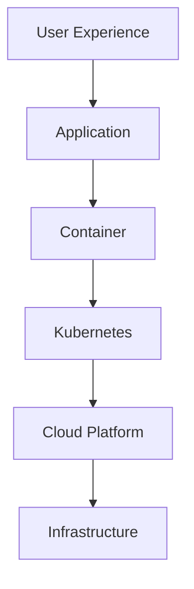
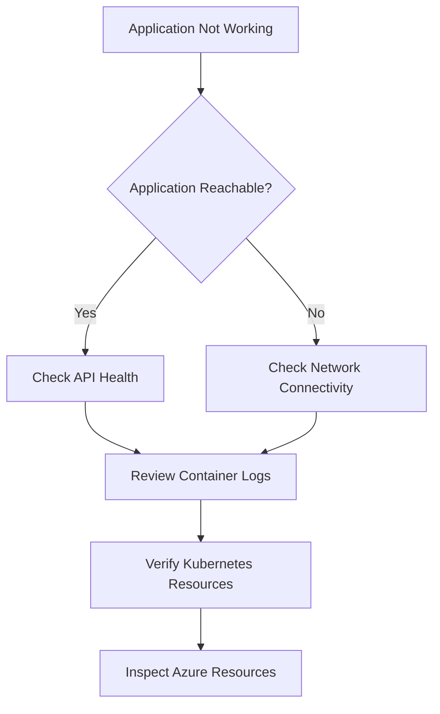

# 🛠️ FlavorForge Troubleshooting Guide

## Overview

Troubleshooting is an essential part of operating any cloud-native application. Since FlavorForge spans multiple technologies—including application code, containers, CI/CD pipelines, Kubernetes, GitOps, and Azure—issues can occur at different stages of the software delivery lifecycle.

This guide provides a structured approach to diagnosing and resolving common problems encountered during development, deployment, and production operations.

Typical troubleshooting areas include:

- Application layer
- Container layer
- CI/CD pipeline
- Security validation
- Kubernetes platform
- GitOps deployment
- Azure cloud infrastructure

---

## Troubleshooting Philosophy

Effective troubleshooting begins with understanding the problem before attempting a solution.

Rather than making random configuration changes, investigate issues layer by layer until the root cause is identified.



---

## Troubleshooting Decision Flow

When an application issue occurs, follow a systematic investigation process.



---

## Debugging Layers

### Layer 1 — Application

**Questions**

- Is the frontend loading correctly?
- Is the backend responding?
- Are API endpoints returning expected results?

**Useful Command**

```bash
curl http://<endpoint>/api/health
```

---

### Layer 2 — Container

**Questions**

- Was the Docker image built successfully?
- Is the container running?
- Are required environment variables available?

**Useful Commands**

```bash
docker ps
docker logs <container-name>
```

---

### Layer 3 — CI/CD Pipeline

**Questions**

- Did the build complete successfully?
- Did security scans pass?
- Was the Docker image published?

**Check**

- Azure DevOps pipeline logs
- Build stage output
- SonarCloud reports
- Trivy scan results

---

### Layer 4 — Kubernetes

**Questions**

- Are pods running successfully?
- Are services exposed correctly?
- Are deployments healthy?

**Useful Commands**

```bash
kubectl get pods
kubectl get services
kubectl get deployments
```

---

### Layer 5 — GitOps

**Questions**

- Is Argo CD synchronized?
- Does the cluster match the Git repository?
- Are deployment manifests valid?

**Useful Commands**

```bash
argocd app list
argocd app get flavorforge-app
```

---

### Layer 6 — Azure Cloud

**Questions**

- Is the AKS cluster healthy?
- Can AKS pull images from ACR?
- Are Azure resources available?

**Useful Commands**

```bash
az aks show
az aks check-acr
```

---

## Common Troubleshooting Guides

The following documents provide detailed guidance for specific problem areas.

| Document | Description |
|----------|-------------|
| 01-application-issues.md | Application and API issues |
| 02-docker-issues.md | Docker build and container issues |
| 03-pipeline-issues.md | Azure DevOps pipeline failures |
| 04-security-quality-issues.md | SonarCloud and Trivy findings |
| 05-kubernetes-issues.md | AKS and Kubernetes troubleshooting |
| 06-argocd-gitops-issues.md | GitOps synchronization issues |
| 07-azure-cloud-issues.md | Azure infrastructure problems |

---

## Essential Debugging Commands

### Kubernetes

```bash
kubectl get pods -A
kubectl describe pod <pod-name>
kubectl logs <pod-name>
```

### Docker

```bash
docker ps
docker images
docker logs <container-name>
```

### Azure

```bash
az account show
az resource list
az aks get-credentials
```

### Git

```bash
git status
git log
git diff
```

---

## Incident Documentation Template

Each troubleshooting document follows a consistent structure.

### Problem

Describe the issue.

### Symptoms

List the observed behavior and error messages.

### Investigation

Document the diagnostic steps performed.

### Root Cause

Explain the underlying cause of the issue.

### Resolution

Describe the actions taken to resolve the problem.

### Prevention

Identify improvements that can prevent the issue from occurring again.

---

## Engineering Mindset

Troubleshooting is more than resolving failures—it is about understanding how systems behave under different conditions and continuously improving their reliability.

A successful DevOps engineer focuses on:

- Understanding system behavior
- Identifying root causes
- Preventing recurring issues
- Improving operational reliability
- Building resilient cloud-native systems

Every incident provides an opportunity to improve both the application and the deployment process.


