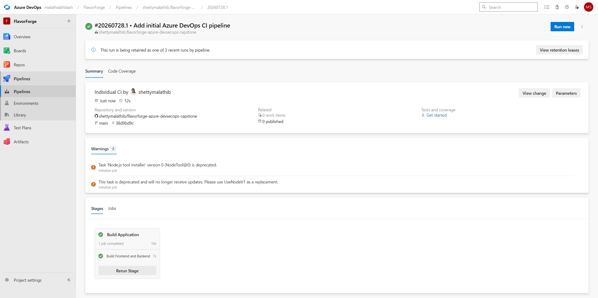
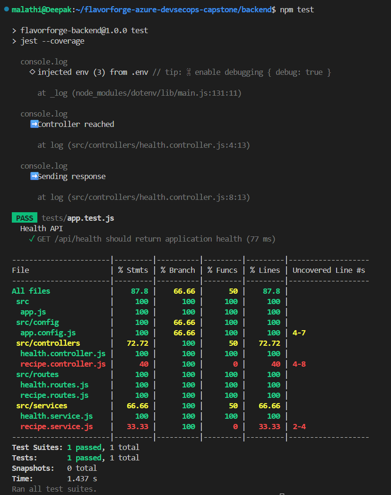
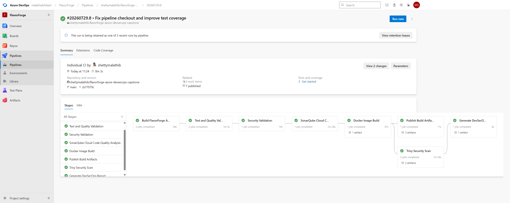
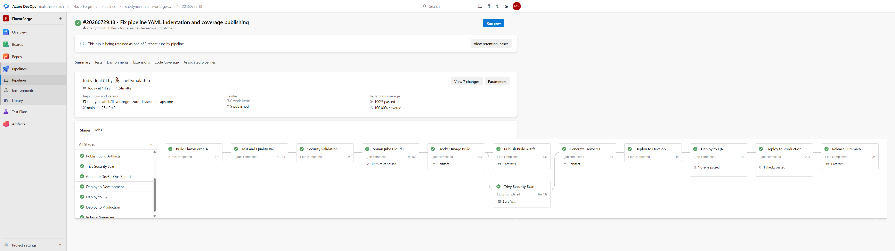

# 4. Step-by-Step Implementation

## Step 1 — Create Azure Resource Group

**Goal:** Create a dedicated Azure Resource Group to host all FlavorForge cloud resources.

### Command

```bash
az group create \
  --name flavorforge-rg \
  --location eastus
```

### Expected Output

```text
{
  "location": "eastus",
  "name": "flavorforge-rg",
  "properties": {
    "provisioningState": "Succeeded"
  }
}
```


### Explanation

The Azure Resource Group serves as the logical container for all cloud resources used throughout the project, including Azure Kubernetes Service (AKS), Azure Container Registry (ACR), networking resources, public IP addresses, and load balancers. Creating the resource group first provides a centralized location for deploying, managing, and monitoring all project resources.

The successful creation of the resource group confirms that Azure is ready to provision all required infrastructure components for the project.


---


# Step 2 — Register Azure Container Registry Resource Provider

### Goal

Register the Azure Container Registry (ACR) resource provider to enable Azure Container Registry services within the Azure subscription.

### Command

```bash
az provider register \
  --namespace Microsoft.ContainerRegistry

az provider show \
  --namespace Microsoft.ContainerRegistry \
  --query registrationState \
  --output tsv
```

### Expected Output

```text
Registered
```

### Explanation

Azure services require their corresponding resource providers to be registered before they can be used. Registering the **Microsoft.ContainerRegistry** provider enables the creation and management of Azure Container Registry resources within the subscription. The registration status is verified before proceeding with ACR creation.

>  Azure CLI showing the `Microsoft.ContainerRegistry` provider registration status as **Registered**.


---


# Step 3 — Create Azure Container Registry (ACR)

### Goal

Create an Azure Container Registry (ACR) to securely store and manage Docker container images used by the FlavorForge application.

### Command

```bash
az acr create \
  --resource-group flavorforge-rg \
  --name flavorforgeacr2026ms \
  --sku Basic \
  --admin-enabled true
```

### Expected Output

```text
{
  "name": "flavorforgeacr2026ms",
  "location": "eastus",
  "sku": {
    "name": "Basic"
  },
  "adminUserEnabled": true,
  "provisioningState": "Succeeded"
}
```

### Explanation

Azure Container Registry (ACR) serves as the private Docker image repository for the project. After the application images are built by the Azure DevOps pipeline, they are pushed to ACR before being deployed to Azure Kubernetes Service (AKS). Enabling the admin user simplifies authentication during development and testing.


---


# Step 4 — Apply Tags to the Azure Resource Group

### Goal

Apply resource tags to the Azure Resource Group for easier identification, organization, and resource management.

### Command

```bash
az tag create \
  --resource-id $(az group show \
  --name flavorforge-rg \
  --query id \
  --output tsv) \
  --tags \
  Project=FlavorForge \
  Environment=Dev \
  Owner=Malathi
```

### Expected Output

```text
{
  "properties": {
    "tags": {
      "Project": "FlavorForge",
      "Environment": "Dev",
      "Owner": "Malathi"
    }
  }
}
```

### Explanation

Azure resource tags provide metadata that helps organize and manage cloud resources. In this project, tags were applied to identify the project name, deployment environment, and resource owner. Tagging resources is a DevOps best practice that simplifies resource management, governance, reporting, and cost tracking.

>  Azure CLI showing the successful creation of tags for the `flavorforge-rg` Resource Group.


---

# Step 5 — Authenticate with Azure Container Registry (ACR)

### Goal

Authenticate the local Docker client with Azure Container Registry (ACR) to enable pushing and pulling container images.

### Command

```bash id="nxxuhr"
az acr login \
  --name flavorforgeacr2026ms
```

### Expected Output

```text id="uozq9s"
Login Succeeded
```

### Explanation

Before Docker images can be pushed to Azure Container Registry, authentication is required. The `az acr login` command securely authenticates the local Docker client with the registry, allowing Azure DevOps and local development environments to store and retrieve container images.

>  Successful authentication with the `flavorforgeacr2026ms` Azure Container Registry.


---


# Step 6 — Create Azure Kubernetes Service (AKS) Cluster

### Goal

Provision an Azure Kubernetes Service (AKS) cluster to host the FlavorForge application and provide a managed Kubernetes environment for container orchestration.

### Command

```bash
az aks create \
  --resource-group flavorforge-rg \
  --name flavorforge-aks \
  --node-count 2 \
  --node-vm-size Standard_D2as_v7 \
  --generate-ssh-keys
```

### Expected Output

```text
{
  "name": "flavorforge-aks",
  "location": "eastus",
  "kubernetesVersion": "...",
  "provisioningState": "Succeeded",
  "powerState": {
    "code": "Running"
  }
}
```

### Explanation

Azure Kubernetes Service (AKS) provides a managed Kubernetes environment without requiring manual control plane management. A two-node cluster was created to host the frontend and backend workloads, enabling scalable, highly available application deployments.

>  Successful creation of the `flavorforge-aks` Kubernetes cluster.


---


# Step 7 — Connect the Local Machine to the AKS Cluster

### Goal

Configure `kubectl` to communicate with the Azure Kubernetes Service (AKS) cluster from the local development machine.

### Command

```bash
az aks get-credentials \
  --resource-group flavorforge-rg \
  --name flavorforge-aks \
  --overwrite-existing

kubectl get nodes
```

### Expected Output

```text
Merged "flavorforge-aks" as current context in /home/<username>/.kube/config

NAME                                STATUS   ROLES    AGE   VERSION
aks-nodepool1-xxxxxxxx-vmss000000   Ready    <none>   xxm   v1.35.6
aks-nodepool1-xxxxxxxx-vmss000001   Ready    <none>   xxm   v1.35.6
```

### Explanation

The `az aks get-credentials` command downloads the Kubernetes cluster credentials and merges them into the local kubeconfig file. This enables `kubectl` to manage the AKS cluster directly. Running `kubectl get nodes` verifies that the connection is successful and that all worker nodes are in the **Ready** state.

> Successful connection to the AKS cluster showing all worker nodes in the **Ready** state.


---


---

# Step 8 — Build the Backend Docker Image

### Goal

Build the Docker image for the FlavorForge backend application using a multi-stage Dockerfile.

### Command

```bash
docker build \
  -t flavorforge-backend:1.0 \
  ./backend
```

### Expected Output

```text
...
Successfully built <IMAGE_ID>
Successfully tagged flavorforge-backend:1.0
```

### Explanation

The backend application is containerized using Docker to provide a consistent runtime environment across development, testing, and production. The generated image is later pushed to Azure Container Registry (ACR), where it becomes available for deployment to Azure Kubernetes Service (AKS).

>  Successful backend Docker image build.


---


# 4. Step-by-Step Implementation

## Azure Infrastructure

✅ Step 1 – Create Azure Resource Group

✅ Step 2 – Register Azure Container Registry Provider

✅ Step 3 – Create Azure Container Registry

✅ Step 4 – Apply Resource Tags

✅ Step 5 – Authenticate with Azure Container Registry

✅ Step 6 – Create Azure Kubernetes Service

✅ Step 7 – Connect Local Machine to AKS

---

## Docker Containerization

### Step 8 – Build Backend Docker Image


---

### Step 9 – Verify Backend Container


---

### Step 10 – Build Frontend Docker Image

Screenshot


---

### Step 11 – Verify Docker Images


---

## Azure Container Registry

### Step 12 – Tag Backend Image


---

### Step 13 – Push Images to Azure Container Registry


---

### Step 14 – Verify Images inside ACR


---

## Azure DevOps

### Step 15 – Create Azure DevOps Project


---

### Step 16 – Configure Service Connections


---

### Step 17 – Configure Azure Pipeline


---

### Step 18 – Execute Multi-Stage Pipeline


---

### Step 19 – Execute Unit Tests


---

### Step 20 – SonarCloud Analysis


---

### Step 21 – Publish Docker Images


---

## Kubernetes Deployment

### Step 22 – Deploy Kubernetes Manifests


---

### Step 23 – Verify Pods and Services


---

### Step 24 – Configure NGINX Ingress


---

### Step 25 – Verify Application


---

## GitOps

### Step 26 – Configure Argo CD


---

### Step 27 – Verify GitOps Synchronization


---

## Final Validation

### Step 28 – Verify Kubernetes Resources

Screenshot


---

### Step 29 – Verify Azure Resources


---

### Step 30 – Verify Production Application


---


---

# Step 9 — Verify the Backend Docker Container

### Goal

Verify that the backend Docker container starts successfully and the Node.js application is running correctly inside the container.

### Command

```bash
docker run -d \
  --name flavorforge-backend \
  -p 3000:3000 \
  flavorforge-backend:1.0

docker ps

curl http://localhost:3000/api/health
```

### Expected Output

```text
CONTAINER ID   IMAGE                     STATUS
xxxxxxxxxxxx   flavorforge-backend:1.0   Up

{
  "status": "UP",
  "application": "FlavorForge Backend",
  "version": "1.0"
}
```

### Explanation

After building the Docker image, the backend container is started locally to verify that the application launches successfully. The `docker ps` command confirms that the container is running, while the health endpoint validates that the backend API is accessible before the image is published to Azure Container Registry.

>  Backend Docker container running successfully and responding to the health endpoint.

---

### Screenshot(s) to use

Use these from your repository:


These two screenshots together provide evidence that:

1. The container is running.
2. The backend API is healthy.

---


# Step 10 — Build the Frontend Docker Image

### Goal

Build the Docker image for the FlavorForge React frontend using a multi-stage Dockerfile optimized for production deployment.

### Command

```bash
docker build \
  -t flavorforge-frontend:1.0 \
  ./frontend
```

### Expected Output

```text
...
Successfully built <IMAGE_ID>
Successfully tagged flavorforge-frontend:1.0
```

### Explanation

The frontend application is containerized using a multi-stage Docker build. During the build process, the React application is compiled into optimized static assets, which are then served using an NGINX web server. This approach produces a lightweight production-ready image suitable for deployment to Azure Kubernetes Service (AKS).

> Successful build of the FlavorForge frontend Docker image.


---

## Step 11 — Verify Docker Images

### Goal

Verify that both backend and frontend Docker images have been successfully created and are available in the local Docker image repository.

### Command

```bash
docker images
```

### Expected Output

```text
REPOSITORY               TAG      IMAGE ID       SIZE

flavorforge-backend      1.0      xxxxxxxxx      xxxMB
flavorforge-frontend     1.0      xxxxxxxxx      xxxMB
```

### Explanation

The `docker images` command lists all locally available Docker images. Verifying both the backend and frontend images confirms that the containerization process completed successfully and that the images are ready to be tagged and pushed to Azure Container Registry.

>  Docker images showing the successfully built backend and frontend container images.


---

# Step 9 — Configure Azure DevOps Service Connections

## Goal

Configure secure service connections between Azure DevOps and Azure resources so that the CI/CD pipeline can authenticate and deploy applications without embedding credentials in the pipeline.

---

## Azure Resource Manager Service Connection

This service connection is used by Azure DevOps to authenticate with the Azure subscription and manage Azure resources such as Azure Kubernetes Service (AKS).

**Configuration**

* Connection Type: Azure Resource Manager
* Authentication Method: Workload Identity Federation
* Subscription: Azure subscription 1
* Resource Group: `flavorforge-rg`
* Service Connection Name: `flavorforge-azure-sc`

---

## Azure Container Registry Service Connection

This service connection allows Azure DevOps to securely push Docker images to Azure Container Registry.

**Configuration**

* Registry: `flavorforgeacr2026ms.azurecr.io`
* Service Connection Name: `flavorforge-acr-connection`

---

## Why This Step Is Required

Azure DevOps uses service connections to securely communicate with Azure resources. These connections eliminate the need to store usernames or passwords inside the pipeline and enable authenticated deployments to Azure services.

---

## Evidence


---

## Result

Azure DevOps was successfully configured with secure service connections for Azure Resource Manager and Azure Container Registry. These connections are used throughout the CI/CD pipeline to build container images, push them to Azure Container Registry, and deploy the application to Azure Kubernetes Service.

---

# Step 9 — Configure Azure DevOps Service Connections

## Goal

Configure secure service connections between Azure DevOps and Azure resources so that the CI/CD pipeline can authenticate and deploy applications without storing credentials inside the pipeline.

---

## Azure Resource Manager Service Connection

This service connection allows Azure DevOps to authenticate with the Azure subscription and manage Azure resources such as Azure Kubernetes Service (AKS).

### Configuration

- **Connection Type:** Azure Resource Manager
- **Authentication Method:** Workload Identity Federation
- **Subscription:** Azure subscription 1
- **Resource Group:** `flavorforge-rg`
- **Service Connection Name:** `flavorforge-azure-sc`

---

## Azure Container Registry Service Connection

This service connection enables Azure DevOps to securely push Docker images to Azure Container Registry.

### Configuration

- **Registry:** `flavorforgeacr2026ms.azurecr.io`
- **Service Connection Name:** `flavorforge-acr-connection`

---

## Why This Step Is Required

Azure DevOps service connections provide secure authentication between Azure DevOps and Azure resources. Using Workload Identity Federation eliminates the need to store usernames, passwords, or service principal secrets inside the CI/CD pipeline while allowing automated deployments to Azure Kubernetes Service and Azure Container Registry.

---

## Evidence

Insert the following screenshots:


---

## Result

Azure DevOps was successfully configured with secure service connections for Azure Resource Manager and Azure Container Registry. These authenticated connections are used by the CI/CD pipeline to build Docker images, push them to Azure Container Registry, and deploy the FlavorForge application to Azure Kubernetes Service.

---

# Step 10 — Configure Azure DevOps Multi-Stage Pipeline

## Goal

Create an Azure DevOps multi-stage YAML pipeline to automate the complete DevSecOps workflow, including application build, testing, security scanning, Docker image creation, image publishing, and Kubernetes deployment.

---

## Pipeline Configuration

The pipeline definition is stored in the project root as:

```text
azure-pipelines.yml
```

The pipeline is connected to the GitHub repository and is automatically triggered whenever changes are pushed to the main branch.

---

## Pipeline Stages

The Azure DevOps pipeline consists of the following stages:

1. Build
2. Test
3. Code Quality Analysis (SonarCloud)
4. Security Scan (Trivy)
5. Docker Image Build
6. Publish Images to Azure Container Registry
7. Deploy to Development
8. Deploy to QA
9. Deploy to Production
10. Release Summary

---

## Why This Step Is Required

A multi-stage CI/CD pipeline automates software delivery by validating code quality, performing security checks, building container images, publishing artifacts, and deploying applications consistently across multiple environments.

---

## Evidence

Insert the following screenshots:











---

## Result

The Azure DevOps multi-stage pipeline was successfully configured and executed. The pipeline automated the complete DevSecOps workflow from source code validation to production deployment, ensuring repeatable, secure, and reliable software delivery.

---

# Step 11 — Configure Azure DevOps Environments and Approvals

## Goal

Configure Development, QA, and Production environments with deployment approvals to simulate an enterprise-grade release management process.

---

## Environment Configuration

The following deployment environments were created in Azure DevOps:

- Development
- QA
- Production

Each environment represents a separate deployment stage in the CI/CD pipeline.

---

## Manual Approval Configuration

Manual approval gates were configured for QA and Production environments to ensure that deployments are validated before progressing to the next stage.

Approval checks simulate the release approval process commonly followed in enterprise DevOps environments.

---

## Variable Groups

Environment-specific Variable Groups were created to manage deployment configuration separately for each environment.

Examples include:

- Development Variables
- QA Variables
- Production Variables

---

## Why This Step Is Required

Enterprise CI/CD pipelines require controlled deployments across multiple environments. Environment approvals and variable groups improve deployment security, reduce configuration errors, and ensure that production releases are reviewed before deployment.

---

## Evidence


---

## Result

Azure DevOps environments, approval gates, and variable groups were successfully configured. The CI/CD pipeline now supports controlled deployments across Development, QA, and Production environments following enterprise DevOps best practices.

---

# Step 12 — Integrate SonarCloud for Code Quality Analysis

## Goal

Integrate SonarCloud into the Azure DevOps pipeline to automatically analyze source code quality, detect code smells, identify bugs, measure test coverage, and enforce quality gates during every pipeline execution.

---

## SonarCloud Configuration

SonarCloud was configured using the Azure DevOps extension and integrated into the pipeline.

The analysis includes:

- Static Code Analysis
- Code Smells Detection
- Bug Detection
- Security Hotspots
- Test Coverage Analysis
- Quality Gate Validation

The SonarCloud analysis executes automatically during every pipeline run.

---

## Why This Step Is Required

Continuous code quality analysis helps identify issues early in the development lifecycle. Integrating SonarCloud into the CI/CD pipeline improves maintainability, reliability, and overall software quality while preventing poor-quality code from progressing through the deployment pipeline.

---

## Evidence


---

## Result

SonarCloud was successfully integrated into the Azure DevOps pipeline. Every pipeline execution now performs automated static code analysis, evaluates code quality, measures test coverage, and validates quality gates before deployment.

---

# Step 13 — Build and Publish Docker Images to Azure Container Registry

## Goal

Build Docker images for the FlavorForge frontend and backend applications and publish them to Azure Container Registry (ACR) for Kubernetes deployments.

---

## Docker Build Process

The Azure DevOps pipeline automatically builds container images for:

- FlavorForge Frontend
- FlavorForge Backend

Each build generates a uniquely versioned Docker image.

---

## Image Publishing

After a successful build, the pipeline pushes the Docker images to Azure Container Registry.

**Container Registry**

```text
flavorforgeacr2026ms.azurecr.io
```

Published repositories include:

- flavorforge-frontend
- flavorforge-backend

---

## Why This Step Is Required

Azure Kubernetes Service pulls application images directly from Azure Container Registry during deployment. Publishing versioned container images ensures consistent, traceable, and repeatable application deployments across all environments.

---

## Evidence


---

## Result

The Azure DevOps pipeline successfully built Docker images for both the frontend and backend applications and published them to Azure Container Registry. These versioned images are used by Azure Kubernetes Service during automated deployments.

---

# Step 14 — Deploy the Application to Azure Kubernetes Service (AKS)

## Goal

Deploy the FlavorForge application to Azure Kubernetes Service (AKS) using Kubernetes manifests and Kustomize overlays for Development, QA, and Production environments.

---

## Deployment Process

The Azure DevOps pipeline deploys the application to AKS after successfully completing the build, testing, code quality, security scanning, and image publishing stages.

The deployment includes:

- Backend Deployment
- Frontend Deployment
- Kubernetes Services
- ConfigMaps
- Secrets
- Horizontal Pod Autoscaler (HPA)
- Ingress Controller

Kustomize overlays are used to manage environment-specific configurations for Development, QA, and Production.

---

## Why This Step Is Required

Azure Kubernetes Service provides a scalable and highly available platform for running containerized applications. Kubernetes automates container scheduling, scaling, rolling updates, and self-healing to ensure reliable application deployment and operation.

---

## Evidence


---

## Result

The FlavorForge application was successfully deployed to Azure Kubernetes Service. Kubernetes manages the application across Development, QA, and Production environments using deployments, services, ingress, autoscaling, and environment-specific Kustomize overlays.

---

# Step 15 — Implement GitOps Continuous Delivery Using Argo CD

## Goal

Implement GitOps continuous delivery using Argo CD to automatically synchronize Kubernetes deployments with the GitHub repository and maintain the desired cluster state.

---

## GitOps Workflow

The GitOps implementation follows these steps:

1. Source code and Kubernetes manifests are stored in GitHub.
2. Argo CD continuously monitors the GitHub repository.
3. When changes are committed, Argo CD detects the updates.
4. Kubernetes manifests are synchronized automatically.
5. Azure Kubernetes Service applies the updated configuration.
6. If configuration drift occurs, Argo CD restores the cluster to the desired state.

---

## Argo CD Application

The FlavorForge application is registered in Argo CD using:

```text
argocd/flavorforge-app.yaml
```

Synchronization is configured to keep the Kubernetes cluster aligned with the Git repository.

---

## Why This Step Is Required

GitOps provides a declarative deployment model where Git acts as the single source of truth. This approach improves deployment consistency, enables automatic recovery from configuration drift, simplifies rollbacks, and enhances auditability.

---

## Evidence


---

## Result

Argo CD was successfully integrated with Azure Kubernetes Service to implement GitOps continuous delivery. Kubernetes deployments are now automatically synchronized with the GitHub repository, ensuring consistent, repeatable, and self-healing application deployments.

---


# Step 16 — Validate the End-to-End DevSecOps Pipeline

## Goal

Validate that the complete DevSecOps pipeline functions successfully from source code commit to application deployment on Azure Kubernetes Service.

---

## Validation Activities

The following components were verified during the final validation:

- Source code successfully committed to GitHub.
- Azure DevOps pipeline executed successfully.
- Unit tests completed successfully.
- SonarCloud code quality analysis passed.
- Docker images were built successfully.
- Docker images were published to Azure Container Registry.
- Azure Kubernetes Service deployed the latest application version.
- Argo CD synchronized Kubernetes manifests with the Git repository.
- Frontend application was accessible through the Ingress endpoint.
- Backend health API responded successfully.
- Kubernetes workloads were in the **Running** state.

---

## Why This Step Is Required

End-to-end validation confirms that every stage of the DevSecOps pipeline operates correctly and that the deployed application is stable, secure, and production-ready.

---

## Evidence


---

## Result

The FlavorForge Azure DevSecOps platform was successfully validated from source code integration through production deployment. The completed solution demonstrates a production-style implementation of CI/CD, containerization, Kubernetes orchestration, Azure cloud infrastructure, automated quality and security checks, and GitOps continuous delivery using Azure DevOps, Azure Kubernetes Service, Azure Container Registry, SonarCloud, Docker, and Argo CD.

---

# 5. Implementation Summary

The FlavorForge Azure DevSecOps Capstone was successfully implemented using modern cloud-native technologies and enterprise DevSecOps practices.

The implementation began with provisioning Azure infrastructure, including a Resource Group, Azure Container Registry, and Azure Kubernetes Service cluster. Docker was used to containerize both the React frontend and Node.js backend applications, while Azure Container Registry served as the centralized image repository.

An Azure DevOps multi-stage CI/CD pipeline was configured to automate source code validation, application build, unit testing, static code analysis with SonarCloud, container image creation, security scanning, image publishing, and Kubernetes deployment.

Environment-specific deployments were managed using Kustomize overlays for Development, QA, and Production. Azure DevOps Environments, Variable Groups, and Manual Approval Gates simulated an enterprise release management workflow.

GitOps continuous delivery was implemented using Argo CD, enabling automatic synchronization of Kubernetes manifests from GitHub to Azure Kubernetes Service while maintaining the desired cluster state.

The completed implementation demonstrates a production-style DevSecOps platform incorporating infrastructure automation, CI/CD, containerization, Kubernetes orchestration, cloud deployment, code quality analysis, security validation, and GitOps-based continuous delivery.

The successful execution and validation of each implementation step confirm that the FlavorForge application meets the project objectives and follows industry-standard DevSecOps practices for building, securing, and deploying cloud-native applications.


