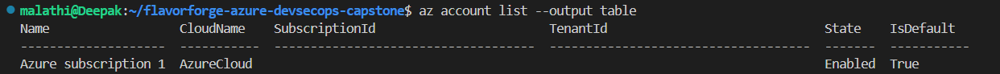
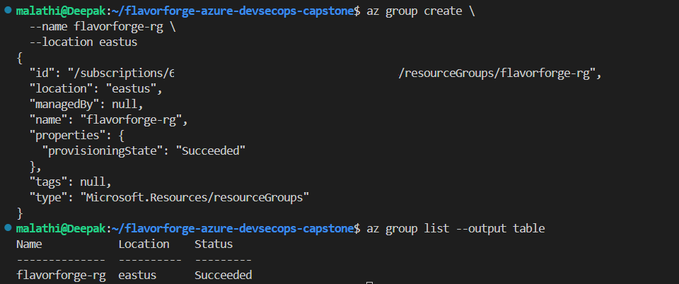
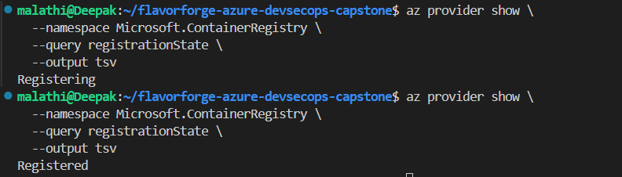

# 01 — Azure CLI and Resource Group

This is where we started the Azure part of the FlavorForge deployment.

We first checked Azure CLI, logged in to Azure, checked the active subscription, created the FlavorForge Resource Group, and registered the Azure Container Registry provider.

---

## Step 1 — Go to the FlavorForge project

We first went to the FlavorForge project:

```bash
cd ~/flavorforge-azure-devsecops-capstone
```

Check the current directory:

```bash
pwd
```

Expected:

```text
/home/malathi/flavorforge-azure-devsecops-capstone
```

---

## Step 2 — Check Azure CLI

We checked whether Azure CLI was available:

```bash
az version
```

Azure CLI was installed and available.

---

## Step 3 — Log in to Azure

We logged in to Azure:

```bash
az login
```

This opened the Azure authentication flow.

We completed the login using the Azure account being used for the FlavorForge project.

### Verify

After logging in, we checked the account:

```bash
az account show
```

This displayed the currently selected Azure subscription and account information.

### Screenshot



---

## Step 4 — Check the Azure subscription

We checked which Azure subscription was active:

```bash
az account show
```

This was important because the resources created by the following commands would be created inside the currently selected subscription.

If more than one subscription is available, the required subscription can be selected with:

```bash
az account set --subscription "<SUBSCRIPTION_NAME_OR_ID>"
```

Do not copy a subscription value from this example. Use the subscription belonging to your Azure account.

### Verify

Run:

```bash
az account show
```

Confirm that the expected subscription is selected.

---

## Step 5 — Create the FlavorForge Resource Group

We created an Azure Resource Group for the FlavorForge project.

The Resource Group name we used was:

```text
flavorforge-rg
```

The Azure region we selected was:

```text
West US 2
```

### Option 1 — Create using Azure CLI

From the FlavorForge project directory, we ran:

```bash
az group create --name flavorforge-rg --location westus2
```

The command creates the Resource Group in the **West US 2** Azure region.

### Verify from the terminal

Run:

```bash
az group show --name flavorforge-rg --output table
```

Check that the Resource Group appears and that the location is:

```text
westus2
```

You can also list the Resource Groups:

```bash
az group list --output table
```

Look for:

```text
flavorforge-rg
```

---

### Option 2 — Check from Azure Portal

We also checked the Resource Group from the Azure Portal.

Open:

**Azure Portal → Resource groups**

Then:

1. Find `flavorforge-rg`.
2. Click **flavorforge-rg**.
3. Check the **Location**.
4. It should show:

```text
West US 2
```

You can also open the Resource Group's **Overview** page to see the resources that are added to it later.

### Screenshot — Azure CLI



### Screenshot — Azure Portal


---

## Step 6 — Register the Azure Container Registry provider

Before creating the Azure Container Registry, we registered the Container Registry resource provider.

### From the terminal

Run:

```bash
az provider register --namespace Microsoft.ContainerRegistry
```

Wait for Azure to process the registration.

### Verify from the terminal

Run:

```bash
az provider show --namespace Microsoft.ContainerRegistry --query "registrationState"
```

The expected result is:

```text
"Registered"
```

### Check from Azure Portal

You can also verify the provider from the Azure Portal:

**Azure Portal → Subscriptions → Your subscription → Resource providers**

Then:

1. Search for:

```text
Microsoft.ContainerRegistry
```

2. Open the provider.
3. Check the registration state.
4. It should show:

```text
Registered
```

### Screenshot



---

## Result

At this point we had:

```text
Azure account
      ↓
Azure subscription
      ↓
flavorforge-rg
      ↓
Region: West US 2
      ↓
Microsoft.ContainerRegistry registered
```

We verified the setup using both **Azure CLI** and the **Azure Portal**.

➡️ **Next:** Create the FlavorForge Azure Container Registry (ACR).
