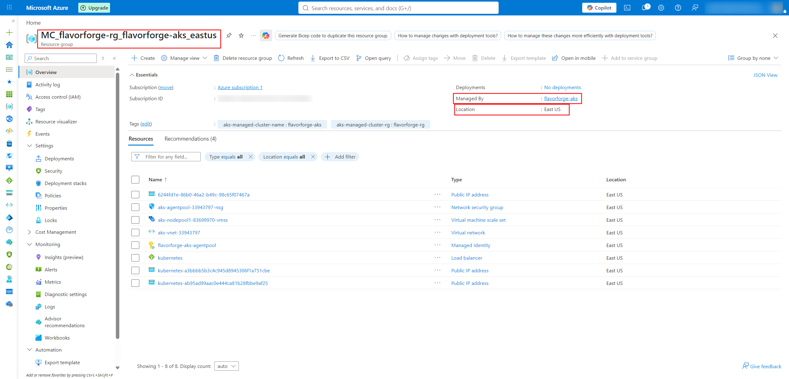
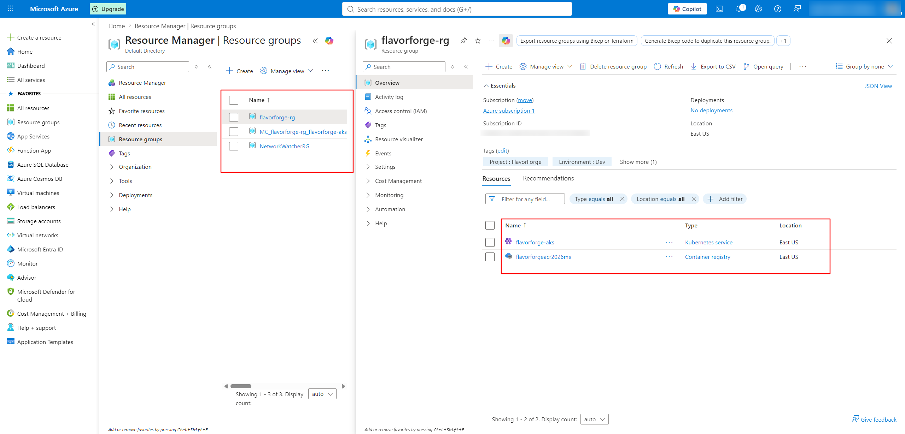

# 02 — Azure Resource Group

## 1. Purpose

After authenticating with Azure and verifying the Azure CLI environment, the next step in the FlavorForge Azure journey was to create the Azure Resource Group.

A Resource Group provides a logical container for related Azure resources.

For FlavorForge, the Resource Group became the main organizational boundary for the cloud infrastructure.

The structure is:

```text
Azure Subscription
        ↓
flavorforge-rg
        ↓
┌───────────────────────┐
│ FlavorForge Resources │
├───────────────────────┤
│ Azure Container       │
│ Registry (ACR)        │
│                       │
│ Azure Kubernetes      │
│ Service (AKS)         │
└───────────────────────┘
```

---

# 2. FlavorForge Resource Group

The Resource Group created for the project was:

```text
flavorforge-rg
```

The Azure resources used by FlavorForge were organized under this Resource Group.

The project infrastructure was located in:

```text
East US
```

Therefore:

```text
Resource Group:
flavorforge-rg

Region:
East US
```






---

# 3. Create the Resource Group

The Azure CLI command for creating the Resource Group is:

```bash
az group create \
  --name flavorforge-rg \
  --location eastus
```

The command specifies:

| Parameter      | Value            |
| -------------- | ---------------- |
| Resource Group | `flavorforge-rg` |
| Azure Region   | `eastus`         |

The Azure region name `eastus` corresponds to the Azure portal region:

```text
East US
```

---

# 4. Verify the Resource Group

After creation, the Resource Group can be verified using:

```bash
az group show \
  --name flavorforge-rg
```

For a simpler table view, Resource Groups can also be listed using:

```bash
az group list --output table
```

The expected Resource Group is:

```text
flavorforge-rg
```

---

# 5. Azure Portal Verification

The Resource Group was also verified through the Azure Portal.

The project contains the following evidence:

```text
screenshots/azure/02-resource-group-created.png
```

This screenshot documents the Resource Group creation stage.

The repository also contains:

```text
screenshots/azure/flavorforge-rg-microsoft-azure-resource-group.png
```

This provides additional evidence of the FlavorForge Resource Group in Azure.

---

# 6. Resource Group Overview

The Resource Group provides a single location from which the FlavorForge Azure resources can be managed.

Conceptually:

```text
                    Azure
                      │
                      ▼
               flavorforge-rg
                      │
             ┌────────┴────────┐
             │                 │
             ▼                 ▼
            ACR               AKS
             │                 │
             ▼                 ▼
      Container Images    Kubernetes Cluster
```

The Resource Group itself does not run the application.

Instead, it organizes the Azure infrastructure used to run the application.

---

# 7. Why Use a Resource Group?

The Resource Group provides several practical benefits for FlavorForge.

### Organization

Related Azure resources are grouped together:

```text
flavorforge-rg
    ├── ACR
    └── AKS
```

### Resource Management

Resources can be viewed and managed together through the Azure Portal or Azure CLI.

### Lifecycle Management

The Resource Group provides a convenient boundary for managing the lifecycle of the project's Azure resources.

### Cost Visibility

Resources belonging to the project can be reviewed together when monitoring Azure usage and costs.

---

# 8. Verify Resources Inside the Resource Group

Azure CLI can be used to list the resources belonging to the Resource Group:

```bash
az resource list \
  --resource-group flavorforge-rg \
  --output table
```

As the FlavorForge infrastructure was built, resources were added to this Resource Group.

The intended high-level structure became:

```text
flavorforge-rg
     │
     ├── flavorforgeacr2026ms
     │       │
     │       └── Container Images
     │
     └── flavorforge-aks
             │
             └── Kubernetes Workloads
```

---

# 9. Resource Group and Azure Container Registry

The Azure Container Registry created later in the project was:

```text
flavorforgeacr2026ms
```

It belongs to the FlavorForge Resource Group.

The relationship is:

```text
flavorforge-rg
       │
       ▼
flavorforgeacr2026ms
       │
       ▼
FlavorForge Container Images
```

The ACR is documented in the next Azure BUILD-JOURNEY stage.

---

# 10. Resource Group and AKS

The Azure Kubernetes Service cluster created for FlavorForge was:

```text
flavorforge-aks
```

It was also associated with:

```text
flavorforge-rg
```

The relationship is:

```text
flavorforge-rg
       │
       ▼
flavorforge-aks
       │
       ▼
Kubernetes Cluster
       │
       ├── Frontend
       ├── Backend
       ├── Services
       └── Ingress
```

This infrastructure was used later to deploy the containerized FlavorForge application.

---

# 11. Resource Group as the Cloud Boundary

The Resource Group became the main Azure boundary for the FlavorForge deployment.

The overall architecture was:

```text
Azure Subscription
        │
        ▼
  flavorforge-rg
        │
        ├─────────────────────┐
        │                     │
        ▼                     ▼
      ACR                    AKS
        │                     │
        │                     ├── Kubernetes
        │                     │
        ▼                     └── FlavorForge
  Container Images
```

This separation is important:

```text
ACR
 ↓
Stores container images
```

while:

```text
AKS
 ↓
Runs the containers
```

Both resources are organized under:

```text
flavorforge-rg
```

---

# 12. Resource Group Verification Checklist

The Resource Group stage can be verified using the following checklist:

| Verification                       | Expected Result        |
| ---------------------------------- | ---------------------- |
| Resource Group exists              | `flavorforge-rg`       |
| Region                             | East US                |
| Azure CLI access                   | Successful             |
| Resource Group visible in Portal   | Yes                    |
| Resource Group visible through CLI | Yes                    |
| ACR associated later               | `flavorforgeacr2026ms` |
| AKS associated later               | `flavorforge-aks`      |

---

# 13. Evidence Available in the Repository

The existing repository contains sufficient evidence for this stage.

### Resource Group creation

```text
screenshots/azure/02-resource-group-created.png
```

### Resource Group in Azure Portal

```text
screenshots/azure/flavorforge-rg-microsoft-azure-resource-group.png
```

No new screenshot is required for this stage because the existing evidence already documents the Resource Group.

---

# 14. Important Learning

A Resource Group is not the same thing as an application server or Kubernetes cluster.

The relationship is:

```text
Azure Subscription
        │
        ▼
Resource Group
        │
        ├── ACR
        │
        └── AKS
```

The Resource Group is the **organizational container**.

ACR is the **container image registry**.

AKS is the **managed Kubernetes platform**.

For FlavorForge:

```text
flavorforge-rg
      │
      ├── flavorforgeacr2026ms
      │
      └── flavorforge-aks
```

Understanding this distinction is important when explaining the architecture during the CBC demonstration or an interview.

---

# 15. Result

The FlavorForge Azure Resource Group was established as:

```text
Resource Group:
flavorforge-rg

Region:
East US
```

The Resource Group provided the Azure organizational boundary for the project's cloud infrastructure.

The next Azure resources were created within this environment:

```text
flavorforge-rg
      │
      ├── Azure Container Registry
      │
      └── Azure Kubernetes Service
```

The Resource Group stage is therefore complete.

---

# 16. Azure Stage Progress

The Azure BUILD-JOURNEY now follows:

```text
01 — Azure Account and CLI
        ↓
02 — Resource Group
        ↓
03 — Azure Container Registry
        ↓
04 — Azure Kubernetes Service
        ↓
05 — ACR → AKS Access
        ↓
06 — Azure Verification
```

The next document is:

```text
docs/week-4/BUILD-JOURNEY/05-azure/03-acr.md
```

This will document how the FlavorForge Azure Container Registry was created, verified, and used to store the Docker images.
