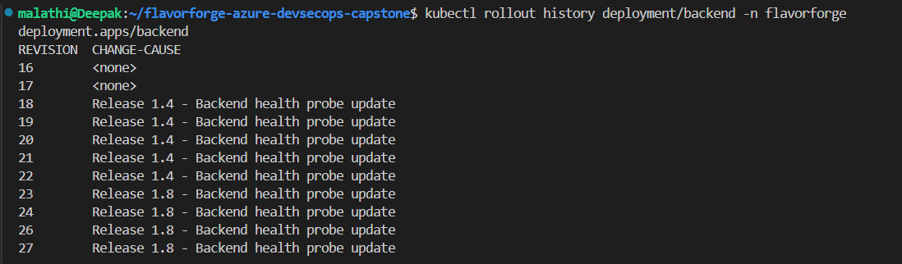
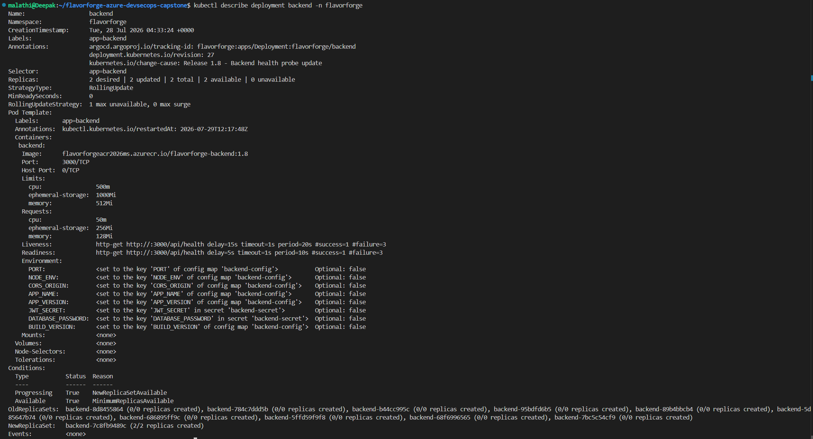

# 06 — Kubernetes

## 1. What we wanted to do

After preparing the Azure Container Registry (ACR) and Azure Kubernetes Service (AKS), the next requirement was to deploy the FlavorForge application using Kubernetes.

The goal of this phase was to:

- Deploy the FlavorForge backend and frontend workloads to AKS.
- Manage application containers using Kubernetes Deployments.
- Configure application settings using ConfigMaps and Secrets.
- Provide internal and external application networking using Kubernetes Services.
- Expose the application through an Ingress controller.
- Support rolling application updates.
- Configure Horizontal Pod Autoscaling (HPA).
- Verify that the deployed application was healthy and accessible.
- Prepare the Kubernetes resources for environment-specific deployment using Kustomize.

The overall deployment flow was:

```text
FlavorForge Application
        |
        v
Docker Images
        |
        v
Azure Container Registry
        |
        v
Azure Kubernetes Service
        |
        +----------------------+
        |                      |
        v                      v
Backend Deployment       Frontend Deployment
        |                      |
        v                      v
Backend Service          Frontend Service
        |                      |
        +----------+-----------+
                   |
                   v
                Ingress
                   |
                   v
          FlavorForge Application
````

---

## 2. Why Kubernetes was required

Docker provides a way to package and run application containers, while Kubernetes provides orchestration for those containers.

For FlavorForge, Kubernetes was required to manage:

* Application Pods.
* Desired replica counts.
* Application restarts.
* Service discovery.
* Container networking.
* Rolling deployments.
* Application configuration.
* Secrets.
* Autoscaling.
* External application access.

Instead of manually running containers:

```text
docker run frontend
docker run backend
```

Kubernetes manages the application workloads declaratively:

```text
                AKS
                 |
        +--------+--------+
        |                 |
        v                 v
 Backend Deployment   Frontend Deployment
        |                 |
        v                 v
 Backend Pods         Frontend Pods
        |                 |
        v                 v
 Backend Service     Frontend Service
        |                 |
        +--------+--------+
                 |
                 v
              Ingress
                 |
                 v
             Users
```

This provides a consistent and repeatable way to deploy and operate the FlavorForge application.

---

## 3. Kubernetes architecture for FlavorForge

The FlavorForge Kubernetes environment uses AKS as the managed Kubernetes platform.

The architecture can be represented as:

```text
Azure
 |
 +-- flavorforge-rg
 |
 +-- flavorforgeacr2026ms
 |      |
 |      +-- Backend Image
 |      +-- Frontend Image
 |
 +-- flavorforge-aks
        |
        +-- Kubernetes Nodes
        |
        +-- Namespace: flavorforge
               |
               +-- Backend Deployment
               |      |
               |      +-- Backend Pods
               |
               +-- Frontend Deployment
               |      |
               |      +-- Frontend Pods
               |
               +-- ConfigMaps
               |
               +-- Secrets
               |
               +-- Services
               |
               +-- Ingress
               |
               +-- HPA
```

The deployment relationship is:

```text
ACR
 |
 | Pull container images
 v
AKS
 |
 +--> Backend Pods
 |
 +--> Frontend Pods
 |
 +--> Kubernetes Services
 |
 +--> Ingress
 |
 +--> Horizontal Pod Autoscaler
```

---

## 4. Prerequisites

Before deploying the FlavorForge Kubernetes resources, the following components were available:

* Azure subscription.
* Azure CLI.
* Azure Kubernetes Service (AKS).
* Azure Container Registry (ACR).
* FlavorForge container images stored in ACR.
* `kubectl`.
* Local Kubernetes credentials.
* Kubernetes manifests.

The AKS cluster used for the project was:

| Setting            | Value             |
| ------------------ | ----------------- |
| Resource Group     | `flavorforge-rg`  |
| AKS Cluster        | `flavorforge-aks` |
| Container Registry | `flavorforgeacr2026ms`  |
| Worker Nodes       | 2                 |
| Kubernetes CLI     | `kubectl`         |

The AKS-to-ACR integration allowed Kubernetes to pull the private FlavorForge images from Azure Container Registry.

---

## 5. Connect the local machine to AKS

The local development machine was configured to communicate with the FlavorForge AKS cluster using `kubectl`.

AKS credentials were obtained using:

```bash
az aks get-credentials \
  --resource-group flavorforge-rg \
  --name flavorforge-aks
```

The Kubernetes context was then verified:

```bash
kubectl config current-context
```

Expected context:

```text
flavorforge-aks
```

Available contexts can be checked using:

```bash
kubectl config get-contexts
```

If required, the FlavorForge AKS context can be selected with:

```bash
kubectl config use-context flavorforge-aks
```

---

## 6. Verify AKS worker nodes

Before deploying application workloads, the Kubernetes worker nodes were verified.

Run:

```bash
kubectl get nodes
```

The nodes should be in the:

```text
Ready
```

state.

The project AKS cluster was configured with two worker nodes.

Conceptually:

```text
flavorforge-aks
       |
       +----------------+
       |                |
       v                v
    Node 1           Node 2
     Ready            Ready
```

A `Ready` node indicates that Kubernetes considers the node available for scheduling workloads.

### Evidence


*Figure 6.1 — AKS Kubernetes worker nodes verified in the `Ready` state.*

---

## 7. Verify Kubernetes cluster connectivity

The Kubernetes control plane was also verified using:

```bash
kubectl cluster-info
```

This confirms that the local Kubernetes client can communicate with the AKS cluster.

The Kubernetes CLI installation can be verified with:

```bash
kubectl version --client
```

At this stage, the local environment was ready to deploy Kubernetes resources to AKS.

---

## 8. Kubernetes deployment flow

The FlavorForge deployment process follows this sequence:

```text
Source Code
    |
    v
Docker Build
    |
    v
Container Images
    |
    v
Azure Container Registry
    |
    | Image Pull
    v
AKS
    |
    v
Kubernetes Namespace
    |
    +--> Backend Deployment
    |
    +--> Frontend Deployment
    |
    +--> ConfigMaps
    |
    +--> Secrets
    |
    +--> Services
    |
    +--> Ingress
    |
    +--> HPA
    |
    v
Running Application
```

The Kubernetes resources are deployed progressively so that each layer can be verified before moving to the next.

---

# 9. Create the FlavorForge namespace

## What we wanted to do

A dedicated Kubernetes namespace was created for the FlavorForge application.

Namespaces provide logical separation between application resources inside a Kubernetes cluster.

Instead of placing the application resources directly in the default namespace, FlavorForge resources were organized under:

```text
flavorforge
````

The namespace architecture is:

```text
AKS Cluster
    |
    +-- default
    |
    +-- flavorforge
          |
          +-- Backend
          +-- Frontend
          +-- Services
          +-- ConfigMaps
          +-- Secrets
          +-- HPA
          +-- Ingress
```

The namespace can be created using:

```bash
kubectl create namespace flavorforge
```

Verify the namespace:

```bash
kubectl get namespaces
```

The `flavorforge` namespace should appear in the list.

Resources can then be inspected specifically within the namespace:

```bash
kubectl get all -n flavorforge
```

Using a dedicated namespace makes it easier to manage, inspect, and troubleshoot the FlavorForge application.

---

# 10. Deploy the backend

## What we wanted to do

The FlavorForge backend provides the application API used by the frontend.

The backend was deployed to AKS using a Kubernetes Deployment.

The deployment is responsible for:

* Creating backend Pods.
* Maintaining the desired number of replicas.
* Restarting failed Pods.
* Managing application updates.
* Providing the desired state of the backend workload.

Conceptually:

```text
Backend Deployment
        |
        +--------+--------+
        |                 |
        v                 v
 Backend Pod 1       Backend Pod 2
```

The backend deployment manifest defines the container image, container port, replica configuration, and other workload settings.

The deployment can be applied using:

```bash
kubectl apply -f kubernetes/base/backend-deployment.yaml
```

If the manifest is stored in a different project path, the corresponding manifest path should be used.

Verify the backend Deployment:

```bash
kubectl get deployment -n flavorforge
```

Verify the backend Pods:

```bash
kubectl get pods -n flavorforge
```

The backend Pods should eventually reach:

```text
Running
```

The deployment can also be inspected with:

```bash
kubectl describe deployment backend -n flavorforge
```

This provides information about the Deployment, ReplicaSets, Pods, events, and rollout state.

### Evidence


*Figure 10.1 — FlavorForge backend Deployment configured in Kubernetes.*

---

# 11. Deploy the frontend

## What we wanted to do

The FlavorForge frontend is the user-facing React application.

It was deployed to AKS using a Kubernetes Deployment.

The frontend Deployment is responsible for managing the frontend Pods.

Conceptually:

```text
Frontend Deployment
        |
        +--------+--------+
        |                 |
        v                 v
Frontend Pod 1       Frontend Pod 2
```

The frontend deployment can be applied using:

```bash
kubectl apply -f kubernetes/base/frontend-deployment.yaml
```

Verify the frontend Deployment:

```bash
kubectl get deployment -n flavorforge
```

Verify the Pods:

```bash
kubectl get pods -n flavorforge
```

The frontend Pods should reach the:

```text
Running
```

state.

The frontend Deployment can be inspected using:

```bash
kubectl describe deployment frontend -n flavorforge
```

### Evidence


*Figure 11.1 — FlavorForge Kubernetes Deployments verified in the AKS cluster.*

---

# 12. Verify the deployed Pods

After creating the backend and frontend Deployments, the Pods were verified.

Run:

```bash
kubectl get pods -n flavorforge
```

A healthy deployment should show the application Pods in the `Running` state.

The relationship is:

```text
Deployment
    |
    v
ReplicaSet
    |
    v
Pods
    |
    v
Containers
```

The Deployment maintains the desired number of Pods.

If a Pod fails, Kubernetes can create another Pod to maintain the desired state.

A more detailed view can be obtained using:

```bash
kubectl get pods -n flavorforge -o wide
```

This shows additional information such as the node on which each Pod is running.

### Evidence


*Figure 12.1 — FlavorForge application Pods running in Kubernetes.*

---

# 13. Backend health verification

The backend exposes a health endpoint that can be used to verify that the application is responding correctly.

The health endpoint was tested after deployment.

A successful health response confirms that:

```text
User Request
     |
     v
Backend Service
     |
     v
Backend Pod
     |
     v
Health Endpoint
     |
     v
Healthy Response
```

The backend health endpoint was also verified from the browser.

### Evidence


*Figure 13.1 — FlavorForge backend health endpoint responding successfully from the AKS deployment.*

---

# 14. Verify resources in the FlavorForge namespace

Once the initial workloads were deployed, the complete set of Kubernetes resources could be inspected using:

```bash
kubectl get all -n flavorforge
```

This provides a consolidated view of resources such as:

* Pods
* Services
* Deployments
* ReplicaSets

The namespace-specific command is useful because it avoids mixing FlavorForge resources with resources belonging to other namespaces.

### Evidence


*Figure 14.1 — Kubernetes resources in the `flavorforge` namespace.*

---

# 15. Kubernetes deployment model

At this stage, the basic FlavorForge application deployment was established:

```text
                    AKS
                     |
              flavorforge namespace
                     |
          +----------+----------+
          |                     |
          v                     v
 Backend Deployment      Frontend Deployment
          |                     |
          v                     v
    Backend Pods           Frontend Pods
```

The next requirement was to configure application settings separately from the container images.

For this purpose, Kubernetes ConfigMaps and Secrets were introduced.

---

# 16. Configure application settings with ConfigMaps

## What we wanted to do

Application configuration should be separated from the container image whenever possible.

For FlavorForge, Kubernetes ConfigMaps were used to provide non-sensitive configuration values to the application.

The basic relationship is:

```text
ConfigMap
    |
    v
Deployment
    |
    v
Pod
    |
    v
Container Environment
````

This allows configuration values to be managed independently from the application container image.

A ConfigMap can be created and inspected using:

```bash
kubectl get configmaps -n flavorforge
```

A specific ConfigMap can be inspected with:

```bash
kubectl describe configmap <configmap-name> -n flavorforge
```

The backend configuration was verified in the FlavorForge namespace.

### Evidence


*Figure 16.1 — Backend ConfigMap configured for the FlavorForge application.*

---

# 17. Configure sensitive values with Kubernetes Secrets

## What we wanted to do

Sensitive configuration values should not be stored as ordinary configuration values.

Kubernetes Secrets were used for sensitive application configuration.

The conceptual relationship is:

```text
Kubernetes Secret
       |
       v
Deployment
       |
       v
Pod
       |
       v
Container Environment
```

Secrets were created in the `flavorforge` namespace.

The available Secrets can be checked using:

```bash
kubectl get secrets -n flavorforge
```

A Secret can be inspected at the metadata level using:

```bash
kubectl describe secret <secret-name> -n flavorforge
```

The Secret values are not displayed directly by the normal `kubectl get secrets` command.

The Secret was then consumed by the application workload through the Kubernetes Deployment configuration.

### Evidence


*Figure 17.1 — FlavorForge Kubernetes Secret created.*


*Figure 17.2 — Kubernetes Secrets verified in the `flavorforge` namespace.*

---

# 18. Verify configuration inside the deployed workload

After configuring ConfigMaps and Secrets, the deployed Pods were inspected to confirm that the required environment configuration was available to the application.

The relationship is:

```text
ConfigMap / Secret
        |
        v
Deployment
        |
        v
Pod
        |
        v
Container
        |
        v
Environment Variables
```

The environment configuration was verified from the running backend workload.

This confirmed that Kubernetes configuration was being passed to the application container.

### Evidence


*Figure 18.1 — Environment configuration available to the deployed Kubernetes workload.*

---

# 19. Verify Secret-backed application configuration

The Secret configuration was also verified against the deployed workload.

This verification demonstrated that:

* The Secret existed in the correct namespace.
* The workload could consume the Secret.
* The required configuration was available to the application container.

### Evidence


*Figure 19.1 — Deployment Pods running with the configured Secret.*

---

# 20. Kubernetes configuration model

At this stage, the application configuration architecture was:

```text
                    AKS
                     |
              flavorforge namespace
                     |
          +----------+----------+
          |                     |
          v                     v
      ConfigMap              Secret
          |                     |
          +----------+----------+
                     |
                     v
               Deployment
                     |
                     v
                    Pod
                     |
                     v
                Container
```

ConfigMaps provide non-sensitive configuration, while Secrets provide sensitive configuration values.

This separation keeps configuration independent from the application image and provides a more appropriate mechanism for managing environment-specific settings.

---

# 21. Configure Kubernetes Services

## What we wanted to do

Kubernetes Services were used to provide stable network endpoints for the FlavorForge application workloads.

The application contains two main workloads:

```text
Frontend Pods
     |
     v
Frontend Service
     |
     v
   Port 80


Backend Pods
     |
     v
Backend Service
     |
     v
  Port 3000
````

The Services use Kubernetes `ClusterIP`, which makes them reachable inside the Kubernetes cluster without assigning a separate public IP address.

This allows the Services to act as stable internal endpoints even when individual Pods are replaced.

---

## 21.1 Backend Service

The backend Service is defined in:

```text
kubernetes/base/backend/service.yaml
```

The configuration uses:

```yaml
kind: Service
name: backend
namespace: flavorforge
```

The Service selects backend Pods using:

```yaml
selector:
  app: backend
```

The backend application listens on port `3000`, so the Service exposes:

```text
Service port: 3000
Target port: 3000
```

The Service type is:

```yaml
type: ClusterIP
```

This means the backend is intended to be accessed internally through the Kubernetes network rather than directly through a public IP.

### Evidence


*Figure 21.1 — FlavorForge backend Kubernetes Service configuration.*

---

## 21.2 Frontend Service

The frontend Service is defined in:

```text
kubernetes/base/frontend/service.yaml
```

The configuration uses:

```yaml
kind: Service
name: frontend
namespace: flavorforge
```

The Service selects frontend Pods using:

```yaml
selector:
  app: frontend
```

The frontend application is exposed through port `80`:

```text
Service port: 80
Target port: 80
```

The Service also uses:

```yaml
type: ClusterIP
```

This keeps the frontend Service inside the Kubernetes cluster while allowing the Ingress controller to route external HTTP traffic to it.

### Evidence


*Figure 21.2 — FlavorForge frontend Kubernetes Service configuration.*

---

## 21.3 Verify Services in the AKS cluster

The deployed Services were verified using:

```bash
kubectl get svc -n flavorforge
```

The result showed:

```text
NAME       TYPE        CLUSTER-IP     EXTERNAL-IP   PORT(S)
backend    ClusterIP   10.0.113.122   <none>        3000/TCP
frontend   ClusterIP   10.0.86.185    <none>        80/TCP
```

The verification confirms that:

* The backend Service exists.
* The frontend Service exists.
* Both Services use `ClusterIP`.
* The backend Service exposes port `3000`.
* The frontend Service exposes port `80`.
* Neither Service has a separate external IP.

### Evidence


*Figure 21.3 — FlavorForge Services configured as internal `ClusterIP` Services.*

---

## 21.4 Why ClusterIP was used

The Services were intentionally configured as `ClusterIP` because external traffic should enter the application through the NGINX Ingress controller.

The resulting architecture is:

```text
                    Internet
                       |
                       v
                NGINX Ingress
                       |
             +---------+---------+
             |                   |
          /api                  /
             |                   |
             v                   v
       Backend Service     Frontend Service
          ClusterIP            ClusterIP
          Port 3000             Port 80
             |                   |
             v                   v
       Backend Pods         Frontend Pods
```

This provides a clear separation between:

```text
External access
      |
      v
   Ingress
      |
      v
Internal Services
      |
      v
Application Pods
```

The Services therefore provide stable internal networking while the Ingress provides the external HTTP entry point.

---

# 22. Configure and verify NGINX Ingress

## What we wanted to do

After configuring the internal Kubernetes Services, the next step was to provide a single external HTTP entry point for the FlavorForge application.

NGINX Ingress was used to receive external HTTP traffic and route requests to the appropriate Kubernetes Service.

The request flow is:

```text
                    Internet
                       |
                       v
              External IP
               4.157.77.48
                       |
                       v
              NGINX Ingress
                       |
              +--------+--------+
              |                 |
           /api                /
              |                 |
              v                 v
      Backend Service    Frontend Service
         port 3000           port 80
              |                 |
              v                 v
       Backend Pods       Frontend Pods
````

The Ingress resource was configured with the NGINX Ingress class.

The relevant manifest is:

```yaml
apiVersion: networking.k8s.io/v1
kind: Ingress

metadata:
  name: flavorforge-ingress
  namespace: flavorforge

spec:
  ingressClassName: nginx

  rules:
  - http:
      paths:

      - path: /api
        pathType: Prefix
        backend:
          service:
            name: backend
            port:
              number: 3000

      - path: /
        pathType: Prefix
        backend:
          service:
            name: frontend
            port:
              number: 80
```

This creates two routing rules:

| Request path | Destination                    |
| ------------ | ------------------------------ |
| `/api`       | Backend Service on port `3000` |
| `/`          | Frontend Service on port `80`  |

### 22.1 Verify the NGINX Ingress controller

The NGINX Ingress controller was verified in the `ingress-nginx` namespace.

The controller Pod was checked using:

```bash
kubectl get pods -n ingress-nginx
```

The controller was running successfully:

```text
NAME                                        READY   STATUS    RESTARTS
ingress-nginx-controller-7d65c586d6-ns6th   1/1     Running   0
```

The controller Service was then checked:

```bash
kubectl get svc -n ingress-nginx
```

The result showed that the controller uses a `LoadBalancer` Service:

```text
NAME                         TYPE           CLUSTER-IP    EXTERNAL-IP
ingress-nginx-controller    LoadBalancer   10.0.156.28   4.157.77.48
```

The Azure Load Balancer therefore provides the external IP address:

```text
4.157.77.48
```

### Evidence


*Figure 22.1 — NGINX Ingress controller installed and running in the AKS cluster.*

---

### 22.2 Configure application Services as ClusterIP

The backend and frontend Services were configured as internal `ClusterIP` Services.

This prevents the individual application Services from requiring separate external load balancers.

The backend Service uses:

```text
backend:3000
```

and the frontend Service uses:

```text
frontend:80
```

The NGINX Ingress controller provides the external entry point instead.

### Evidence


*Figure 22.2 — Backend and frontend Services configured as internal `ClusterIP` Services.*

---

### 22.3 Verify the Ingress external address

The deployed Ingress resource was verified using:

```bash
kubectl get ingress -n flavorforge
```

The result was:

```text
NAME                  CLASS   HOSTS   ADDRESS       PORTS
flavorforge-ingress   nginx   *       4.157.77.48   80
```

The Ingress therefore exposes the FlavorForge application through:

```text
http://4.157.77.48
```

### Evidence


*Figure 22.3 — FlavorForge Ingress receiving the external IP `4.157.77.48`.*

---

### 22.4 Verify frontend routing

The frontend was accessed through the Ingress external address:

```text
http://4.157.77.48
```

The `/` path is routed to:

```text
frontend Service → port 80
```

This confirmed that external HTTP traffic could reach the FlavorForge frontend through NGINX Ingress.

### Evidence


*Figure 22.4 — FlavorForge frontend accessed through the NGINX Ingress external address.*

---

### 22.5 Verify backend routing

The `/api` path is routed to the backend Service:

```text
/api
  |
  v
backend Service
  |
  v
port 3000
```

The backend endpoint was verified through the external Ingress address.

This confirmed that NGINX Ingress was correctly routing API requests to the backend application.

### Evidence


*Figure 22.5 — FlavorForge backend API routed through NGINX Ingress.*

---

### 22.6 Verify the backend health endpoint through Ingress

The backend health endpoint was also tested through the external Ingress address.

The expected route is:

```text
http://4.157.77.48/api/health
```

The successful response confirmed the complete request path:

```text
Browser
   |
   v
Azure Load Balancer
   |
   v
NGINX Ingress Controller
   |
   v
/api rule
   |
   v
Backend ClusterIP Service
   |
   v
Backend Pod
   |
   v
Health endpoint
```

### Evidence


*Figure 22.6 — FlavorForge backend health endpoint successfully verified through NGINX Ingress.*

---

## 22.7 Final Ingress verification

The final Ingress configuration was verified with:

```bash
kubectl describe ingress flavorforge-ingress -n flavorforge
```

The output confirmed:

```text
Address:          4.157.77.48
Ingress Class:    nginx

/api   backend:3000
/      frontend:80
```

The NGINX controller was also confirmed as:

```text
STATUS: Running
TYPE:   LoadBalancer
EXTERNAL-IP: 4.157.77.48
```

This verifies that the FlavorForge application has a single external HTTP entry point while the frontend and backend Services remain internal `ClusterIP` Services.

The resulting architecture is:

```text
                         Internet
                            |
                            v
                    4.157.77.48:80
                            |
                            v
                 Azure Load Balancer
                            |
                            v
                 NGINX Ingress Controller
                            |
                +-----------+-----------+
                |                       |
             /api                      /
                |                       |
                v                       v
        backend:3000              frontend:80
        ClusterIP Service         ClusterIP Service
                |                       |
                v                       v
          Backend Pods             Frontend Pods
```

This establishes the Kubernetes networking layer required for external access to FlavorForge.

---

# 23. Configure Horizontal Pod Autoscaling

## What we wanted to do

The FlavorForge backend should be able to adjust the number of running Pods based on application load.

Kubernetes Horizontal Pod Autoscaler (HPA) was configured for the backend Deployment.

The HPA monitors CPU utilization and adjusts the number of backend replicas within a defined minimum and maximum range.

The scaling model is:

```text
                  Backend Deployment
                         |
                         v
                 CPU utilization
                         |
                         v
                    Backend HPA
                    /         \
                   /           \
                  v             v
          Minimum replicas   Maximum replicas
                 2                 5
                         |
                         v
                  Backend Pods
````

The backend HPA uses CPU utilization as its scaling metric.

The configured target is:

```text
CPU target:       70%
Minimum replicas: 2
Maximum replicas: 5
```

---

## 23.1 Verify the Metrics Server

The HPA requires resource metrics from the Kubernetes Metrics Server.

Pod resource usage was verified using:

```bash
kubectl top pods -n flavorforge
```

The current metrics showed:

```text
NAME                        CPU(cores)   MEMORY(bytes)
backend-7c8fb9489c-fstht    1m           24Mi
backend-7c8fb9489c-r2rzs    1m           47Mi
frontend-5585ccd455-25tws   0m           3Mi
frontend-5585ccd455-zgdr7   0m           3Mi
```

This confirmed that resource metrics were available for the deployed Pods.

### Evidence


*Figure 23.1 — Kubernetes resource metrics available for the FlavorForge Pods.*

---

## 23.2 Configure the backend HPA

The backend HPA targets the `backend` Deployment.

The configuration uses the Kubernetes `autoscaling/v2` API:

```yaml
apiVersion: autoscaling/v2
kind: HorizontalPodAutoscaler

metadata:
  name: backend-hpa
  namespace: flavorforge

spec:
  minReplicas: 2
  maxReplicas: 5

  scaleTargetRef:
    apiVersion: apps/v1
    kind: Deployment
    name: backend

  metrics:
    - type: Resource
      resource:
        name: cpu
        target:
          type: Utilization
          averageUtilization: 70
```

This configuration means:

```text
CPU < target
    |
    v
HPA can scale toward minimum
    |
    v
2 Pods minimum


CPU increases
    |
    v
HPA increases replicas
    |
    v
Up to 5 Pods maximum
```

### Evidence


*Figure 23.2 — Backend Horizontal Pod Autoscaler configured successfully.*

---

## 23.3 Verify backend Deployment and Pods

The backend Deployment was verified using:

```bash
kubectl get deployment -n flavorforge
```

The current result was:

```text
NAME       READY   UP-TO-DATE   AVAILABLE
backend    2/2     2            2
frontend   2/2     2            2
```

The backend currently has two available replicas.

This matches the HPA minimum replica configuration.

The current scaling state is therefore:

```text
HPA minimum:        2
Current replicas:   2
Available replicas: 2
```

### Evidence


*Figure 23.3 — FlavorForge Deployments and Pods running in the AKS cluster.*

---

## 23.4 Inspect the backend Deployment

The backend Deployment was inspected to verify its Kubernetes configuration and relationship with the HPA.

The Deployment is the scaling target referenced by:

```text
backend-hpa
     |
     v
Deployment/backend
     |
     v
Backend Pods
```

### Evidence


*Figure 23.4 — Backend Deployment inspected in the `flavorforge` namespace.*

---

## 23.5 Verify current resource utilization

Current Pod resource consumption was checked with:

```bash
kubectl top pods -n flavorforge
```

The backend Pods were using approximately:

```text
backend Pod 1: 1m CPU
backend Pod 2: 1m CPU
```

The HPA reported the current CPU utilization as:

```text
2% / 70%
```

This means the current workload is well below the configured CPU scaling target.

### Evidence


*Figure 23.5 — Current CPU and memory utilization of FlavorForge Pods.*

---

## 23.6 Verify HPA status

The HPA was verified using:

```bash
kubectl get hpa -n flavorforge
```

The current result was:

```text
NAME          REFERENCE            TARGETS       MINPODS   MAXPODS   REPLICAS
backend-hpa   Deployment/backend   cpu: 2%/70%   2         5         2
```

This confirms:

| HPA setting       | Current value |
| ----------------- | ------------: |
| Target Deployment |     `backend` |
| CPU target        |         `70%` |
| Minimum Pods      |           `2` |
| Maximum Pods      |           `5` |
| Current replicas  |           `2` |
| Desired replicas  |           `2` |

The HPA is therefore active and currently maintaining the backend at its minimum replica count.

### Evidence


*Figure 23.6 — Backend HPA status showing CPU utilization, replica limits, and current replicas.*

---

## 23.7 Verify the HPA configuration and conditions

The HPA configuration was inspected using:

```bash
kubectl get hpa backend-hpa -n flavorforge -o yaml
```

The important configuration values were:

```text
minReplicas: 2
maxReplicas: 5

scaleTargetRef:
  kind: Deployment
  name: backend

CPU target:
  averageUtilization: 70
```

The HPA status also confirmed:

```text
AbleToScale:       True
ScalingActive:     True
Current CPU:       2%
Current replicas:  2
Desired replicas:  2
```

The HPA reported:

```text
the desired replica count is less than the minimum replica count
```

with the reason:

```text
TooFewReplicas
```

This is expected behavior rather than an error. The calculated workload requirement was below the configured minimum, so Kubernetes maintained the backend at two replicas.

The scaling decision can therefore be represented as:

```text
Current CPU utilization
        |
        v
       2%
        |
        v
Target CPU = 70%
        |
        v
Required replicas below minimum
        |
        v
Minimum replicas enforced
        |
        v
Backend remains at 2 Pods
```

### Evidence


*Figure 23.7 — Backend HPA configuration and status verified using Kubernetes YAML output.*

---

## 23.8 Final HPA architecture

The completed autoscaling architecture is:

```text
                         AKS
                          |
                          v
                 flavorforge namespace
                          |
                          v
                  Backend Deployment
                          |
                          v
                    backend-hpa
                          |
                 CPU metrics
                          |
              +-----------+-----------+
              |                       |
          Below target             Higher load
              |                       |
              v                       v
       Maintain minimum        Increase replicas
           2 Pods                 up to 5 Pods
              |                       |
              +-----------+-----------+
                          |
                          v
                    Backend Pods
```

The configured HPA policy provides:

```text
Minimum replicas:     2
Maximum replicas:     5
CPU target:          70%
Current utilization:  2%
Current replicas:     2
```

The verification confirmed that the backend HPA was active and successfully obtaining CPU utilization metrics.

At the time of verification, the backend was using approximately `2%` CPU against the configured `70%` target. Therefore, the HPA maintained the minimum replica count of `2`.

This provides horizontal scaling for the FlavorForge backend. When CPU utilization increases, the HPA can increase the number of backend Pods up to the configured maximum of `5`. When utilization decreases, Kubernetes can reduce the replica count while respecting the minimum of `2` Pods.

---

# 24. Perform a Kubernetes Rolling Update

## What we wanted to do

After verifying the FlavorForge Deployments, Services, Ingress, and Horizontal Pod Autoscaler, the next step was to verify the Kubernetes Deployment rolling update configuration.

A rolling update allows Kubernetes to replace application Pods gradually when the Deployment configuration changes.

For FlavorForge, the rolling update process can be represented as:

```text
Current Deployment
        |
        v
Deployment Update
        |
        v
New ReplicaSet
        |
        v
New Pods
        |
        v
Readiness Verification
        |
        v
Old Pods Removed
        |
        v
Updated Deployment
````

The objective was to verify the Deployment configuration, revision history, ReplicaSet state, rollout status, and application health.

---

## 24.1 Check the current Deployment

Before verifying the rolling update configuration, the current backend Deployment was inspected.

Run:

```bash
kubectl get deployment backend -n flavorforge -o wide
```

The current Deployment showed:

```text
NAME      READY   UP-TO-DATE   AVAILABLE   AGE   CONTAINERS   IMAGES
backend   2/2     2            2           14d   backend      flavorforgeacr2026ms.azurecr.io/flavorforge-backend:1.8
```

This confirms that:

* The backend Deployment exists in the `flavorforge` namespace.
* Two replicas are desired.
* Two replicas are up to date.
* Two replicas are available.
* The backend is using image version `1.8`.

The current Deployment state is:

```text
backend Deployment
        |
        +----------------+
        |                |
        v                v
 Backend Pod 1      Backend Pod 2
     Ready              Ready
```

The backend Deployment was therefore in a healthy state before verifying the rolling update configuration.

---

## 24.2 Verify the rolling update strategy

The backend Deployment configuration was inspected to verify the Kubernetes update strategy.

The current backend image was checked using:

```bash
kubectl get deployment backend -n flavorforge \
  -o=jsonpath='{.spec.template.spec.containers[0].image}'
echo
```

The result was:

```text
flavorforgeacr2026ms.azurecr.io/flavorforge-backend:1.8
```

The Deployment strategy was then verified:

```bash
kubectl get deployment backend -n flavorforge \
  -o=jsonpath='{.spec.strategy.type}'
echo
```

The result was:

```text
RollingUpdate
```

The rolling update settings were checked using:

```bash
kubectl get deployment backend -n flavorforge \
  -o=jsonpath='{.spec.strategy.rollingUpdate}'
echo
```

The result was:

```text
{"maxSurge":0,"maxUnavailable":1}
```

The configuration is:

| Setting          |           Value | Meaning                                                      |
| ---------------- | --------------: | ------------------------------------------------------------ |
| Update strategy  | `RollingUpdate` | Pods are replaced gradually                                  |
| `maxSurge`       |             `0` | No additional Pod is created above the desired replica count |
| `maxUnavailable` |             `1` | At most one Pod can be unavailable during the update         |
| Desired replicas |             `2` | Two backend replicas are maintained                          |

The rolling update behavior can therefore be represented as:

```text
Backend Deployment
        |
        v
   RollingUpdate
        |
        +---------------------+
        |                     |
        v                     v
  maxSurge = 0        maxUnavailable = 1
        |                     |
        +----------+----------+
                   |
                   v
       Controlled Pod replacement
```

This provides a controlled way to update the backend application while Kubernetes manages the transition between the old and new ReplicaSets.

---

## 24.3 Verify Deployment rollout history

Kubernetes maintains revision history for Deployments.

The backend Deployment rollout history was checked using:

```bash
kubectl rollout history deployment/backend -n flavorforge
```

The output showed multiple Deployment revisions:

```text
deployment.apps/backend
REVISION  CHANGE-CAUSE
16        <none>
17        <none>
18        Release 1.4 - Backend health probe update
19        Release 1.4 - Backend health probe update
20        Release 1.4 - Backend health probe update
21        Release 1.4 - Backend health probe update
22        Release 1.4 - Backend health probe update
23        Release 1.8 - Backend health probe update
24        Release 1.8 - Backend health probe update
26        Release 1.8 - Backend health probe update
27        Release 1.8 - Backend health probe update
```

The current Deployment revision was confirmed as:

```text
27
```

The Deployment description also showed:

```text
deployment.kubernetes.io/revision: 27
```

and the change cause:

```text
kubernetes.io/change-cause: Release 1.8 - Backend health probe update
```

This demonstrates that Kubernetes is maintaining a revision history for the FlavorForge backend Deployment.

The revision history can be represented as:

```text
Revision 18
     |
     v
Revision 19
     |
     v
Revision 20
     |
     v
Revision 21
     |
     v
Revision 22
     |
     v
Revision 23
     |
     v
Revision 24
     |
     v
Revision 26
     |
     v
Revision 27
     |
     v
Current Deployment
```

Deployment revision history is useful because it provides a record of previous Deployment versions and can be used when investigating or rolling back application changes.

### Evidence



*Figure 24.1 — FlavorForge backend Deployment rollout history showing multiple Kubernetes revisions, with revision 27 as the current revision.*

---

## 24.3.1 Verify the current ReplicaSet

The Deployment was inspected using:

```bash
kubectl describe deployment backend -n flavorforge
```

The current Deployment reported:

```text
Replicas:               2 desired | 2 updated | 2 total | 2 available | 0 unavailable
StrategyType:           RollingUpdate
RollingUpdateStrategy:  1 max unavailable, 0 max surge
```

The current ReplicaSet was:

```text
NewReplicaSet:   backend-7c8fb9489c (2/2 replicas created)
```

The Deployment conditions showed:

```text
Progressing    True    NewReplicaSetAvailable
Available      True    MinimumReplicasAvailable
```

There were no Deployment events indicating an active problem:

```text
Events:          <none>
```

The current relationship is:

```text
Backend Deployment
        |
        v
backend-7c8fb9489c
        |
        +----------------+
        |                |
        v                v
 Backend Pod 1      Backend Pod 2
     Ready              Ready
```

This confirms that the current ReplicaSet successfully manages the required backend Pods and that the Deployment is in a healthy state.

### Evidence



*Figure 24.2 — Backend Deployment showing the current ReplicaSet, available replicas, healthy conditions, and no Deployment events.*

---

## 24.4 Monitor the rollout

Kubernetes provides rollout status information while a Deployment is being updated.

The rollout status can be checked using:

```bash
kubectl rollout status deployment/backend -n flavorforge
```

The Pods can also be monitored using:

```bash
kubectl get pods -n flavorforge -w
```

The `-w` option watches for changes to the Pods.

During a rolling update, Kubernetes manages the transition between the old and new ReplicaSets.

The expected lifecycle is:

```text
Old ReplicaSet
      |
      v
New ReplicaSet created
      |
      v
New Pods started
      |
      v
New Pods become Ready
      |
      v
Old Pods terminated
      |
      v
New ReplicaSet becomes active
```

A successful rollout indicates that Kubernetes has completed the Deployment transition.

---

## 24.5 Verify the final Deployment state

After the rollout completes, the Deployment should be checked again:

```bash
kubectl get deployment backend -n flavorforge
```

The backend Pods can then be verified:

```bash
kubectl get pods -n flavorforge
```

The rollout can also be confirmed using:

```bash
kubectl rollout status deployment/backend -n flavorforge
```

The expected final state is:

```text
Backend Deployment
       |
       +-----------+
       |           |
       v           v
 Backend Pod    Backend Pod
   Running        Running
```

The Deployment should report the required replicas as available and the Pods should remain in the `Running` state.

---

## 24.6 Verify application health after the update

A successful Kubernetes rollout should be followed by application-level verification.

The backend health endpoint was tested after the Deployment update.

The verification flow is:

```text
Kubernetes Rolling Update
          |
          v
New Backend Pods
          |
          v
Pods become Ready
          |
          v
Backend Service
          |
          v
NGINX Ingress
          |
          v
/api/health
          |
          v
Healthy Response
```

A successful health response confirms that the updated backend remains accessible through the Kubernetes networking layer.

---

## 24.7 Verify Services and Ingress after the rollout

The application Services should remain available after the Deployment update.

Verify the Services:

```bash
kubectl get svc -n flavorforge
```

Verify the Ingress:

```bash
kubectl get ingress -n flavorforge
```

The application networking architecture remains:

```text
Internet
    |
    v
NGINX Ingress
    |
    +------------------+
    |                  |
    v                  v
Frontend Service   Backend Service
    |                  |
    v                  v
Frontend Pods      Backend Pods
```

The rolling update changes the application Pods without changing the stable Service endpoints used by the application.

---

## 24.8 Why rolling updates are important

Rolling updates provide an important Kubernetes deployment capability.

They allow application versions to be updated while Kubernetes continues managing the desired number of application replicas.

For FlavorForge, this provides:

* Controlled application updates.
* Reduced downtime during normal updates.
* Automatic creation and management of new Pods.
* Gradual replacement of old Pods.
* Deployment revision tracking.
* Health-aware rollout progression.
* The ability to roll back to an earlier revision when required.

The overall update process is:

```text
Application Image
        |
        v
Deployment Updated
        |
        v
New ReplicaSet
        |
        v
New Pods
        |
        v
Readiness Verification
        |
        v
Old Pods Removed
        |
        v
Updated Application
```

This demonstrates how Kubernetes manages application lifecycle changes declaratively rather than requiring individual containers to be manually stopped and started.

---

## 24.9 Rolling update verification

The following commands were used to verify the backend Deployment and its rolling update configuration:

```bash
kubectl get deployment backend -n flavorforge -o wide
kubectl rollout status deployment/backend -n flavorforge
kubectl rollout history deployment/backend -n flavorforge
kubectl describe deployment backend -n flavorforge
kubectl get pods -n flavorforge
kubectl get svc -n flavorforge
kubectl get ingress -n flavorforge
```

Together, these checks verify:

| Verification           | Purpose                                       |
| ---------------------- | --------------------------------------------- |
| Deployment             | Confirms desired replicas and current image   |
| Update strategy        | Confirms `RollingUpdate` configuration        |
| Rollout status         | Confirms rollout progression                  |
| Rollout history        | Shows Deployment revisions                    |
| Deployment description | Confirms ReplicaSet and Deployment conditions |
| Pods                   | Confirms application Pods are running         |
| Services               | Confirms stable application networking        |
| Ingress                | Confirms external routing remains available   |

The Kubernetes rolling update configuration and Deployment state were therefore verified as part of the FlavorForge deployment.

### Evidence

The rolling update evidence is stored in:

```text
screenshots/kubernetes/rolling-update/
├── 1-rollout-history.png
└── 2-deployment-describe.png
```

The screenshots provide direct evidence of:

* Backend Deployment revision history.
* Current Deployment revision.
* RollingUpdate configuration.
* ReplicaSet state.
* Available replicas.
* Deployment health conditions.

This completes the Kubernetes rolling update verification for FlavorForge.