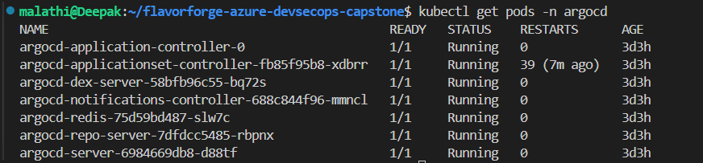
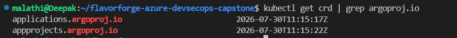
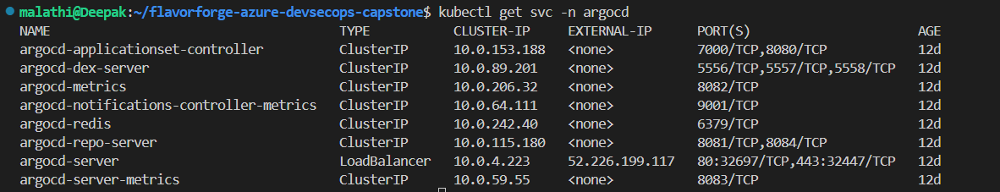

# 06 — Argo CD Verification

## Objective

The final Argo CD verification confirms that the Argo CD components are running and that the FlavorForge application is successfully managed through GitOps.

The verification covers:

* Argo CD Pods
* Argo CD CRDs
* Argo CD Services
* FlavorForge Argo CD Application
* Sync status
* Health status
* GitOps deployment relationship

---

## 1. Verify Argo CD Pods

Check the Argo CD components:

```bash
kubectl get pods -n argocd
```

The final environment showed all major Argo CD components running:

```text
argocd-application-controller        1/1   Running
argocd-applicationset-controller     1/1   Running
argocd-dex-server                    1/1   Running
argocd-notifications-controller      1/1   Running
argocd-redis                         1/1   Running
argocd-repo-server                   1/1   Running
argocd-server                        1/1   Running
```

This confirms that the Argo CD control-plane components are operational.

### Evidence



---

## 2. Verify Argo CD CRDs

Verify the Argo CD Custom Resource Definitions:

```bash
kubectl get crd | grep argoproj.io
```

The Argo CD CRDs provide Kubernetes support for resources such as:

```text
applications.argoproj.io
applicationsets.argoproj.io
appprojects.argoproj.io
```

These resources are required for managing Argo CD Applications and related GitOps configuration.

### Evidence



---

## 3. Verify Argo CD Services

Check the services running in the Argo CD namespace:

```bash
kubectl get svc -n argocd
```

The services provide the internal networking required by the Argo CD components.

### Evidence



---

## 4. Verify the FlavorForge Application

The most important Argo CD verification is the application status.

Run:

```bash
kubectl get applications -n argocd
```

The final result was:

```text
NAME          SYNC STATUS   HEALTH STATUS
flavorforge   Synced        Healthy
```

This confirms:

| Verification  | Result        |
| ------------- | ------------- |
| Application   | `flavorforge` |
| Sync Status   | 🟢 `Synced`   |
| Health Status | 🟢 `Healthy`  |

`Synced` confirms that the application is synchronized with its desired Git configuration.

`Healthy` confirms that Argo CD considers the managed application resources to be in a healthy state.

---

## 5. Verify Application Details

The application can be inspected in more detail with:

```bash
kubectl get application flavorforge -n argocd
```

For detailed resource and configuration information:

```bash
kubectl describe application flavorforge -n argocd
```

If the Argo CD CLI is configured:

```bash
argocd app get flavorforge
```

These commands can be used to inspect the application's:

* Git source
* Target revision
* Destination cluster
* Destination namespace
* Sync state
* Health state
* Managed Kubernetes resources

---

## 6. GitOps Verification

The final verification confirms the complete GitOps relationship:

```text
┌──────────────────────────┐
│    FlavorForge Git Repo  │
│                          │
│ Desired Configuration    │
└────────────┬─────────────┘
             │
             ▼
┌──────────────────────────┐
│         Argo CD          │
│                          │
│ Application: flavorforge │
└────────────┬─────────────┘
             │
             ▼
┌──────────────────────────┐
│       AKS Cluster        │
│                          │
│ FlavorForge Resources    │
└──────────────────────────┘
```

The final application state was:

```text
Git Repository
      ↓
    Argo CD
      ↓
flavorforge
      ↓
   Synced
      ↓
   Healthy
      ↓
AKS / Kubernetes
```

This demonstrates that Argo CD is functioning as the GitOps control layer for FlavorForge.

---

## 7. Argo CD Verification Summary

| Area                      | Verification       | Status      |
| ------------------------- | ------------------ | ----------- |
| Argo CD Namespace         | `argocd` present   | 🟢 Verified |
| Argo CD Pods              | Components running | 🟢 Verified |
| Application Controller    | Running            | 🟢 Verified |
| ApplicationSet Controller | Running            | 🟢 Verified |
| Argo CD Server            | Running            | 🟢 Verified |
| Repository Server         | Running            | 🟢 Verified |
| Argo CD CRDs              | Present            | 🟢 Verified |
| Argo CD Services          | Present            | 🟢 Verified |
| FlavorForge Application   | `flavorforge`      | 🟢 Verified |
| Sync Status               | `Synced`           | 🟢 Verified |
| Health Status             | `Healthy`          | 🟢 Verified |

---

## 8. Final Argo CD Result

The final Argo CD verification confirms:

```text
Argo CD Components
        ↓
      Running
        ↓
FlavorForge Application
        ↓
      Synced
        ↓
      Healthy
```

The most important final evidence is:

```text
NAME          SYNC STATUS   HEALTH STATUS
flavorforge   Synced        Healthy
```

Therefore, the FlavorForge application was successfully synchronized and reported as healthy through Argo CD.

---

## 9. Evidence Location

The Argo CD verification screenshots are maintained under:

```text
screenshots/argo-cd/
```

The key evidence includes:

```text
screenshots/argo-cd/
├── argocd-pods-running.png
├── argocd-crds.png
├── argocd-services.png
└── argocd-applications.png
```

These screenshots provide visual evidence for the Argo CD installation and final GitOps application state.

---

## Result

The Argo CD stage is complete.

The final verification demonstrates:

```text
Git Repository
      ↓
    Argo CD
      ↓
flavorforge Application
      ↓
     Synced
      ↓
     Healthy
      ↓
FlavorForge on AKS
```

This completes the **Argo CD / GitOps deployment stage** of the FlavorForge Build Journey.

➡️ **Next: `11-devsecops/01-devsecops-flow.md`**
