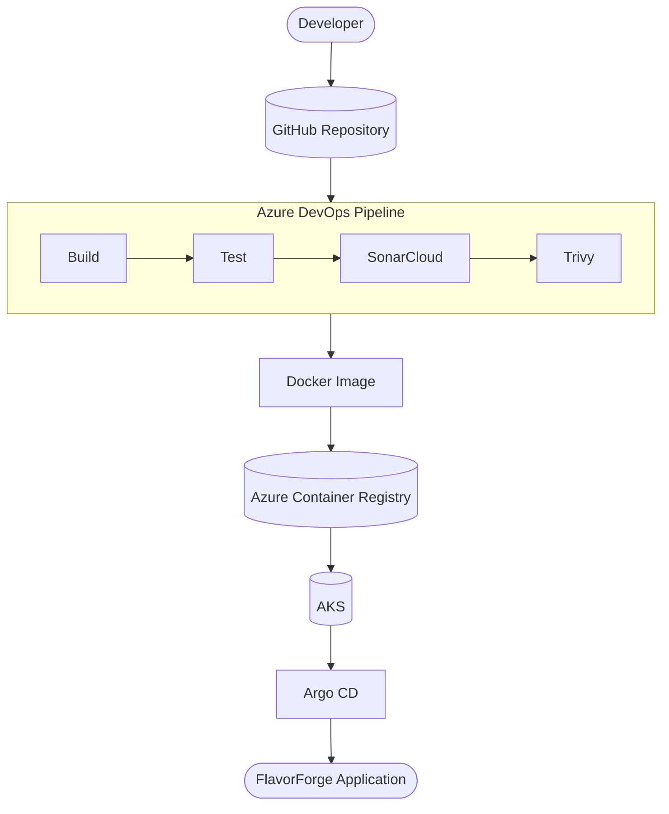

# 🚀 FlavorForge Azure DevSecOps Capstone
# Multi-Stage CI/CD Pipeline Implementation

**Student:** Malathi Shetty  
**Project:** Project 3 — Multi-Stage CI/CD Pipeline (Azure DevOps)  
**Organization:** CareerByteCode Bangalore — Cloud & DevOps Internship Program  
**Date:** July 2026

# 1. Overview

## 1.1 Problem Statement

Modern applications require a reliable and automated delivery process to move code from development to production environments. Manual deployments increase the risk of errors, configuration drift, and inconsistent releases.

FlavorForge implements an end-to-end Azure DevSecOps delivery pipeline that automatically builds, tests, secures, containerizes, and deploys a cloud-native React and Node.js application using Azure DevOps, Docker, Azure Container Registry, Kubernetes, and GitOps practices.

## 1.2 What This Project Demonstrates

This project demonstrates the implementation of a multi-stage CI/CD pipeline using Azure DevOps.

The pipeline automates:

- Source code validation
- Application build
- Unit testing
- Code quality analysis using SonarCloud
- Docker image creation
- Container security scanning using Trivy
- Image publishing to Azure Container Registry
- Deployment to Azure Kubernetes Service
- GitOps-based synchronization using Argo CD

## 1.3 Architecture Diagram

The FlavorForge DevSecOps architecture follows a complete CI/CD workflow.

Source code changes are pushed to GitHub. Azure DevOps Pipeline automatically triggers multiple stages:

1. Build application
2. Run automated tests
3. Perform security and quality checks
4. Build Docker images
5. Push images to Azure Container Registry
6. Deploy application to Azure Kubernetes Service
7. Synchronize deployment state using Argo CD GitOps

#### FlavorForge DevSecOps architecture diagram

